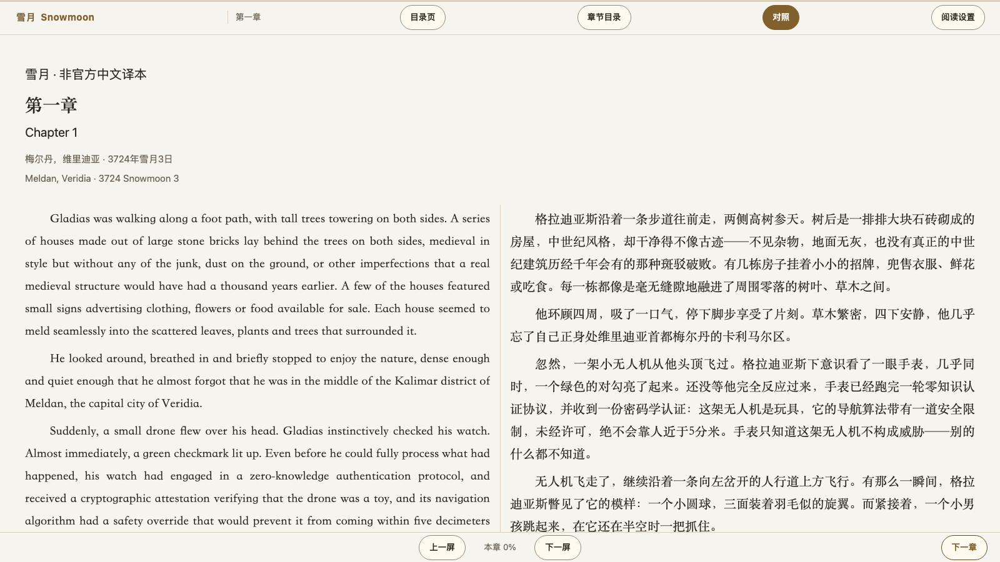
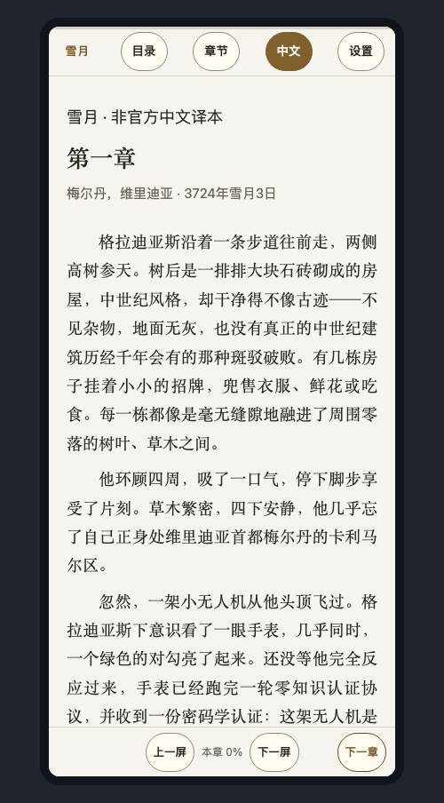

# 雪月 Snowmoon · 中文版

**Vitalik Buterin（以太坊创始人）的英文科幻小说《Snowmoon》完整中文译本。**
32 章、约 14.6 万汉字，56 幅插图全部重绘为中文。

## 👉 [点此在线阅读 → snowmoon.vanfer.tech](https://snowmoon.vanfer.tech/)

打开网页就能读。手机和电脑都适配，不用注册、不用下载，下次打开还记得读到哪一章。



## 这是什么书

《雪月》是 Vitalik Buterin 写的一部英文科幻小说，故事发生在城邦维里迪亚（Veridia）：
公共资源靠「二次方资助」这类密码学机制分配，职位把关要看预测分数，
手腕上的终端能投票、能收消息；街上还说着一种当地人自创的语言「泽国语」（Dzegoban）。
世界观做得扎实，适合慢慢读、边读边琢磨。

这个仓库是它的**非官方中文译本**：正文由英文原文译出，56 幅插图重绘为中文版，
书中模拟手表与终端的界面（投票刻度、聊天记录、税务表格等 85 处）也按原样保留，没有删改结构。

## 读起来是什么样

顶部一排按钮，中文读者基本不用配置：

- **中英对照**：「中文 / English / 对照」一键切换。对照模式左右分栏，两边同步滚动，随时核对原文。英文那栏的插图是**原图**（英文标注），中文那栏是重绘的插图版，图文对得上。
- **两种读法**：滚动（像网页一样往下读）或翻页（一屏一页）。
- **接着上次读**：读到的位置和已读章节记在你自己浏览器里，关掉再打开还是那一页。
- **看着舒服**：羊皮纸 / 浅色 / 深色 / 夜间护眼四种底色，宋体 / 黑体，五档字号，段落可选「常规段落」或「一句一行」。
- **手机上也能读**：窄屏自动收成单栏，按钮缩成短标签，点正文左右两侧或横向滑动即可翻页。
- **桌面端快捷键**：`←` `→` 翻屏（到章首章末继续按就换章）、`↑` `↓` 滚动、`D` 切换中英对照、`T` 切换主题、`Esc` 关闭面板。

<p align="center"></p>

## 不想联网？把书拿到本地

在 GitHub 上下载这个仓库的 zip，或者：

```bash
git clone https://github.com/0xVanfer/snowmoon-zh-cn.git
```

拿到之后不用装任何东西：

| 打开这个 | 适合 |
| --- | --- |
| `book/site/index.html` | 和线上一样的完整阅读站（纯静态，双击即可） |
| `book/snowmoon-zh.md` | 全书单文件 Markdown，插图以相对路径引用，适合导入其它阅读器 |
| `book/chapters/` | 逐章 Markdown，一章一个文件 |

## 关于这个译本

| 项目 | 情况 |
| --- | --- |
| 原著 | 《Snowmoon》，作者 Vitalik Buterin，[原站](https://vitalik.eth.limo/snowmoon/)，共 32 章 |
| 译文 | 32 章全部完成，约 14.6 万汉字 |
| 插图 | 56 幅，全部由英文版重绘为中文版 |
| 状态 | 已完结；非官方译本，未经原作者审定 |

译制过程中做过多轮「读者视角」复核（逐章检查忠实度、中文语感、术语一致性），
译文、插图与站点成品都有脚本自动校验，不通过就不会发布。
如果你发现译文有问题，或觉得某处可以更顺，**欢迎提 issue 或发邮件告诉我们**。

## 常见问题

**Q：手机上怎么读？**
用手机浏览器打开 <https://snowmoon.vanfer.tech/> 就行，页面会自动变成单栏。进度存在手机本地，关掉浏览器再回来还在原处。

**Q：能分享给别人吗？**
可以，请注明来自本项目。译文与插图以 GPL v3 发布，英文原文版权归原作者，许可细节见 [docs/licensing.md](docs/licensing.md)。

**Q：为什么叫「非官方译本」？**
这是社区的译制版本，与原作者没有隶属关系，译文和重绘插图都未经他审定。对译文有疑问时，随时切到「对照」模式看英文原文。

## 想自己动手

只想读的话，到上面一节就够了；如果你想自己跑一遍译制流程或改站点：

| 用途 | 依赖 |
| --- | --- |
| 读成品 | 现代浏览器，无需构建 |
| 译制流水线 | Python 3.11+（仅标准库），`python3 pipeline/*.py` |
| 文字翻译 | DeepSeek Harness + DeepSeek V4.1 Flash（subagent 逐章翻译） |
| 多轮审计修复 | 使用 Minimax M3.1 |
| 前端设计与插图重绘 |视觉模型（`pipeline/vision_api.py`） |
| 插图与站点截图校验 | Google Chrome（headless） |
| 站点托管 | GitHub Pages（推送 `main` 自动构建发布） |

```bash
# 1) 结构抽取（上游英文原文按许可要求不入库，需自备到 sources/en/html/chapter-N.html）
python3 pipeline/extract.py
# 2) 逐章翻译：按 pipeline/prompts/translate.md 派 subagent，产出 translations/zh/chapter-NN.zh.json
python3 pipeline/validate_translation.py
# 3) 术语与体例统一（依赖 pipeline/build_conlang_vocab.py 生成的泽国语词表）
python3 pipeline/build_conlang_vocab.py
python3 pipeline/merge_terms.py && python3 pipeline/normalize_zh.py
# 4) 插图中文化（需要 harness 环境中的视觉模型凭据；--check 先预检，不发请求）
python3 pipeline/make_figures.py build
python3 pipeline/vision_api.py --check
python3 pipeline/vision_api.py --batch sources/work/jobs/figures.jsonl \
    --out sources/work/jobs/figures.out.jsonl --concurrency 6
python3 pipeline/make_figures.py apply
# 5) 组装成品并自检（→ book/snowmoon-zh.md、book/chapters/、book/site/）
python3 pipeline/build_markdown.py && python3 pipeline/build_site.py
python3 pipeline/qa_book.py && python3 pipeline/qa_site.py
```

流水线的每一步、前端重设计流程、部署与复现说明，见 [docs/pipeline.md](docs/pipeline.md)。
其余文档：[文体与排版规范](docs/style-guide.md)、[术语表](docs/glossary.md)、[读者复核记录](reviews/)。

## 许可与联系

本项目（中文译文、中文化插图、自产脚本与提示词）与上游 Snowmoon 均以 **GPL-3.0-only** 发布，
完整条款见 [LICENSE](LICENSE) 与 [docs/licensing.md](docs/licensing.md)。

本项目为粉丝译制，与原作者无关联。问题反馈：<https://github.com/0xVanfer/snowmoon-zh-cn/issues> 或 <vanfer@vanfer.tech>。
