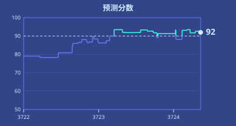

# 第一章

梅尔丹，维里迪亚 · 3724年雪月3日

格拉迪亚斯沿着一条步道往前走，两侧高树参天。树后是一排排大块石砖砌成的房屋，中世纪风格，却干净得不像古迹——不见杂物，地面无灰，也没有真正的中世纪建筑历经千年会有的那种斑驳破败。有几栋房子挂着小小的招牌，兜售衣服、鲜花或吃食。每一栋都像是毫无缝隙地融进了周围零落的树叶、草木之间。

他环顾四周，吸了一口气，停下脚步享受了片刻。草木繁密，四下安静，他几乎忘了自己正身处维里迪亚首都梅尔丹的卡利马尔区。

忽然，一架小无人机从他头顶飞过。格拉迪亚斯下意识看了一眼手表，几乎同时，一个绿色的对勾亮了起来。还没等他完全反应过来，手表已经跑完一轮零知识认证协议，并收到一份密码学认证：这架无人机是玩具，它的导航算法带有一道安全限制，未经许可，绝不会靠人近于5分米。手表只知道这架无人机不构成威胁——别的什么都不知道。

无人机飞走了，继续沿着一条向左岔开的人行道上方飞行。有那么一瞬间，格拉迪亚斯瞥见了它的模样：一个小圆球，三面装着羽毛似的旋翼。而紧接着，一个小男孩跳起来，在它还在半空时一把抓住。

“我得五分！”男孩兴奋地喊。

格拉迪亚斯把心思收回来，继续安静地打量四周。刚才接住圆球的男孩来自一个有4个孩子的家庭，较小的两个各骑着一辆三轮车。

在另一条向右岔开的人行道上，格拉迪亚斯看见一位老奶奶带着个小孩。两人走近一张长椅、像是要停下时，原本坐在椅上的夫妻先站了起来让座。老奶奶道了谢，带着孩子坐下。

而这一路上，一直有个音频节目在他耳边响着。那是运行在格拉迪亚斯手持终端上的本地 AI“翡翠”，正在讲解空气传播病毒的细微机理，以及如何估算在疫情中改动一栋楼的通风或密度会怎样影响全市总病例数。

---

格拉迪亚斯往前走，房屋渐渐让位给浓密的绿色灌木。灌木一过，步道开始缓缓上行，随后既平顺又突然地变成一座空中步道，横跨在一条繁忙道路的上方；他脚下驶过许多轿车、巴士和几辆无人配送车。一阵凉风吹在脸上。

“暂停，我想看看风景”，格拉迪亚斯对翡翠说。他习惯性地把这句话说得极轻，只有喉部肌肉在动，嘴唇没发出一点声音。紧裹在他脖子上的丝质颈带把这句话完整地收了下来。

他在空中步道中段停下，向左转身，望向远处。脚下那条繁忙的道路向前延伸约2公里，然后向右拐去。再往远处，是一座覆满树木的山。山坡下半部有几处公寓楼高高探出树冠，约15层，外形装饰得像放大的中世纪城堡塔楼，只是侧面的窗户多得多。

格拉迪亚斯又把脸转向左边，最后看了一眼那片自然。维里迪亚的自然真美，他想。随后他转向右边——道路穿过空中步道继续向前，那里的建筑密度高得多。今天，他的工作是对人的世界发表意见。

格拉迪亚斯重新迈步，走下空中步道。左侧是一排5层公寓楼，中间夹着步道和卖各种货品的小店。步道和人行道都被高大的绿树遮住了阳光。

右侧立着一道高大的隔音墙，漆成绿蓝两色，藏在又一排更密的高树后面，几乎看不见。

沿着隔音墙走了没多远，他的手持终端震了一下。

<table><thead><tr><th>表决对象：巴德拉街1103号</th></tr></thead><tbody><tr><td>翡翠 AI 摘要：5层公寓楼，蓝灰色</td></tr><tr><td><input type="range" style="width:100%">
-5 0 5
</td></tr><tr><td><button>选择</button></td></tr></tbody></table>

格拉迪亚斯立刻明白要做什么。作为维里迪亚公民，他被密码学抽签随机选中，要对自己有多喜欢这栋建筑投上一票。

他记得，少年时的维里迪亚公民课讲过：投票的目的是确定每栋建筑要缴的公共美学税——它是综合土地税的主要组成部分。开发商对此极为在意。在维里迪亚，把楼盖得让公众喜欢，不只是炫技的机会——它还能赚钱。

格拉迪亚斯打量着那栋楼，蓝灰色的巴德拉街1103号。它看着还算合群，和同一条街上的其他楼差别不大。风格现代，但耐看，完全不像他在自由城这类地方的照片里见惯的那种毫无生气的方形混凝土楼。楼两侧都有步道，步道上方都覆着树——和附近其他楼一样。

这可不容易，格拉迪亚斯想。为了找点参照，他挥了一下手持终端，调出附近*其他*几栋楼缴的土地税率。先看该由他投票的那栋。

<table><thead><tr><th colspan="2">巴德拉街1103号</th></tr></thead><tbody><tr><td>基础土地税：</td><td>1.00%</td></tr><tr><td>美学税：</td><td>0.18%</td></tr><tr><td>其他评则税：</td><td>0.33%</td></tr><tr><td>土地税合计：</td><td>1.51%</td></tr></tbody></table>

接着他转向左边，用手持终端对准最先找到的几栋确实不一样的建筑放大：一栋的风格是木石混搭，一栋屋顶上有花园，还有第三栋更小却更显贵气，外形像八面体，地块四周绕着一圈布置精巧的方形花园，每个角上都立着一棵红叶满枝的枫树。三栋缴的美学税都明显低于巴德拉街1103号，其中一栋甚至略微为负。

他又放大远处一栋几乎看不清的楼。这么远的距离，街道两旁密密的树很巧妙地把楼挡了起来，但手持终端还是轻松锁定，下载了特写图和各项税率。

那栋楼是一家航空公司的总部。公司灵机一动，把办公楼盖成了飞机的样子。建筑本身很有冲击力，他想，可要是每天早上都得从它旁边走过，他肯定要讨点补偿。

他查了查它的税。

<table><thead><tr><th colspan="2">清丘大道980号</th></tr></thead><tbody><tr><td>基础土地税：</td><td>1.00%</td></tr><tr><td>美学税：</td><td>0.59%</td></tr><tr><td>其他评则税：</td><td>0.30%</td></tr><tr><td>土地税合计：</td><td>1.89%</td></tr></tbody></table>

活该，格拉迪亚斯想。不过他倒也乐见维里迪亚的制度让口味与他如此不同的人也能自我表达，哪怕得为此付出代价。

格拉迪亚斯的思绪回到正事上。他要投的是眼前这栋蓝灰色建筑。他又看了一眼界面。

<table><thead><tr><th>表决对象：巴德拉街1103号</th></tr></thead><tbody><tr><td>翡翠 AI 摘要：5层公寓楼，蓝灰色</td></tr><tr><td><input type="range" style="width:100%">
-5 0 5
</td></tr><tr><td><button>选择</button></td></tr></tbody></table>

他记起，这是二次方投票。他所有的票都会被自动平移、拉伸或压缩，使全部票的平均值为零、票数平方的平均值为一。所以给每一项都投赞成、每一项都投反对，或者每一项都投到极端，都没有意义。最好的做法——*数学上可证的最好*——是不只按你觉得对的*方向*投，还要按你觉得合适的*力度*投，不多不少。

格拉迪亚斯犹豫起来。各栋楼拿到的美学税看上去……已经挺公道了？也许那栋飞机楼被罚得有点*太*重。允许这样一栋楼立着，不只是尊重人们在自己土地上自作主张的自由，也给梅尔丹带来了真正的多样性。何况那片本来就是商务区，有一栋也无妨。

接着他提醒自己：他投的不是那栋飞机楼，而是巴德拉街1103号。

对，他想。该怎么投？赞成还是反对？

想了一会儿，他最终凭直觉定了下来，把滑块只往右推了一点点。

他按下“选择”。

这不过是热身，他想——他身为维里迪亚公民，碰巧在即将以掌舵会见习官身份投出更重要的那一票之前，被随机抽中投了一次美学票。那一票很难投。而他马上要投的这一票会难得多——而且在那里，系统是要记分的。

他继续往前走，一分钟后到了隔音墙上的一处缺口：他要去的那场演唱会的入口。

---

格拉迪亚斯把手持终端凑近入口闸门上一个泛着绿光的圆圈。他稍等片刻，手持终端生成了一份密码学证明，闸门里嵌着的机器随即完成了验证。

“已验证，欢迎”，机器说。

闸门只知道有人持有效且未使用过的凭证到来——仅此而已。

格拉迪亚斯穿过闸门，朝演唱会主场地走去。

他看见少数观众穿着和他一样的维里迪亚标志性隐私袍。那是一种宽松的深紫色长袍，从罩住头的兜帽一直盖到脚踝。脚踝以下，穿隐私袍的人一律配同款深紫色的鞋。

其他观众大多穿着简单的 T 恤，要么纯色，要么印着他们喜欢乐队的口号。

有些人目标明确、步子利落，跟格拉迪亚斯一样。有人在跳舞。有人在聊天。还有人平静地往前走，只想被动地享受演出。

格拉迪亚斯走进一片开阔的空地，四周是高高的隔音墙——就是他先前见过的那道墙，只不过这回是从里侧看。

噪声越来越响，格拉迪亚斯挤过人群。他拉紧隐私袍面罩前方的一根带子，把那条横在鼻梁上、隔开鼻子上下两边的密封带勒紧。几分钟前听的那档空气传播病毒节目，已经让他留了心，注意别生病。

他很快到了舞台一带，清楚地听见了恐结乐队主唱粗粝的嗓音。

<blockquote>我们怀着满腔怒火迎向他们
用闪亮的钢铁与飞镖剥下他们的皮肉
</blockquote>

格拉迪亚斯又掏出了手持终端。

来这场演唱会的大多数人，是为了享受音乐、和朋友聚聚。对格拉迪亚斯来说，这绝对不是他*理想*的娱乐——他偏爱柔和温吞得多的音乐——但他也谈不上*讨厌*。最主要的是，他以人类学的眼光觉得这场演唱会有意思：借此探看那些他平时几乎不会打交道的人的趣味与情绪。

但说到底，格拉迪亚斯来这场演唱会另有目的。他点开手持终端上的评则：

<h3>基本摘要</h3><table><thead><tr><th>档</th><th>标准</th><th>税率</th></tr></thead><tbody><tr><td>1</td><td><ul><li>内容强烈提倡以下两项或更多：个人成长、科学与技术教育、善待他人、健康的家庭关系、良好的冲突处理方式、公民责任</li><li>不满足第4、5档的任何标准</li></ul></td><td>0%</td></tr><tr><td>2</td><td><ul><li>内容较弱地提倡以下一项或更多：个人成长、科学与技术教育、善待他人、健康的家庭关系、良好的冲突处理方式、公民责任</li><li>不满足第4、5档的任何标准</li></ul></td><td>10%</td></tr><tr><td>3</td><td><ul><li>内容不满足第4、5档的任何标准</li></ul></td><td>20%</td></tr><tr><td>4</td><td><ul><li>内容较弱地提倡以下一项或更多：暴力、违法行为、使用不推荐物质、赌博或高风险投资、过度炫富、糟糕的冲突处理方式、宗教或族群仇恨</li></ul></td><td>30%</td></tr><tr><td>5</td><td><ul><li>内容强烈提倡以下两项或更多：暴力、违法行为、使用不推荐物质、赌博或高风险投资、过度炫富、糟糕的冲突处理方式、宗教或族群仇恨</li></ul></td><td>40%</td></tr></tbody></table>
<b>来自维里迪亚国家级二次方资助与图谱资助的收益，税率提高至2.5倍</b>
 
<button>查看相关先例</button><button>返回</button>

在维里迪亚，真正被严格*禁止*的事极少。恐结要是愿意，完全可以让所有歌翻来覆去地喊“北极皇帝万岁”和“但愿所有政府官员都痛苦地被杀”，也不会被封杀或抓去坐牢。但维里迪亚*确实*有的，是一整套繁复的税收与补贴体系，由掌舵会这个与政府有关联却去中心化的集体维护。

这个集体里，掌则人负责就税则评则投票，决定各项税目怎么定。另一部分是监审官，负责审计一家家企业，每次审计都给某家企业在某条评则上定一个位置。格拉迪亚斯是见习官：正在受训的掌舵会成员。

而今天，格拉迪亚斯的任务是评定恐结在“公开演出的社会影响”这条税则评则上的位置。

<blockquote>城市在夜色中燃烧的浓烟
目之所及，我们不留一处可藏身
</blockquote>

格拉迪亚斯点下“查看相关先例”，翻了一遍。他按下侧面的一个按钮，右上角弹出一个小窗：“翡翠聆听模式已开启”。他没有说话，只是让翡翠听恐结唱歌。可听了5分钟，也只跳出寥寥几条相关先例。

格拉迪亚斯把模式切到“分析”，又让它听了5分钟。翡翠列出了一些听上去还算合理的结论，但格拉迪亚斯看得出它并不可靠。这类音乐的源数据太少，翡翠 AI 给不出好答案；而什么时候该听翡翠的、什么时候该多信自己的直觉，归根结底是他的分内事。这一次，靠直觉。

好吧，这歌确实很暴力。

可另一方面，一百多年的维里迪亚公民课传统把*鼓吹*暴力和仅仅为娱乐*展示*暴力区分开来。格拉迪亚斯看得见也听得见，观众在跳舞、欢呼、享受音乐。他们像是在找乐子，而不是被仇恨鼓动起来要对付谁。

但翻到*另一只手的另一面*，格拉迪亚斯知道，近来的监审官不像以前那么在意这条区分，他们似乎把更温和、更柔软的社会本身当成了目的。

格拉迪亚斯不太确定，这究竟是当初制定这条评则的掌则人的本意，还是对社会真正正确的选择。再过几个月，他就是正式监审官，能自主决定的余地更大。但现在，他决定的自由有限：系统在记分。

格拉迪亚斯低头看向手持终端。

见习官做出的审计，有10%会被监审官重做一遍。见习官的分数，反映的就是这部分投票与监审官判断吻合到什么程度。今天，格拉迪亚斯的分数是92。只要保持在90以上，他就能入选，成为监审官——或者，如果他改了主意，也可以当掌则人。但分数哪怕掉3分，他的职业生涯就至少要再搁置一年。

屏幕其余部分满是聊天消息。这项审计分配了9名见习官，分成3组，每组3人。同组另外两名成员意见不一。一个坚持第3档——算是不偏不倚的判断——另一个更严，要求第4档。

格拉迪亚斯叹了口气。另外两组大概也在这么想。简单起见，假设其他每个见习官都在第3档和第4档之间抛硬币，那么按二项式公式，另外6人也恰好平分的概率是六选三——20——除以64，约31%。可要是其他人的票*不是*抛硬币……唉，精确算太难了，但肯定更低，就当20%吧。也就是说，有20%到30%的概率，他这一票会明显影响恐结明年的税率。哦，太好了。真正的责任。

格拉迪亚斯又环视了一圈人群。第一首歌结束，他听到他们在欢呼。他忽然生出一股勇气。他愿意冒那10%的风险，让自己的预测分数受损。不再多想，他按下第3档。

有那么一瞬间，他为自己的决定感到骄傲。

“喂，各位，这儿有个掌舵会的人！”，他身后有人喊。

---

格拉迪亚斯浑身一僵。脑子还没跟上，眼睛已经扫过全场，找到了最近的出口。

他立刻明白发生了什么。掌舵会的安全，尤其是防收买、防影响，全靠成员的身份隐秘。掌舵会严禁成员泄露自己的任务。为了让成员把保密当回事，掌舵会刻意设计了一套游戏，让他们时刻绷紧神经。任何人都可以接入管理掌舵会运作的去中心化密码学网络，押上一小笔保证金，提交一个猜测：某个成员的任务是什么。猜中了，那名成员的薪水会被扣，猜中者分走一半作为奖励。

他还没来得及再作反应，附近另一个也穿隐私袍的男人突然拔腿，朝右侧的消防出口跑去。10米内的所有人纷纷掏出手持终端对准他录像。格拉迪亚斯也立刻明白了这边是怎么回事：诱饵。某个路人出于好心把注意力引到自己身上，给他争取脱身的机会。

格拉迪亚斯转过身，打算跑。可还没迈出一步，他就看见正前方一个高大魁梧的男人，手持终端直直对着他的脸。

格拉迪亚斯僵住了。起初他以为自己完了，脑子里飞快过了一遍各种可能，想找一条出路。最后，那个爱思考的哲学家格拉迪亚斯让了位，换成了另一个格拉迪亚斯——更有想象力，也更促狭，一个从初中课间之后就没再醒过的家伙。

格拉迪亚斯朝右边看去。

“等等，那是北极皇帝的新檄文吗？”，他问。

男人一愣，顺着他的目光看过去。就在那一瞬，格拉迪亚斯从他手臂上夺过手持终端，猛地转身。

“删除上一个长时内所有音频、图片和视频。重启。”

他撒腿就跑。几个嘀嗒之后，终端应道，“已删除4个文件”，并短暂显示出几张照片和视频的缩略图。右下角那张正是格拉迪亚斯的脸。屏幕随即黑了。

格拉迪亚斯把手持终端抛向空中，指望追他的人更舍不得自己那台终端，先回头去捡，而不来追他。他继续往前跑。

鞋子拖慢了他的脚步——鞋跟很高，好让他的身高和其他穿袍者齐平；鞋底又故意做得凹凸不平，让步态毫无规律——尽管如此，格拉迪亚斯还是很快跑到了出口。人群正被别的骚动分了神，似乎没注意到他。

他出了演唱会场馆，跳上一辆本地巴士。

---

巴士上几乎空着。左边还有两个人，都穿着隐私袍；是男是女、是老是少，他看不出来。右边是个穿普通衣服、背着书包的少年，像是放学回家。

他的目光落到车厢内壁的广告上。

第一张广告是海报，提醒维里迪亚人终身学习的重要。海报左边是一间教室，一个孩子、一位中年妇女和一位更年长的男人一起读着课本；右边写着：

<blockquote>
学校教育到20岁为止。教育是每个维里迪亚人一生的责任与义务。

今天就来了解由维里迪亚图谱资助补贴的各年龄段教育项目。
</blockquote>

第二张广告是海德菲尔，一个卖水和各类饮料的品牌。在维里迪亚掌舵税的温和推动下，过去20年里它已经几乎完全无糖。

广告左边是经典的黄绿配色海德菲尔瓶子，右边写着：

<blockquote>
海德菲尔

我们的饮品自豪地不含2,000多种已知毒物和不推荐物质。
</blockquote>

格拉迪亚斯笑了。

他真希望当初被抽中投票的是海德菲尔这张广告，而不是那栋蓝灰色的楼。他清楚，投这一张，他会把滑块几乎一路推到最右边。

这世上需要多一点好玩的东西。

---

15分钟后，格拉迪亚斯下了巴士。沿街走了一小段，他到了家门口，推门进去。

“塞拉，你在家吗？”他喊。

“正写博客呢”，她答道，从房间里出来迎他。

“那，晚饭想吃什么？”

“嗯，泽国餐车7分钟后到，再吃那个怎么样？”

“行啊！你还是10号？”

“对！”

“好，那我这次要13号。”

塞拉掏出手持终端，开始下单。

楼梯上传来咚咚的脚步声。

“爸爸回来了！”小儿子兹文喊着，一步三级地跳下楼梯，跑过来抱住格拉迪亚斯，他也顺着孩子回抱了一下。

年纪大些的少年费布里克下楼慢得多，一只手拿着手持终端，线缆连着他另一只手里更大的算力盒。

“我们订泽国餐车，你们想吃什么？”格拉迪亚斯问。

“4号！”费布里克答道。

“5号，我赢啦！”兹文喊。

“莉莉和赫雷达呢？”

“莉莉在卫生间。赫雷达课后数论班，还得一个长时才回来。拜托，你又不是不知道她每次都点9号。”

卫生间的门开了，莉莉慢慢走出来，眼睛盯着地面。

塞拉叹了口气。“怎么了？”

“历史考试60分。随便吧……”

塞拉转过身，搂住莉莉。“不是每样都擅长也没关系的”，她轻声说。

莉莉把脸扭得更开，避开塞拉和家人。她跑过去，坐到沙发上。

塞拉叹了口气，给莉莉点了8号。

塞拉点下确认。格拉迪亚斯、塞拉、兹文和费布里克围着桌子坐下等。

沙发上，莉莉掏出手持终端，专注地盯着屏幕飞快点击，全副心思都放在某个格拉迪亚斯和塞拉始终看不明白的游戏上。

这是格拉迪亚斯和塞拉与孩子们倒数第四顿晚饭——兹文和莉莉是他们亲生的，费布里克和赫雷达则来自他们的共同家庭，维尔叔叔和黛雅婶婶那边。再过4天，维尔叔叔和黛雅婶婶就要来接走4个孩子，照顾他们接下来的半年。

格拉迪亚斯叹了口气。他会想孩子们的。但同时，他也盼着这半年的自由。

“我们还要去维尔叔叔家住半年吗？”兹文问。

“当然啦！”塞拉答道。

“耶，我最喜欢维尔叔叔了！”

“对我来说，维尔就是*爸爸*！”费布里克特意强调。他又想了想。“格拉德叔叔、塞拉婶婶，我也爱你们！”

“我也爱你。”

门铃响了。格拉迪亚斯走到门口开门，接过一大袋餐盒。他把袋子放在桌上，取出印着各自号码的餐盒分给每个人。格拉迪亚斯、塞拉、费布里克和兹文都开始吃。

“维尔来了以后有什么打算？”格拉迪亚斯问。

“我打算去自由城待一两个月，见见扬，说不定写篇关于联合城邦的博客。我读了太多关于他们共治的东西，现在真想看看那些说法落到地上究竟怎么连起来。”

“不错！我打算去森林里多走几趟长路，跟本地 AI 一起深挖环境和生物评则。要当上监审官，我还得再做4次审计！”

格拉迪亚斯和塞拉继续吃。莉莉悄悄走到桌边，也打开了自己的餐盒。

就在这时，格拉迪亚斯的手持终端震了一下。他掏出来，跳出一条通知。

<table><thead><tr><th>来自</th><th>消息</th><th>时间</th></tr></thead><tbody><tr><td style="width: 25%">
匿名  
信誉分 ≥ 200已验证<b style="font-size: 150%; color: #8f8">✓</b>

</td><td style="width: 6%; text-align:center">→</td><td>我在演唱会上看见你了，我知道你在掌舵会。</td><td>60259</td></tr></tbody></table>

又过了几个嘀嗒，来了第二条：

<table><thead><tr><th>来自</th><th>消息</th><th>时间</th></tr></thead><tbody><tr><td style="width: 25%">
匿名  
信誉分 ≥ 200已验证<b style="font-size: 150%; color: #8f8">✓</b>

</td><td style="width: 6%; text-align:center">→</td><td>别担心，我不打算举报你去领赏金。不过，我有个请求想请你帮忙。</td><td>60266</td></tr></tbody></table>

