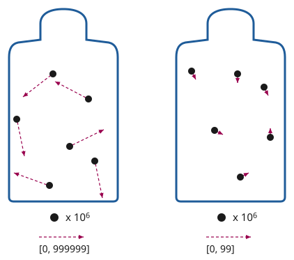
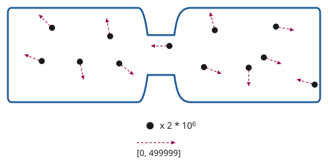

# 第二章

帕佛盖都，泽国 · 3724年雪月5日

芬和泽下了巴士，沿着训民街往前走。

训民街是帕佛盖都比较热闹的工商业街之一。街道两侧，招牌上的彩灯闪个不停，宣传着各式各样的电子产品：手持终端、手表、算力盒、照明、电池、传感器等等。店铺之间夹着小型工厂，造着各种精密器件，有几处甚至在生产计算机芯片。沿街的建筑都只有一两层高，不少招牌就架在通往地下的楼梯口上。

左边有两家紧挨着的店。一家卖各式传感器——摄像头、麦克风、生物与化学传感器、空气质量监测器，当然还有专门用来探测传感器的传感器。另一家卖隔信箔——一种常见的材料，很多房间默认就铺它，用来阻断无线信号。隐私与透明，监控与反监控——泽国人保平安，靠的就是这一对矛盾。

两家店之间，一块招牌用大字写着：

zui fia kun zun

“地下安全之所。”

“gie fe kiu kai ci bin hu。”泽在心里默念。“扎根，无首。”这是泽国半个世纪以来一直用来生长、并保住自身的策略。

芬和泽继续往前走，享受着车道与人行道之间树下的阴凉。

一架无人机嗡嗡地从头顶飞过。片刻之后，他们的手表轻轻震了一下——软件跑完了认证协议，确认来者是友方的安保无人机：出自通过了全部检查的批次，运行的是友方算法。整串流程——飞过、认证、确认——在几百毫嘀嗒内就走完了，芬和泽几乎都没察觉到发生过什么。

“昨晚那场民本棋下得怎么样？”芬问。

“我拿了第三名！终于琢磨出一种墙形结构，能把他们的滑翔机原样弹回去，把他们的地盘搅得一团糟。”

“你呢？”

“在‘无聊学校’备考地理呢。”

“很无聊吧？”

“嗯，我们在讲联合城邦，老师就让我们死记硬背那些共治投票比例。自由城在德文维尔占5%的投票权，德文维尔在红郡占15%，红郡又……”

“那套制度到底管不管用，你有什么新看法吗？”

“哪有啊，批判性治理研究要上大学才讲呢。”

“就像化学要上高中才讲那样？”

芬笑了。“他们现在打算在去中心化大学用十天讲完一整年的批判性治理研究？”

去中心化大学（DU），泽国语里叫 dzu hu sun du——就是他们要去的地方。泽想起得确保准时到，便看了一眼手表。

“时间刚跳到69,000。教室的准确位置应该马上就会解密、广播出来。”

手表震了一下。泽收到一条通知。

<table><thead><tr><th>文贵街1842号</th><th>TEI 70000</th><th style="font-size:300%; color: #ff8">✓</th></tr></thead></table>

泽停下脚步，把手表给芬看。

“嗯？黄色的对勾。看来他们换了一套新的密码学证明系统，今天到了课上，记得把咱们的码同步一下。”

“又换？”

“大概吧。听说北极帝国越来越咄咄逼人，所以我们在加强安保。”

“行吧。总之它上面写着文贵街1842号。我们……刚经过训民街1990号。那它在我们后头。”

“那我们就在这儿左转到二十街，再左转到文贵街？”

泽在心里把账算了一遍。有名字的街之间相隔200米，从训民街到文贵街隔了四条街，也就是800米。门牌号本身就是米数，所以从2000号走到1842号要走158米。800加158……一共要走958米。课在70,000嘀嗒开始，所以他们还剩不到一千嘀嗒，说白点就是十分钟。慢步走是一嘀嗒一米，而芬和泽走得快。所以他们来得及。

“行！”

两人快步走了起来，确保能提前赶到。

几分钟后，他们到了。“哎呀，芬，你可算来了！”一个年轻女人喊道。芬和泽被领着走下两段有点积灰的楼梯。

到了底层，另一个男人正等着，拦住了他们。“计划变了，改在负一层正对面的房间了。”

泽叹了口气。

四个人又爬上一层楼梯，进了一间大屋子，并排坐在一排椅子上。

四壁糊着厚厚一层隔信箔，糊得很仓促。箔面之上是泽国经典的那种审美：可爱的卡通动物在摆弄电子器件和化学实验器材，背景是绿树和蓝天。屋子前方，左边一只充气卡通猪，右边一只仓鼠。猪用左手举着一个计算器，仓鼠用右手举着一小瓶绿色液体。两只空着的手一起举起一张海报，上面是去中心化大学的校训：

pa jan li sun zo

zai gau fe pa jan

go li sun zo

bai gau fe go

“一人向学，一人得自由；一国向学，一国得强盛。”

他们身后，讲师走了进来，关上了门。泽看了一眼手表。70,001。

---

“欢迎来到物理课。”讲师说。

“今天，我要试着讲一个很重要的话题，我觉得几乎所有人都把它搞混了：热力学。”

比较专心的学生收起了手持终端，不再说话，准备听讲。其他人起先还在聊，但很快就安静下来。

泽旁边的女生把手伸到桌子边缘底下，眼睛没看，手指顺着摸了一遍——这是习惯，不是在认真搜查。另一个学生习惯性地把手持终端在屋里挥了一圈，想捕捉到任何未知的电子设备。没有人说什么。从来没有人说什么。

“在座有谁听过‘熵’这个词——在信息论或密码学的语境里？”

大约四分之三的学生举了手。

“那在座有谁听过‘熵’这个词——在热力学第二定律的语境里？就是说它永远在增大，其中一种表现是热总是从热的地方流向冷的地方，绝不会反过来？”

几乎每个学生都举了手。熵是科幻作品最喜欢的题材。

“那在座有谁觉得自己能讲清这两者之间的联系？”

没有人举手。

“好，那我们开始。”

讲师按了一下手表上的按钮，前墙上出现了一张幻灯片：

“想象我们有两罐气体。每罐有一百万个分子。但左边那罐里，分子的运动速度快得多。假设左罐里分子的速度可以用六位数表示，从0到999,999。而右边那罐里分子运动得慢，速度可以用六位数表示，从0到99。”

“谁能告诉我，要把左罐里发生的一切完整表示出来，需要多少位数字？假设你已经知道那是气体，知道有一百万个分子，唯一的自由变量就是速度。”

“六百万！”大约十个学生齐声喊道。

“很好。那右边那罐呢？”

“两百万！”

“我们来梳理一下。从你的角度，作为观察者，你知道这两罐都是气体，知道是哪种气体，也知道有一百万个分子。但你不知道每一个分子的速度。那么对左边那罐来说，你所不知道的信息量是……？”

“六百万位数字！”

“那右边呢？”

“两百万位数字！”

“所以一共是八百万位数字，是你所不知道的信息。那么，如果我们把两罐放到一起，让气体混合，会怎么样？关于速度，我们会知道些什么？”

泽举起了手。

“好，你来说？”

“分子会随机地互相碰撞。等它们安定下来，因为能量守恒，速度最后会落在中间，也就是0到50万之间。”

“对，非常好！严格说来，能量与速度的平方成正比，我们也可以争论这些速度该怎么表示，顺带一提，我们也完全忽略了位置，但我们就简化一下，说0到50万吧。”

讲师又点了一下手表。下一张幻灯片。

“那么，要表示我们对这个新系统所不知道的信息，需要多少位数字？”

另一个学生举起了手。

“请讲。”

“从0到50万，比五位多，又不到六位；如果按对数算，每个分子大约是五点七位。”

“那总数是多少？”

“一千一百四十万位数字。”

“非常好！所以结论是：把两罐气体混在一起，我们损失了知识。我们对气体的了解比之前更少了。而且我们可以量化损失了多少知识：是三百四十万位数字。”

“我们说熵会增大、热从热处流向冷处，说的就是这个。每添进一丁点热量，把冷的东西加热所增加的未知位数，总要多于把热的东西降温同样幅度所减掉的位数，所以未知的总量只升不降。你对这些罐子能做的每一个可能的操作，平均看来，要么让总未知量不变，要么让它上升——而只要你做了任何有用的事，或者犯了任何错，它就一定会上升。这就是热力学第二定律。”

讲师停顿了一下。

“那么，我们怎么证明它？”

没有一个学生回答，但很多人似乎好奇地往前倾了倾身子。

“我们用反证法。假设我们真有一个能倒着来的神奇程序：从混合后的两罐出发——一千一百四十万位的未知量，把我们送回分开的两罐——八百万位的未知量。”

泽又一次举起了手。

“我能试试吗？”

“请讲。”

“我记得我们宇宙的物理定律是完全时间可逆的，对吧？所以，如果一件事能朝一个方向做，就总能把同样的步骤倒过来跑一遍。”

“完全正确。那么，为什么到了原子层面，这种时间可逆性反而会意味着温度均衡无法逆转呢？这不矛盾吗？”

“嗯，如果我们真能把不冷不热的温度分成热的一份、冷的一份，那就能做无限的数据压缩了。”

“比如，假设你有一个一千一百四十万位数据的文件。你造一个真正完美的双罐装置，再用一把枪，把气体分子以完全正确的速度射出来。然后你用你的程序把气体重新分开，再把罐子拆开，最后测量速度。你就能得到八百万位数据。”

“而且，因为我们宇宙的物理是时间可逆的，你就能把同样的事反过来做：拿那八百万位数字，输进枪里，让气体分子以正确的速度射出来，把完全一样的分离程序倒着执行一遍，再测量，你就能得到原先那一千一百四十万位数字。时间反演过程的输出必须等于原过程的输入。于是我们就有了一个完全通用的办法，能把任意一千一百四十万位数据塞进八百万位里。要是能做到这一点，我们就能一遍又一遍地做下去，把整个星球表示成八百万位，甚至压缩得更小，用八位就搞定。而这是不可能的！”

“完全正确。换句话说，在一个物理规律时间可逆的宇宙里，你不可能让不知道的东西从多变成少。而在一个物理规律时间不可逆的宇宙里，你**可以**，因为你只要把所有你不知道的东西毁掉就行了。”

“简直就是北极皇帝！”泽真想喊出来。但他忍住了。把一个这么明显的笑话当众讲明白是很失礼的——半个教室的人心里大概早就想到了。讲师和学生们短暂地停了一下，品味这个笑话，咧嘴笑笑，享受了片刻的心意相通。然后讲师继续往下讲。

“但在一个物理规律时间可逆的宇宙里，总有些东西是你不知道的，而这份未知只能挪来挪去，而且注定越来越多。我们能做的最好的事，就是从不知道我们在乎的东西，变成不知道我们不在乎的东西。比如，从不懂热力学，变成不知道那些作为废热从投影仪里跑出来的分子的速度。”

“干得漂亮，孩子。你叫什么名字？”

“泽。”

“那么，泽，你答得完全正——”

旁边的房间爆出一声巨响。整间屋子都在晃。

不到一嘀嗒的工夫，一部分墙和地板轰然塌了下来。

泽反应过来时，一块碎石已经砸中了他的胳膊。

---

泽发现自己倒在地上，翻倒的椅子就在旁边。

他脑中闪过那个最后关头把他们改到另一间房的男人——那间房比原定要去的地方高一层。

他立刻就明白了。去中心化大学一直在做的那些额外防范——密码学、地点的突然变更、隔信箔——都不只是儿戏。而北极帝国也不只是地理课上的一个单元。这些东西是**真的**。

“大家都没事吧？有人受伤吗？”讲师喊道。

泽想了一会儿，琢磨胳膊这点伤值不值得喊疼。他试着把胳膊抬起、放下。胳膊没有反应。

接下来他感觉到的，是两条胳膊抓住了他，把他从地上拉起来，扶到椅子上。泽转过头。是芬——让泽松一口气的是，芬一点伤都没有。

烟灌满了房间。每个学生的手表都开始大声报警——空气质量监测只是它众多功能中的一项。学生们点了点手表，报警声很快小了下去。学生们慢慢互相搀扶着站起来，讲师则四处走动，看看有没有人伤得重、真正需要帮忙。

讲师走到泽身边，泽默默指了指自己的左臂。讲师掏出手持终端，扫了一下。屏幕底部刷出一段 AI 生成的内容。

“疼吗？”讲师问。

“有点，但撑得住。”

“看起来是骨折。今天就去医院看一下。越早去，好得越快。”

“我送你去。”芬接话。“得保证你月底那场比赛还能打。”

讲师继续往前走。屋里满是烟。空气质量警报还在响，但芬和泽能分辨出讲师在问不同的学生“你还好吗？”，有一个学生回答“我没事。”

空气过滤器开到最大功率，烟很快散了。芬和泽对视了一眼。一时间，学生和讲师都沉默着，气氛有些尴尬。

泽用没受伤的那条胳膊撑着桌子站了起来。“我想我们对这面墙的了解，比两分钟前少多了。”他开了个玩笑。

几个学生笑了，或者轻轻笑出了声。他对听众的情绪拿捏得很准。

“没有别人受伤了吧，你们都确定？”

“我没事。”大约十个人回答。

“好，我看今天的熵已经够我们受的了。回家吧。”

---

芬和泽在教室里比其他人多待了一阵。泽重新坐回椅子上。芬拿了把扫帚，把碎屑都推到一边。很快，就只剩他们和讲师了。

“哇，北极人越来越凶了。以前他们可不针对物理教育。”

“临时给我们换教室的那位真是个天才。那一下救了我们的命。”

“可惜，我估计从这儿往后只会更糟。”

芬和泽震惊地看着讲师。

“记住，他们的玩法，就是永远把我们的重工业和科技压在低位。让我们活着，但把我们的文明永远压在构不成威胁的水平上。”

“而我们的对策是‘gie fe kiu kai ci bin hu’：扎根，无首。用分布式制造，把我们要用的工具全造出来。让官方政府照旧运转下去——就像一百年前我们输掉战争时那样，缓慢、腐败——但用密码学来匿名协调那些真正要紧的决定，不需要任何抛头露面的个人领袖来掌舵。整个去中心化大学已经在这么运转了。很快，我们大部分的发电、农业和医药也会这样。”

“这招一直很管用。经过最近这几年，我们终于差不多到了那个水平：完全不需要任何集中的重工业，也能自己站住脚。问题是，看样子他们也渐渐看明白了。”

“Dze go ba fau gie。”芬和泽齐声说，平静而倔强。

“泽国将再度崛起。”
