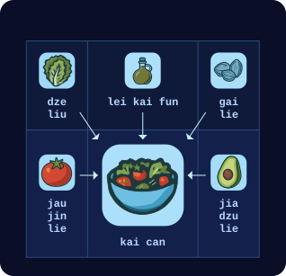

# 第四章

帕佛盖都，泽国 · 3724年雪月24日

芬和泽坐在一处露天院子里的桌边。近旁几张桌子空着，别的桌旁坐着几拨少年和几对上了年纪的夫妇，正在吃饭。

从门口的豁口望出去，芬看见街对面有个少年正爬上一架木梯——梯子被匆匆架在一根公共路灯杆上。转眼他就到了顶，立刻动手拆一台监控摄像头。拆完，他把摄像头塞进一只黑布袋，又爬了下来。

泽用手指敲了敲桌面。芬的目光猛地收回来，重新专注地盯住泽手持终端上的一段动画。

“那好，我这是在看什么？”芬问。

“这是我上一盘民本棋的棋谱。那局我们用的是‘逢三转一百八’的规则。有人琢磨出了这种新打法，能破掉常规的墙形结构，拿垃圾把对手的地盘整个淹掉。我正想找些反制手段。”

“终局是什么样？你是想搭出一堵完美的墙，还是一路石头剪刀布到底？”

“嗯，记住，规则是可时间反演的。所以，任何能用某种方式造出来的墙，就能用某种方式拆掉。”

“啊？”

“还记得中学那会儿吗？我们觉得电影里那些好人也好、坏人也罢，把护盾发生器装在护盾外面，让对方找到、砸掉，简直蠢透了。”

“记得。”

“结果蠢的不是他们，是我们。因为物理定律是时间可逆的，所以没有什么是无敌的。任何能造出来的东西就能拆掉，你只要沿着造出它的那条路径倒着走一遍。所以，一堵拆不掉的护盾，就不是能造出来的东西。弱点一定藏在某处——问题只在于你藏得多好。”

“你是打算往防守方向发展还是怎么着？”

“嘿，我只想拿冠军。今年是我能参赛的最后一年，赢了就能进全国赛。”

“你是说，今年是你最后一次机会，让白对你刮目相看？”

“嘿——”

一台机器人滑到他们桌边。

“jie mo kai tu jie hei ja ma？”它用餐厅机器人那种刻意可爱的泽国语问。“要吃的还是喝的？”

芬看向机器人身上的屏幕。

他点了“kai”，又点了一张沙拉的图片。

芬又点了一下，接着按了几个按钮点了茶。机器人应声叫了一下，滑到泽身边。

“哇，现在什么都变成图片操作了！”

“我在去中心化大学最近上的那门课正好是语言学，所以在这儿终于轮到我当天才了。”

芬从背包里掏出一本薄薄的纸册子。封面上是班孙培的标志：两条横向伸出的手臂，一条从左、一条从右，在中间相握。标志上方是标题：“po so dze go ban de sia”——“泽国语第九版的构想”。

“再多讲讲？”

“还记得吧，我们把词根数量压到256个以后，大家都说还要接着压，早晚要用四大元素——地、气、火、水——来表达一切？”

“嗯？”

“结果班孙培现在想放弃那条路了。就停在256个词根，把泽国语的下一版往另一个方向推。”

“什么方向？”

“往视觉走。所以首先，他们真的在认真考虑把象形文字捡回来。”

“什么？！”

“当年改用维里迪亚字母是有道理的，因为老符号太难画。但我们现在有计算机了。问题不在输出，而在输入。诀窍在于，他们正在设计的新符号里，有一部分笔画编码整个读音：就算你忘了怎么念，看一眼符号也能知道准确的读法；符号剩下的部分则仍然尽量兼顾含义。”

“好吧……？”

“他们思路上的变化更大。语言到现在为止都只有一维，因为说话本身只有一维：一个词接一个词，写下来的也就是嘴里说出来的。但如果你想一想‘语言’里那些不依附于说话的部分——比方说，你喜欢数学，那就想想二次方程求根公式。”

“负 b 加减根号下 b 平方减 4ac，再除以 2a？”

“你想想，要是你得把它写下来、投到屏幕上给人看，那得多难看。比如，就想象此刻有人在屏幕上读到这一串字，那会是什么滋味。再想想方程式，就是我们平常写下来的样子。我到现在也背不全，但我记得它很好看！它是一幅漂亮的画。分数线把东西分成上下两层，有个根号，一眼就能看出哪些在根号里、哪些在根号外。”

“所以他们想把整个泽国文都变成那样？”

“对。”

“你知道有个老结论：拿同一段文本，把它翻译成每一种语言，各版本的篇幅长短不一。但把这些译文拿来压缩——用你手头任何一台计算设备里现成的压缩算法就行，随便哪种——长度最后几乎一样。所以信息量本来就是相同的。问题永远是：你怎么组织它，才能让它最好取用、最有用？”

泽想了一会儿，回想起一个月前那堂热力学课。信息就是信息，问题只在于怎么排列它。泽点了点头。

“所以班孙培现在正在全泽国做 A/B 测试。祭司们一共拿出六种不同的可视化样式，只要你把自家的文字或招牌按他们的新想法调整一下，或者把你读别人张贴内容的感受报上去，他们就发信誉分。”

“等等……他们搞的是那种全国规模的组织动员，就为了再一次优化我们的语言？”

“大概吧……”

---

泽朝那座半公里高的金字塔走去——那是帕佛盖都南缘最显眼的地标。从外面看，它像一座外表包得光滑的石砌金字塔，方形底座，像是千年前某个伟大文明留下的东西。石面上嵌着树：沿小径一左一右两行，从泽所站的位置一直通到半山腰；另有一行恰在半高处，横着环绕金字塔一圈。

但外表是骗人的。造一座那么高的金字塔，就算对维里迪亚、甚至对北极国来说也贵得离谱。这本就是一座现成的山，带着现成的洞穴；人们把它翻修成金字塔的样子，把洞穴改造成居住和办公空间。泽国政府的一部分就设在那里，还有许多大公司——不过那里的空间很贵。

泽在一盏路灯旁停下，穿过宰贡街：这是帕佛盖都正式结束前的最后一条街，也是那条笔直、养护良好的小径的起点——小径直通山体金字塔的入口。

泽把受伤那条手臂的每根手指张开又合上，接着反复张手、并拢。他模拟了几下按键的动作。这条手臂感觉已经全好了，不过泽知道，自己的反应速度还是会慢一点。

街道以大约10%的坡度向上延伸，泽走起来消耗的热量差不多翻了一倍。他感觉得到。他脑中下意识地不再推演接下来那场比赛的战术，转而单纯惊叹这座金字塔的美。

又往上走了一段，泽短暂地回头看了一眼，为帕佛盖都的景致惊叹：大片连绵的低层建筑间杂着树木，各式小店铺和工厂灯火闪烁，生产、售卖着各种各样的货物，全都嵌在一张规整的街道网格里——南北向排开十七条街，间隔两百米；东西向排开三十三条街，间隔一百米。有些路则像蛇一样时上时下：路面宽裕时，整条路都留在地面；人行道要占满整个宽度才容得下行人时，车道就钻到地下。

泽重新转向正前方，继续往上爬。大约五分钟后，他到了正门。

泽的手表震了一下。

<table><thead><tr><th>zan</th><th></th><th>tie</th><th>tei</th></tr></thead><tbody><tr><td style="width: 25%">
芬
</td><td style="width: 6%; text-align:center">→</td><td>jie fe hen dzi</td><td>74160</td></tr></tbody></table>

芬给他发来消息：“祝你好运。”

按正门侧面几块指示牌的指引，泽向左转，沿那条覆满树荫的水平小径走了大约三十米，从一处较小的侧门进了山体金字塔。

在里面，隧道看起来就像现代建筑里的走廊。每条走廊约两米宽、三米高：下面两米是矩形，上面一米是半圆。石头打磨得很干净，看上去和任何保养良好的建筑内部没什么两样，只是没有窗户。偶尔，泽会经过几间开着门的房间。他分不清哪些隧道、哪些房间是翻修过的洞穴，哪些是从头挖出来的。

他跟着指示牌走，先向右再向下，然后向左，接着直行向下大约一百米。最后又向右一拐。

大约十米之后，他看见了那扇门。门两侧是一层层石砖，接近顶部处弯成拱形。门顶正中有一个标志：两条横向伸出的手臂，在中间以拳头相撞。

他走了进去。一位年长的女人注意到他，转过身来。

“哦，嗨，泽！”

“啊，穆，又见到你真好！”

“要打四分之一决赛了，激动不？”

“嗯！”

“那可得当心。记住，你现在是团队的一员了。你是搞数学的，不是搞外交的。你连我生日都不记得！”

“嘿，队伍是随机分的！没什么关系要打理，这更像数学，不像外交。”

“你会吃惊的。我倒觉得，这反而让实时的外交变得更要紧。”

另一个女人走了进来，年纪和泽差不多。

“啊，泽，我们又见面了。”

泽的脸立刻沉了下来。过去这几年，白和他对上三次，三次全赢，而且赢的时候一点也不宽厚。他别过头去。

白走近了些，把手搭在泽肩上。“怎么，泽，你怕我？你知道我就喜欢让你害怕。你兴冲冲想拿奖金给你妈买个算力盒，我就把它全抢走，给自己换来一趟红郡南部美丽海岛上的度假。我该给你寄几张照片。”

泽攥紧了拳头。

“赛场上见！也说不定这一轮你还没碰上我，就先输给别人了。”她笑了笑，慢慢走开了。

一声铃响。一个机械音——比咖啡店的机器人更严厉——指示所有选手各就各位。

泽走进墙上的一间电梯舱。门合上，他能感觉到电梯开始下行。一只托盘弹了出来，一个机械音——这次像送餐送饮的机器人一样可爱——要求泽交出所有电子设备。泽掏出手持终端，摘下手表，把两样都放在托盘上。托盘缩回电梯侧壁里。

过了十五秒，电梯门打开，露出一间巨大的房间，里面有一千多人在观看。一条通道亮了起来，指向一台带椅子的巨大控制台。

泽敬畏地环顾这间屋子。这是他第一次来这里——四分之一决赛之前的比赛都在简陋得多的场地进行。他愣愣地看着，惊讶于一场高中编程比赛竟然能拿到这样的场地。随后他的思绪收了回来——这事回头问穆，他想。现在，他不是来享受的，他是来比赛、来赢的。

泽向前走。远处另外三名选手的轮廓也在往前走，但光线太暗，看不清是谁。他走到椅子前，坐下。

一群手持终端大小的无人机嗡嗡地绕着泽飞，扫描任何可能用来作弊的设备。如果泽的手持终端或手表还在身上，它们就会自动把同样的事反过来做一遍：向无人机的制造商和两名检查员索要并核验一份认证，确认它的固件跑的是反作弊扫描，而不是来取他性命的。但在这里，泽没有电子设备撑腰，只能靠信任。

半分钟后，无人机查完了，飞走了。一只托盘从控制台下方滑出来，上面放着几副连着一根长线的眼镜。泽拿起眼镜。他把线从手臂下绕到身后，好让线垂在背后，然后戴上了眼镜。

一个洪亮的机械音再次严肃地宣布："MU GU GEI FA"。五十嘀嗒后开始。

泽平静下来，努力把紧张丢到脑后，又在脑中过了一遍战术。墙、滑翔机、石阵、从石阵里榨出可用负熵的技巧、侧翼进攻。虽说每局总会冒出点新规则，但所有战术里最重要的，还是懂得随机应变。

"LE MU GEI FA"。二十五嘀嗒后开始。

泽短暂地闭上眼，吸了口气。

"PA GU GEI FA"

“欢迎来到第十八届民本棋锦标赛、四分之一决赛的首轮。今晚将接连进行四场比赛。到午夜，我们就会知道谁将晋级半决赛，谁又得另找一门营生。或者明年再加把劲！”

“今天，因缘际会分在嘉队的是——潘蒙宝和扎津戈。”

“而分在扎乌队的是……泽雷民和白嘉恒。”

泽僵住了。

---

泽能看见棋场，开局时它一片漆黑。他在显示区的一角看到了自己的符记：一个由圆点组成的图案——只要棋盘上任何地方出现它的复制，他就能看见周围三十格内的一切。

他在棋盘右下角画下几个自己符记的复制——布局阶段允许他在那里落格。一落下去，棋场内他符记近旁的那几块就亮了起来。几乎同时，他也能看见棋场左下角的几处了。白也放下了她的符记。

泽看见白在搭墙、建滑翔机工厂——滑翔机飞出去，径直撞上附近的石阵，石阵又把一架滑翔机反射回白的地盘；那里的一道镜面墙再把它原路送回，同时又向上射出一架滑翔机。

他也开始照做。他在沙盒里试了几种滑翔机与墙的组合，确认能用之后，再把它们部署到棋场上。

"MU GU GEI TAU FA"

战斗将在五十嘀嗒后开始。

正常情况下，到了这个阶段，选手们会在语音频道里激烈交谈，协调战术。泽和白之间，谁都没说一个字。最接近交流的举动，是泽刻意不把滑翔机瞄向某几处石阵，白领会了暗示，自己去占那几处石阵，同样也留了几处给泽。

"LE MU GEI TAU FA"

二十五嘀嗒。

泽猛地意识到：还没有宣布新规则。规则和他以前玩过很多次的一模一样。规则会等到开始才宣布？还是另有蹊跷？

没时间瞎猜了，泽想。得专注在棋上。

"PA GU …… SO …… BI …… ZE …… HA …… MU …… FO …… SHI …… LE …… PA ……"

"TAU FA"

滑翔机开始飞行。

体型更大的飞船从泽和白的基地里飞了出来。

头几百个回合没有交战——只是向棋场扩张、收集资源。滑翔机飞出去，与石阵相互作用，造出更多滑翔机。飞船飞出去，像一架缓慢移动的大型滑翔机，最终以受控的方式撞上石阵，留下各自符记的复制。泽能看见的棋场范围越来越大。

泽和白的领地接上了。白有几架走偏的滑翔机误闯泽的领地，撞毁了他的一座工厂。泽在心里骂了一句，把下一个干预回合用来加筑面向白的墙。筑其中一道墙时，他手指一滑，误造出一架滑翔机，朝自己的基地飞回去。泽又在心里骂了一句，随即松了口气——那架滑翔机无害地撞在了一处石阵上。

一千个回合之后，双方的滑翔机和飞船碰上了。与此同时，第一次干预回合到来。在这个回合里，所有选手都可以在自己符记的任意一处复制附近落格。泽疯狂调整兵力，想更有效地攻击扎。

在前线，泽摆下了他早已练熟的“移动墙”阵形——一种飞得只有一半快的大型滑翔机，但专门优化过，能把更基础的几类滑翔机原封不动地弹回发射它的一方。在三道移动墙正后方——它们全都对准扎在棋盘上的那一角——他放上了自己的载符飞船。

白这边，她的滑翔机与潘的滑翔机飞进对方领地的频率大致相当。白有所斩获：她把滑翔机送进潘领地深处，把一些石阵搅成一团乱局，让滑翔机四处乱射，摧毁了潘的一些符记。而潘更擅长向中央推进，再掉头绕回，从背后攻击白的一些阵形。

接着，泽推出下一步：让三架外形古怪的滑翔机沿着边缘深入扎的领地。滑翔机撞上扎在东北角主基地四周筑起的墙，恰好在一个回合里聚合成泽的符记——正赶上泽的下一个干预回合。泽迅速清掉杂物，在符记四周筑墙，又让三架滑翔机朝战略方向对准。现在，他在扎领地的正中心有了一个基地。

观众能看到一幅巨大的详细地图，呈现屏幕上发生的一切。芬在远处用手持终端查看，看到的是摘要视图，上面标着每位选手符记的位置：

泽继续攻打扎。把对手两名选手里彻底清掉一个，他想，他们在干预回合里的操作量就少一半——而干预回合永远是最出人意料的变数来源。

与此同时，白的符记又少了几处：潘从棋场底边中段发起进攻，想把泽和白隔开。

在场边看着的穆叹了口气。她知道泽和白合不来，他们这一边正因此吃亏。这就是所谓“无政府代价”（price of anarchy）吧，她想——一群人互不协调、各人只顾自己的目标，为此白白损失掉的那部分。她凝神看着。她知道，接下来这一分钟将决定他们能不能想通。

几公里外，芬用手持终端看着，自己也觉得憋闷。泽想赢，芬知道；但差不多同样强烈的，是他想听白开口求他。

泽盯着棋盘，集中精神，想找出下一步。仿佛过了漫长的一个世纪，他决定改变战术。

泽继续攻打扎，但故意不瞄准他的任何符记。他转而攻击潘领地东缘的北段，花掉整个干预回合在那里筑墙、造滑翔机工厂。他筑了更多墙，只是为了让滑翔机在那里积聚、来回弹射。

潘和扎都看不见这些。他们看到的，是泽重创了扎，却始终收不掉他；同时潘把白一步步逼向东南角。潘因此有了底气，向东发起进攻。那片地带夹在泽的主基地和东北方向对扎的前线之间，防守薄弱，他想在那里搅出乱子。

泽看出白撑得很吃力。但两人之间的通信线路依旧沉默。她仍然太骄傲，不肯开口。

随后，泽看见潘派出与他用过的同一类移动墙来对付他。他意识到，单靠自己赢不了潘。于是，他把自己的干预回合用来尝试一种新策略。

首先，泽派出一些滑翔机，摧毁潘在棋场中央的符记。接着才是真正的进攻。泽、白和观众都看见一艘飞船从泽的主基地沿对角线朝西北飞出，直扑潘的基地。路径上潘的符记已被清空，所以潘和扎对此毫无察觉。潘看到的是：自己的进攻成功切开了白与泽，把白一路逼回她的主基地，四面被围。扎还剩五个符记，奇迹般地顶住了泽主攻的势头。

泽看了一眼计时器。再过六十个回合，才到下一个干预回合。他的飞船已经快到潘的基地了。

四十个回合。

终于，泽开口了——这是整局棋里，队伍语音频道上第一次有人说话。

“白，下一个干预回合，轮到你出彩了。”

二十个回合。

泽的飞船撞上潘主基地南侧仅存的一道完整的墙，短暂地抖成一团混乱的形状。

然后，仿佛奇迹一般，整整一个回合，那团混乱聚成了一个符记。

白的符记。

泽听见一声抽气——这是这局里队伍语音频道上过的第二条消息。

泽用他的干预回合拆掉了自己的墙。几十架滑翔机朝四面八方飞去，同时从多个角度瞄准扎剩下的全部符记。白在沙盒视图里拼命摆弄，照着泽一千多个回合前那一手试了几次。第三次，她成功了，随即把这一手实时下到了棋场上。符记被墙围住，滑翔机四散飞射。

两百个回合后，扎剩下的符记全部被清除。

按符记总数算，是十五比十五——正好持平。但现在扎出局了，泽和白在干预回合里合力能做的事，是潘一个人能做的两倍。

潘做了最后的挣扎，放出几种新式滑翔机，想尽量摧毁泽主基地里的一切。他照搬了泽的招牌战术，派出一艘飞船，试图在那里立起一个符记。计划成功了一半，但最关键的一步——立起符记——没有成。泽早已布下反制，把那艘飞船拦在了半路。

与此同时，白和泽继续在潘的领地上大肆破坏，白打西边，泽打北边和东边。一千个回合后，棋场大部分已经成了一片高熵荒原。还算完好的主要地盘，只剩下白的主基地、泽主基地的一小块，以及原先与扎交战的那条战线上泽这一侧。符记总数：泽5个，白5个，潘4个。

就在这时，潘认输了。

观众欢呼起来。

---

等候室里两部电梯同时打开，泽和白同时走了出来。穆在等他们。

“恭喜你们俩。下一站是十五天后的半决赛。”

“我有点糊涂。这局里的一切都和以前一样。新规则到底是什么？”

“啊，我猜到你会问这个。”

“几天前，就在祭司们进地牢定规则组合之前，我跟其中一位提了个建议：把局面弄得更有意思些，更有创意些。门封了五天——比平常长一倍。现在我们知道原因了。规则的变化是：队伍分组不是用密码学随机数抽的。”

泽的眼睛一下子睁大了。

“这一次，比赛是一场心理考验。尽管配给你的队友是你最不愿意配合的人，尽管创下了整局比赛里队伍语音频道消息最少的历史纪录，可到了那一刻，你们几乎一句话都没说，就配合起来了。所以你们通过了。”

穆停顿了一下。

“祭司们会满意的。”

有那么一瞬间，穆和泽默默地对视着。

白打破了沉默，走了过来。

“对不起。”

“哎，你总得给我点比这更实在的东西吧。比如，下次你去红郡度假，带上我。”

话一出口，他意识到刚提的这个建议可能让白产生不该有的联想，赶紧补了一句：

“还有我妈。”
