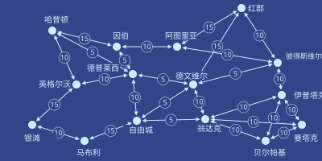

# 第五章

自由城，联合城邦 · 3724年雨月11日

泽从空港的大门走出来，回身把门扶住。

“妈，快点！”他喊道。

泽的母亲敏快步跟上，从门里走了出来。白跟在后面，手里拎着一个购物袋。

三人顺着指示牌走到出租车候车点，把行李塞进后备箱，拉开车门坐了进去。

“欢迎来到自由城，你们俩！”白大声说。

“能来真好。”敏回答。“其实这是我头一回出国。”

“那这地方跟红郡比怎么样？我看你到现在哪儿都去过了。”敏接着问。

“哦，我觉得红郡更好看。可惜北极的无人机一闹，那边整整五天航班全取消了。”

“那真是太糟了。不过到目前为止，我觉得自由城棒极了！也就是说，等我哪天真去成红郡，兴致不会被提前耗掉，到时候对红郡的那股兴奋劲儿，还能跟现在对自由城一样足！”

车里安静下来，三人各自望着出租车窗外。车沿着一条高速路开，路边的楼各式各样——有的矮，有的高；有的石头砌的，有的水泥浇的，有的玻璃配钢架；有的好看，有的难看。有些盖到一半就停了工，像是被废弃了。当中还夹着几处确实讨人喜欢的地方：小公园，长椅，树栽得整整齐齐，人在里面待着，会觉得整座城市的其余部分都不存在。

头顶嗡嗡地飞过几架小型飞行器，有的载着单个乘客，有的运着货——多半是给那些有钱又急得不行的人送吃的。

远处有一片区域明显比别处体面，四周围着一道高高的灰、紫两色相间的墙。坐在右侧的白和泽都把目光转了过去。

“大概是本地的大梅港。”白琢磨着说。

出租车拐下高速路，出了匝道，接着沿一条街往前开，绕过了好几个环岛。

有那么几分钟，路上的人和楼里的陈设，看着都比泽国任何地方阔气得多。忽然，车从一座高架桥下穿过，桥那边的房子一下子破旧了不少，餐馆和店铺也更简陋，外面骑摩托车的人多了起来。

出租车一条街一条街地穿过自由城，泽、白和敏一路看下去，躲在这只安全的茧里打量四周。

又开了五分钟，出租车一拐，驶进一个车库。车停稳，车门打开。

“谢谢！”敏喊道，打开后备箱。三人取了行李，走进酒店。

泽把手表拍到一根一米高的柱子顶上，那里有个绿色圆圈，正中间写着“办理入住”。

过了一个嘀嗒，圆圈响了一声。

<table><tbody><tr><td>

信誉分 ≥ 100已验证<b style="font-size: 150%; color: #8f8">✓</b>

</td><td>

支付成功<b style="font-size: 150%; color: #8f8">✓</b>

</td></tr></tbody></table><b>已入住。您的房间号：714、715、716。</b>

泽、白和敏的手表同时震了一下，确认了各自的房门钥匙。

---

把行李放进房间、冲了个澡之后，泽走出电梯，重新回到酒店大堂。白已经在那儿了，正望着窗外。

“妈说她得睡一觉，我们出去逛逛吧。”泽提议。

白点点头。两人走出酒店，进了自由城的户外天地。

“话说回来，你为什么答应跟我一起来？”白问。

“嗯，这显然是我在很长一段时间内成本最低的一次出国机会。”泽回答。

“半决赛我们俩都赢得很轻松——我的对手根本没料到下到四千回合会突然改规则——我看你赢得还更快。所以决赛就是我和你。”

“所以这是个独一无二的局面。换成平时，这就是个囚徒困境：我们谁都不能歇下来享受点什么，因为只要一方歇了，另一方就会在大赛前猛补，占到便宜。但这次不一样——因为我们可以一起歇，就能确定谁也没在偷偷干别的。”

“而且剩余很可观——我和妈这辈子都是头一回出国。”

“那你又为什么答应带上我？”

“这么一想，差不多是一样的。只是没用那套博弈论去算。”

“不过对我来说，你所谓的‘剩余’，就是跟你待在一起。”

泽哼了一声。

---

泽和白来到一栋楼前，它比周围明显更大、也更气派。

招牌上写着“自由城经济研究所”。

研究所名字的正下方列着一张入场费价目表，票价由一个二元函数决定：随你在里面停留时间的平方根递增，随你的学术与智识信誉分升高而递减。

学术与智识信誉分很难挣。那种可以零知识抵押、用来换贷款或者办酒店入住的信誉分，来得容易；只有赖过账、或者把酒店房间砸过好几回，才会变难。学术与智识信誉分就不一样了，得真做点扎实的活儿才行。

入口设了闸机，上面亮着绿色圆圈。泽和白用手持终端一碰，走了进去。

楼里是一整条螺旋状的坡道，绕了好几圈。沿着外墙走的话，几乎感觉不出坡度——周长大约三百米，绕一圈才升高四米。

正中间是电梯和楼梯，留给想快点上下的人。

泽和白慢悠悠地沿坡道走，不久看见一家餐馆。一男一女坐在那儿，喝着茶，吃一盘蔬菜配米饭。旁边有块大屏幕，正在放一场讲解联合城邦共治制度的讲座。

“两座城市建立共治关系后，各自选出对方议会中的一定比例席位。”

“这个比例出自事先商定的数字。按人口与 GDP 的几何平均来算，较大的一方按商定比例选出较小城市议会中的席位；较小的一方在较大城市议会中的比例，则等于商定比例除以两城规模之比的平方根。”

“你也许会问，为什么是平方根？因为事实证明，较大的参与方持有较大份额的治理权时，那份效用会超线性地大于小份额的效用——”

泽不再听了，任脑子自己转，试着从最基本的原理把这套数学推出来。

白朝桌边那两人走去。

泽还在算那套数学，跟着白走。两人一路走，直到几乎站到了那对正在吃饭的人跟前。

“你们好，两位忙吗？”泽有点局促地冒出一句。

“啊，不忙，一点都不忙。”那女人回答。

“来，跟我们坐吧，我是游客，最喜欢遇见本地人，好多了解了解这地方。”

“啊，我们也是游客，从泽国来的。”泽回答。“我叫泽。”

“我是白。”

“我叫塞拉。”那女人回答。“这位是我的……朋友，扬。”

泽和白坐了下来。

“那你们是从哪儿来的？”白转头问。

“维里迪亚。”塞拉回答。

“我其实就是本地人。”扬补了一句。

“那你们来这儿是做什么的？”

“我是写博客的，主要写经济和文化。我和丈夫刚带完这一轮孩子，孩子现在在共同家长那边，所以我们俩都算是在休假——”

“嗯，也不算真休假，还是在工作。就是一边旅行一边看看。”

“那自由城到现在感觉怎么样？”

“有些方面确实自由。有些方面就不一定了。”

“这里穿隐私袍的人比维里迪亚和泽国都少，那是因为大家都开车出门，有意思的事基本都发生在那些封闭的院落里。”

“泽国怎么样？”

“老样子。读书，下民本棋。我还在琢磨以后是搞物理还是搞密码学。”

“跟他说说你胳膊的事。”白低声说，声音却大到另外三人都听得见。

“哦对，前阵子我们教室被炸，我胳膊断了。”

塞拉和扬都愣住了——先是被这条消息本身，接着又被泽讲这件事时那副满不在乎的样子。

“袭击越来越厉害了吗？”

“他们开始更多地冲教室来。还听说越来越多的监控无人机被偷运进来。”

“那泽国是不是也打算搞一套自己的反监控网络，好跟上形势？”

“问题在于，北极人在各个机构里都有间谍。所以反监控网络要是看得太多，就成了他们自己的武器。”

“所以我们才一直在啃密码学。每台监控摄像头都跑一套算法，只在情况可疑时才吐出数据；每次吐数据就往密码学网络发一个哈希，这样我们就能追踪这种事发生的频率；再加上一整套硬件认证和随机红外扫描，确保摄像头跑的程序确实是它声称的那个。”

“甚至有条规矩：任何人都可以去把公共场所的摄像头拧开，自己检查。还有些俱乐部专门干这个，把报告发到网上。这套东西相当先进。我真希望自己能弄懂这些加密、证明和认证背后的数学到底是怎么回事。”

“得了吧，我们整个去中心化大学分部都知道你是热力学的高手，比老师还强。你完全可以洗点转去密码学，把这些全搞明白。”

“你*是*存心让我没法专心准备民本棋决赛吧？”

一个机器人滑到他们桌边，屏幕上是一份菜单。

白和泽凑过去看菜单，轮流按了几下按钮，要了茶，还点了份蔬菜饭，跟塞拉和扬吃的那种差不多。

“这场军备竞赛占掉你们多少时间？”扬问。

“占多少时间？我们有百分之几的人是全职干这个的；对其他人来说，除了学会怎么保命，这本来不该算我们的活儿。至于占掉我们多少快乐、多少精神、多少魂——那是另一个问题。”

扬和塞拉叹了口气。

几分钟后，机器人端着饮料回来；再过几分钟，又送来了饭。他们吃着，时而说些轻松的话题，听泽和白讲泽国文化的种种细节——民本棋、泽国语、人们盼着国家崛起的那股心气——时而只是沉默。那块屏幕还在讲共治，还在放各种图表和数学公式，这时已经没人再看了。

---

<table><thead><tr><th>来自</th><th>消息</th><th>时间</th></tr></thead><tbody><tr><td style="width: 25%">
格拉迪亚斯
</td><td style="width: 6%; text-align:center">→</td><td>［正在呼叫］</td><td>58130</td></tr></tbody></table>

塞拉点了点手表。

她勉强辨认出格拉迪亚斯的脸。

“在自由城过得怎么样？”格拉迪亚斯问。

“刚跟扬吃了午饭，然后来了两个泽国的可爱孩子。”

“他们怎么样？”

“他们特别好。不过北极人对他们做的事太让人难过了——两个里头有一个最近胳膊受了伤。”

塞拉决定换个话题。

“你最近怎么样？”

“挺好。”

他顿了顿。

“我在琢磨一件事。”

“什么事？”

“最近有人跟我提了个建议——不要去当监审官，改当掌则人。”

“诶！”

“你觉得呢？”

格拉迪亚斯停了几秒，明显是在斟酌怎么回答。

“对维里迪亚来说，这更重要——真正把评则本身定对。而且我觉得这份工作会更有意思。”

“我的第一反应是，我其实支持这个决定。”

“你知道吗，那两个孩子走了以后，这五十来分钟我一直在想泽国。后来扬也很快去开会了。”

“他们从我们的图谱资助里获益不少，对吧？”

“确实如此。”

“可评则呢？评则有没有以任何方式鼓励企业把自家任何一款产品做得对泽国更有用？”

格拉迪亚斯想了一会儿。“没有吧，至少我想不出哪条。”

“那也许你就该去当掌则人。这可以算你的一个项目！想办法制定或调整评则，让它更好地支持泽国。”

塞拉停了一下。

格拉迪亚斯瞪大眼睛，愣愣地看着她。

“对，就当掌则人，肯定没错。这是最正确的选择。”

“会很有意思的。俗话说，Dze go ba fau gie！”
