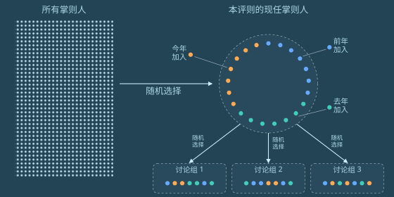

# 第六章

梅尔丹，维里迪亚 · 3724年雨月12日

格拉迪亚斯低着头，慢慢朝自家门口走，好让带兜帽的隐私袍顺带挡住冷雨。门前那一小块地方有片小檐遮着。走到门前，他才慢慢摘下兜帽，从小桌上拿起一个餐盒——泽国餐车的10号，老样子。然后他抬手，把手表贴向门边一个发着绿光的圆圈。

门开了。格拉迪亚斯叹了口气，走进去，任门在身后合上。他沿楼梯下到地下室，把餐盒放在桌上。灯亮了，一段模拟自然声响的柔和背景音缓缓升起，身后另一扇门自动关上。

格拉迪亚斯脱下隐私袍，颈带还戴着，把袍子扔到椅背上晾着，然后坐上另一把宽大柔软的椅子，椅背向后倾了大约四十五度。

手表震了一下——本地网络通过了它的认证，放它接入。

他微微张嘴，通过颈带低声下了一道指令：接通莫夫。

几乎立刻，莫夫就接了。

“你那边安全吗？”，莫夫问。

“我是对着喉震颈带低声说的，你的声音通过耳机进来。我们在一个密封的地下室里，门和墙都贴着隔信箔，外面还套着一栋上锁、隔音良好的房子。外面下着真雨，里面放着假雨声。这样够安全了吗？”

“这年头，谁知道呢。”

“行啊，你要想的话，我可以把假雨声换成一片人声嘈杂，让人声更难被剥离出来，*再*戴上耳机。”

“不用了，就这样吧。你这套布置已经比大多数人强了。”

“我今天就提交路线选择。我要当掌则人。”

静了几嘀嗒。

“什么时候定的？”

“几天前。”

“至少过去一整年，你都铁了心要当监审官。”

“真正能带来改变的权力在掌则人手里。评则本身比——”

“是他吧？那位神秘的绅士，德尔瓦特？”

又静了几嘀嗒。

“塞拉知道吗？”

“当然知道，我两天前就告诉她了。”

“在我之前。”

“那当然，她是我——”

“可你还是没告诉她……你为什么改主意，对吧？”

“你查到的那些东西，就不能直接告诉我吗？”

“好吧，行。”

“还记得我上次跟你说的吧——德尔瓦特一散会，我就跟了上去，结果他直接走到大梅港另一家毫不相干的茶馆，50分钟后在那儿又见了一拨人。他从另一道门出去，我就在那儿把人跟丢了。”

“嗯，我记得。”

“你猜怎么着，这事还没完。我往那两个地方各挑了个不起眼的角落，扔进去一只侦察蝠——两只都被揪了出来，没戏。可接下来三天，我特意来回跑这两个点。前两天两边都安安静静。到第三天，我又看见德尔瓦特了。他每天都换一件新隐私袍，鞋垫重新随机化，步态和身高都跟着变，可他有个弱点，让我认出了他。”

“什么弱点？”

“他的举止。他四下张望的次数比常人少得多，整个人只盯着自己要去的方向。我牺牲过几只侦察蝠，故意弄出干扰的响声。大多数人至少会偏一下头；德尔瓦特不会。”

“我就这么着又找到了他——从一家茶馆走到下一家。”

“这么说他一直在见人？”

“对。也许他想劝去当掌则人的，不止你一个。”

“那我们怎么办？”

“眼下看，只有一条路：先顺着德尔瓦特说的走，同时把眼睛睁大。”

“总之，你该歇歇了。记住，明天我们还要去公民大会。”

格拉迪亚斯挂断了通话。他拿出手持终端，接着研究掌则人的治理结构。

格拉迪亚斯记下：结构跟监审官类似，只是更大——监审官是三组、每组三人，掌则人是三组、每组七人。合议庭不属于掌舵会，但他记得也很像：两对两人各自评议，然后才投票，另有一人专作平局裁决，五个人的意见取中位数定案。掌则人小组比合议庭和监审官小组人多，这说得通：一条评则比任何一次单独裁决都重要。合议庭人少也说得通：五名裁判只负责一轮，而且总能上诉。

格拉迪亚斯在几个界面之间来回切换，翻看这一轮计划评估的评则清单：

<table><thead><tr><th>评则名称</th><th>摘要</th></tr></thead><tbody><tr><td style="width: 5%">5</td><td style="width: 20%">实体空间的应急准备</td><td>设有安全庇护所、耐用应急物资、完全或部分脱离电网的，减税；建筑设计不安全或脆弱的，加税。</td></tr><tr><td style="width: 5%">6</td><td style="width: 20%">硬件开放度</td><td>尊重用户维修权、公开可用的原理图、设计及其他源文件、遵循开放标准的，减税；故意制造不兼容、限制可改造性及相关反竞争做法的，加税。</td></tr><tr><td style="width: 5%">7</td><td style="width: 20%">室内空气洁净</td><td>税率与实测的平均空气质量指标成比例——二氧化碳、 PM2.5及其他主流指标。计算平均时，人员在室时间更长的时段权重更高。适用于容纳20人以上的场所。</td></tr></tbody></table>

格拉迪亚斯继续往下翻掌则人的文档。大约30分钟后，他累了，往后靠进椅子里。他让翡翠根据他看到现在的那些内容出一套测验题，帮他复习。翡翠应了一声，开始在后台干活。

然后他放下手持终端，攒了点力气从椅子上挪到床上，睡着了。

---

3724年雨月13日

格拉迪亚斯出了门，穿着隐私袍，没戴面罩，也没上兜帽。他向右转，沿街往前走。

街道两侧是一排排跟他家一样的房子。人行道两边种着树，投下荫来。大多数房子是几种大同小异的默认样式，米色、浅蓝、灰色，看上去都是最近20年里盖的。

不过大约每十栋里就有一栋带点怪花样。格拉迪亚斯路过的第一栋，阳台造得像科幻片里的飞船。第二栋压根不是标准住宅，而是三栋小房子，一看就是集装箱改的。它们*看起来*倒像是他会住的地方，格拉迪亚斯想，他甚至喜欢看它们，可它们一出现，这片街区就再也谈不上整齐了。

第三栋侧面开了家咖啡馆。几个人站在外头喝茶。格拉迪亚斯想起塞拉几年前的一篇博客。在英格尔沃，这种事绝不可能被允许，他想——住宅区就是用来住人的。代价是：在英格尔沃，你要是住错了地方，去最近的咖啡馆得走一公里半。而在这儿，他没打算找，走了不到三百米就撞见一家。

最后，格拉迪亚斯到了目的地：一个位于街角第一家的小型社区与活动中心。他看见有人陆续进来，有走路的，也有几辆出租车在楼旁街上减速停下。他向右转，跟所有人一样从同一个入口进去。

“莫夫，你在这儿！”他喊了一声——那声音同时低得只有颈带收得到，又冲得让颈带把它当成喊叫。

“啊，见到你真好，格拉迪亚斯！”

“今天大会的主题是什么？”

“在讨论我们想要更多什么样的公共空间，好给面对面社交多造些机会。他们担心这种机会越来越少了——现在大家不只在银聊和蓝鲸上聊，还跟翡翠和别的 AI 聊。”

“有道理。”

他们听见一声哨响。其他参与者开始往其中一间会议室里走。格拉迪亚斯和莫夫跟了上去。

屋里摆着五张桌子，每张配十把椅子，前方是台区，立着一个供单人发言的讲台。格拉迪亚斯和莫夫一进去，就感到一阵微风——吊扇往下送风，同时把从外面抽进来的新风补上。格拉迪亚斯抬头，还看见天花板上似乎洒下淡淡的紫光。八成是远紫外消毒灯，他想。

他们挑了一张桌子坐下。

一个年纪偏大的少女在格拉迪亚斯旁边坐下，做了自我介绍。

“你好，我叫佩莱。”

“我叫格拉迪亚斯。”

“很高兴认识你。”

大约半分钟后，一个男人走上讲台，他的隐私袍也没上兜帽，没戴面罩。他顿了顿，开口说话。

“欢迎大家！”

屋里立刻安静下来。

“第一次来这个大会的，欢迎你们，也谢谢你们到场。我叫阿拉盖尔，做宣谕使七年了。这是本学期大会的第四场，主题是怎么改善维里迪亚的公共空间，让面对面社交更顺畅。”

“不管你是新来的，*还是*一直都在的，都非常感谢你们出席。”

格拉迪亚斯用眼角瞥见佩莱取出一副颈带戴上，转向他，开始低声说话。片刻之后，他的手表震了。手表判断出佩莱想问他什么，自动开了一条通话频道。

“再跟我说一遍，宣谕使到底是干什么的？”，格拉迪亚斯从耳机里听到她问。

格拉迪亚斯还没想好怎么答，莫夫已经接上了话。

“宣谕使是掌舵会成员——掌则人或者监审官——每年被随机抽中退休，去当某种大使，帮掌舵会和公众之间多些理解。我记得图谱资助的成员或者裁判也能当宣谕使。”

“目的是给出一点透明度。掌则人和监审官都很封闭，这是为了不被操纵，可他们也不想让人误会，进而怀疑整套制度。所以宣谕使充当桥梁。他们会把自己的思路、当年怎么做的事全摊开讲——但只在自己已经没有权力之后，这样就没人能影响他们。”

“那所有宣谕使都要主持大会吗？”

“看各人选择。有人演讲，有人写书，有人帮忙组织大会。最不爱跟人打交道的，就只写书，或者在银聊上管几个子论坛。”

“你要是想弄清自己对加入掌舵会有没有兴趣，找宣谕使聊聊也很合适。”莫夫补了一句。

“你想加入吗？”他又问，随即咬住了舌头——他意识到自己差点犯了大忌：在一个陌生人面前暴露了自己掌舵会成员的身份。

“不了，我已经定了。我要读化学。”

“不错！”

“我朋友觉得我不会喜欢，还得拼死拼活。可我喜欢这种挑战。”

他们把注意力转回讲台。

“好，我想请每桌的人轮流讲讲：你在哪个公共空间待过，觉得好、愿意再去。我们做半个长时。我会到各桌转转，有问题尽管问。”

“开始吧！”

阿拉盖尔不再说话，慢慢走下讲台，往房间一侧走去。

格拉迪亚斯这桌，一个中年女人轻轻举手。其他人点头，把第一个发言的机会让给她。

“我很喜欢加拉纳尔广场，就是卡利马尔边上那个，往南大概一公里。我总去那儿喝茶吃东西，看鸟看树。那地方真好。树好，茶好，荫也好，还总有有意思的人过来聊两句。”

格拉迪亚斯插话进来。

“我喜欢它旁边还挨着个游乐场。孩子小的时候，我们一家常去，大人喝茶，放孩子们自己去玩。”

那女人和另外几个人点头。

“那儿还有个小图书馆和科学博物馆！”佩莱补了一句。

她刚说完，他们就听见脚步声。阿拉盖尔走了过来，站在他们旁边。

“阿拉盖尔，”佩莱问，“这些大会的结果，最后到底怎么变成实际的改变？”

“好问题。很多人都在看这些大会在做什么。掌则人讨论税则评则时会查大会的结果，琢磨他们想激励房产的哪些特征。”

“有时候掌则人也会悄悄直接来参加大会。谁知道呢，说不定这会儿就有一位掌则人或者见习官坐在桌边。”他用开玩笑的语气补了一句。

阿拉盖尔停了片刻，又开口，补了最后一句。

“还有图谱资助的成员，以及所有参与二次方资助的人。这是个很值得看的信号。”

就在这时，格拉迪亚斯的手表震了，屋里每个人的手表同时震了起来。

格拉迪亚斯看了眼手表。房间空气过滤器里的传感器检测到了某种流感病毒。

几乎立刻，吊扇转得更快，紫光也更亮了。屋里大约一半人从口袋里掏出面具戴上，有布面的，也有弹性体呼吸器。另一半什么也没做，只是看着。还有很多人戴上颈带，打算接下来的对话都靠它低声说——万一自己就是病人呢：病人不大声说话，传播就少。整个过程显得自然而自动，每个人似乎都尊重别人的选择。

另一个女人开口了。她通过颈带低声说话，可在格拉迪亚斯听来，耳机里传出的声音跟他直接听人讲话一样清楚自然。

“往西再走一公里左右，有个差不多的广场，塔帕亚广场。设施也类似——能坐下，能喝茶，旁边有店。可那边的游乐场简陋得多，我儿子说坐着都不舒服。而且我总觉得那儿没加拉纳尔热闹。所以也许游乐场真的很要紧。”

“塔帕亚的图书馆也是一个样。书要么是些无聊的商业书，要么是没人看得懂的外文——不是古贝尔帕基语，就是哈拉格米尔来的什么东西。”

莫夫又接了话。

“啊，我知道那边怎么回事。有条评则奖励底层铺面的活跃使用，可很多人钻空子——塞进去些理论上达标、实际没人想用的东西。我猜塔帕亚的经营者觉得自己的主要客群不喜欢身边有小孩。”

“那条评则真该改改了……”

佩莱和另一个女人都点头。

莫夫往后一靠，对话继续。别人接着互相问答时，格拉迪亚斯和莫夫都在心里记着：大家说出的偏好里，共同点在哪里。后台的翡翠也在记。

---

离开大会、跟莫夫道过别后不久，格拉迪亚斯到了家餐厅。门在他面前打开。他走进去，坐下。一台机器人滑到他跟前，给他看菜单。他按了几个键，点了水和一份沙拉。

他环顾餐厅。另外有四位客人坐着，都靠窗看景——两位单独坐，一组两人。

单独坐的两人里，一个戴着某种耳塞和颈圈，每分钟大约两次张嘴动几嘀嗒。格拉迪亚斯想，那不是通话，就是某种 AI 辅助辅导。另一个单独坐的人似乎什么也没做，纯粹在看风景。坐一起的那对都是女人，看样子三十几岁，正在聊天。隔着距离格拉迪亚斯能听清几个词——说的是她们儿子快要比的翔球赛。

几分钟后，一个还没完全成年的少年走进来。格拉迪亚斯一眼认出了他：费布里克。

“格拉德叔叔，在这儿碰到你真好！”

“费布里克！”

格拉迪亚斯张开手臂要抱他。费布里克抱了上来。

“上学去？”

“对，去学校。还有两天就考试了！”

“有把握吗？”

“我觉得有！今天考树，昨天我凭记忆从零写了两棵不同的有界深度树，还有基于哈希的前缀树。真弄懂了以后，太好玩了！”

“维尔和黛雅把你们照顾得好吗？”

“他们特别好。跟以前一样，特别上心。天天给我们做好吃的。而且爸给我买了个新算力盒！”

一个服务员把一杯茶递给费布里克，杯子带着密封盖。

“我来付。”格拉迪亚斯喊了一声。“快去上学吧，好运！”

“我想你，格拉德叔叔！”

费布里克跑出餐厅，左转，从视野里消失。

几分钟后，格拉迪亚斯的水和沙拉到了。他慢慢吃完，走到柜台前付账。

桌面一个绿色圆圈的轮廓亮了起来。格拉迪亚斯把手表贴上去。

轮廓变红了。

<table><thead><tr><th>支付被拒。</th></tr></thead><tbody><tr><td>余额不足。</td></tr></tbody></table>

格拉迪亚斯迅速翻了翻手持终端里的几个钱包，才想起自己忘了给自己转钱。他的钱大部分只有两种取法：在家取，或者万不得已时走社交恢复——由预先选定的家人和朋友持有的六把密钥，凑齐其中四把的联合签名。这些人彼此都不知道别的恢复人是谁。

他飞快地想办法。他让翡翠以他的信誉为抵押借一笔钱。手持终端花了一嘀嗒收集作废符、生成零知识证明，然后显示在格拉迪亚斯的手表上供他确认。

<table><thead><tr><th colspan="2">信誉担保借款申请</th></tr></thead><tbody><tr><td>工作经历：助教。  教授和5名学生给出好评。</td><td>作废符：  0x18f4……60c5</td></tr><tr><td>申请借款：</td><td>2773齐普币</td></tr></tbody></table><button>提交</button>

唯一会公开可见的信息，只有作废符和借到的金额。作废符是一段伪随机哈希，由他工作的公开评语以确定却无法关联的方式生成。它会被发布到密码学网络上，防止同一份信誉被拿去抵押两次。证明会确认这个作废符有效、它所代表的信誉足以借出这笔钱，此外什么也不透露。格拉迪亚斯的姓名对任何人都不可见。

格拉迪亚斯点下“提交”，交易飞进密码学网络。两嘀嗒后，交易确认，2773齐普币出现在他的钱包里。

格拉迪亚斯又贴了一次手表。

<table><thead><tr><th>支付成功。</th></tr></thead><tbody><tr><td>基础价</td><td>10.5齐普币</td></tr><tr><td>税额</td><td>1.1齐普币</td></tr><tr><td>合计</td><td>11.6齐普币</td></tr></tbody></table>

在维里迪亚，乃至世界大部分地方，连销售税的支付都是零知识的。只有格拉迪亚斯和餐厅知道刚有一笔10.5齐普币的订单。销售税会实时、自动地送进政府。整套制度的执行不靠审计表格，而靠随机抽查——稽查的人上门点单，核实餐厅每次请求付款时用的都是纳税类交易。

格拉迪亚斯谢过服务员，慢慢走出餐厅。

---

出了餐厅，格拉迪亚斯继续沿街走，又走了几百米后向右转。经过几户人家，小路无缝融进一片森林。再走几百米，两侧开始出现用大石块砌成的房子。

这条路穿过卡利马尔区，格拉迪亚斯以前走过很多次。

他继续走，穿过空中步道，进了隧道，来到那个 Y字形路口。这一次，贴着埃菲里昂勋爵那篇告示的海报不见了。他停了一会儿，然后——也许是他这辈子第二次——在路口向左转。他继续往前走。

小路很快回到地面。它从几条高速公路下面蜿蜒穿过，但一路上都有树遮着——*尤其*是公路在头顶的时候。

高速公路底面的涂鸦，还有底下的脏东西，感觉都比平时多。格拉迪亚斯说不准是最近打扫得不够勤，还是就这条路因为什么缘故没怎么维护。

不久，路开始向上弯，接成山侧一段笔直的露天阶梯，高200米。这地方格拉迪亚斯只来过一次：被授为见习官那次。

他爬了大约10分钟。运动量加上隐私袍，让他浑身发热，尽管外头很冷，也几乎要出汗。终于到了顶。小路又变成隧道。隧道很快变成阶梯，爬完两段楼梯后，天光重新出现。格拉迪亚斯此刻站在一座塔顶层的空地上，四周是石墙。他能看见头顶的天空。身旁是一个绿色圆圈，比平时更大、更亮。塔边缘的座位上坐着十名掌舵会成员，全都穿着隐私袍。

格拉迪亚斯把手表贴向圆圈。墙上各处此前他没注意到的灯亮了起来，是一种独特的绿色。

几乎立刻，一名掌舵会成员开口了。

“欢迎，见习官。”

“你们可以叫我——”

“我们不该知道。保证这套程序落到正确的档案上，是密码学的事。”

“那我猜，你们可以按我证明里那个作废符的数字来叫我。”

几名掌舵会成员的身子不自在地绷了一下。他们没料到这场本该庄重、基本全程无声的程序里，会有人这样接话。但也有几个人往前倾了倾，像是乐见一点变化。

“好吧， 372ef。你做好选择了吗？”

“做好了。”

“什么选择？”

“我申请成为掌则人。”

静了几嘀嗒。

“372ef，你可以再把手持终端贴一次圆圈，确认你的决定。”

格拉迪亚斯把手持终端贴向圆圈。

<table><tbody><tr><td>申请已确认。</td></tr></tbody></table>

