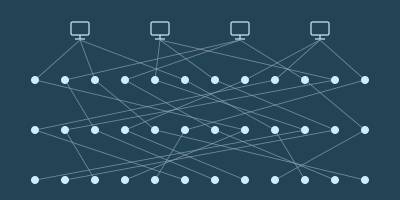

# 第九章

帕佛盖都，泽国 · 3724年雨月28日

白和芬坐在一处院子里，边吃边喝。白脸上淌着泪。

“你知道吗，泽这孩子其实挺好的，”芬轻声说。“你要是能对他好一点，他能帮上你大忙。”

“好一点，像你这样？”白反问，语气发苦。

芬犹豫了。他不知道该怎么接话。

“你知道泽带着他妈，跟我一起去自由城那一趟，我是什么感受吗？”她问。

“难受，因为你本想跟他单独走这一趟，可你看得出来，他并不想？”芬问。

“不是！”白喊道。

“我给你个提示。前几天那盘棋下完，你提议下一趟让我带上我妈，我当时就是那个感受。”

“你不喜欢你妈？”

“你从来没问过我妈是谁、在哪儿！我们见过十多次面，你一次都没问过。”

“好吧，抱歉。你妈是谁？”

“我妈死了！我爸也是。”

“我还小的时候，他们死在一场实验室爆炸里。是谁干的，你知道。”

芬的脸沉了下来。

“我住在姨妈家。可她基本不管我，给我一间房，一天两顿饭，就这么多了。”

“所以我只能靠自己活下来。学着怎么自己挣钱。上高中的时候就在打零工。”

“所以，以前那几次我不让他拿奖金去给他妈买算力盒，希望泽能原谅我。”

“我连妈都没有！我只有我的成绩、我的成就。现在连这个也被泽拿走了。”

她安静下来，往椅背上一靠。这些话她原本没打算说。停了一小会儿，她又开口了。

“可泽那几手棋，真是漂亮。我沿着对角线布下那么完美的防线，把他骗到那里去进攻，当时我特别得意，觉得那是我这辈子做过最聪明的一件事。结果他一出手，做了件更聪明的。”

“我确实想更懂你们。你们是被什么驱动的，又是怎么想的。”

白和芬都停了下来，各自喝了几口茶。

“换个话题吧。来，你想不想看看他们打算把泽国语下一版做成什么样？”

白的眼睛一亮。

“行啊，看看。”她回答。

芬掏出他的小册子，封面上写着“po so dze go ban de sia”——“泽国语第九版的构想”。

“泽国语是一部杰作，”芬解释道。“它始终在几者之间艰难地保持平衡：既要容易学、语法有逻辑，又要说着顺口、读着舒服，还得能用来谈现实生活里人们真正在意的事。”

“最早那几版，是在上个世纪我们输给北极人那场战争之后只过了十年就着手做的，内容简单，也没什么争议：把图画文字换成字母，砍掉复杂的变格、变位和不规则动词。”

这时候，白已经听得入了神，眼里全是好奇。

“接下来是语法上更难的取舍。泽国语的语法可以非常有逻辑——只要你想让它有逻辑。拿个小学水平的简单句子来说：‘giu jan li mo fe jia dzu lie’。那人吃牛油果。‘li’是主语和动词之间的分隔词，‘fe’是动词和宾语之间的分隔词。计算机程序能直接解析，毫无歧义。”

“还能更复杂。‘lo mo fe jia dzu lie zo hen jun’。吃牛油果有益健康。‘lo’和‘zo’是开括号和闭括号。口语里，‘lo’可以省掉。”

“但这样就有了歧义。拆开看‘jia dzu lie’——黑心果。它是中心是黑色的果，还是既黑、又在某种意义上是‘中心’的果？理论上我们有专门的分隔词：‘ji’。我们可以说‘jia dzu ji lie’，歧义就少一些。但歧义永远无法彻底消除。木瓜籽的中心也是黑的。”

“所以必须在规则性和实用性之间找平衡。聊日常生活里常见的事时，得好说、好听。于是班孙培的祭司们就去试着优化意义空间的规则性，尽管他们清楚自己永远不会——也不可能——完全成功。”

“只要你掌握那256个词根，人们说的话你就能听懂超过一半。不是全部，但比从前好得多——从前，一个复杂的词，你没见过它本身，就完全猜不出它是什么意思。”

“他们为什么在这上面下这么大功夫？为什么不多花点力气去搞经济、搞技术，或者搞军事之类的？”

“这个嘛，我们要是去搞那些，北极人就炸我们。语言是无害的。我觉得连北极人都觉得泽国语了不起。另外，班孙培还有几次腾出手来改革计时体系——一分钟一百嘀嗒、一长时一百分钟、一天十长时，就是这么来的——而且我们让这套东西在全世界扎了根。连北极人都采用了。”

“你们是不是还有一本秘密教科书，里头连那个的第九版都规划好了？”

“有。我们想在某个时候用光尺取代米。光每一嘀嗒走十亿光尺。一光尺等于259.020683712毫米。”

“听说英格尔沃人挺喜欢这个。他们的旧计量单位被人数落了那么久，说又复杂又没逻辑；现在我们推出的这个单位，长度跟他们过去用的长度单位很接近，而且是直接建立在宇宙最基本的物理常数之上的。所以某种意义上，我们是在说他们一直是对的。”

白笑了。

“总之，泽国语的下一版——”

白打断了他。

“下次吧。这些让我挺好奇的，我觉得哪天该自己去研究研究泽国语的历史。”

“直觉不错！我保证，等讲到第九版会更有意思。泽自己看不到这些的价值，他最近满脑子都是棋。”

“我想也是。而且我看这事不会停，对他来说显然回报很丰厚。”

“也许我该找个时候跟他下几盘，图个乐——或者说，对他来说算练棋吧。”

“哦，还有，谢谢你岔开话题，让我心情好起来！”

---

泽穿过隧道，顺着手表给的指引走下楼梯。每到岔口，他都会四面看看，把周围的环境看个仔细。他从没进过这座山体金字塔这么深的地方。

最后，他来到一扇密封的门前，门边有个绿色的圆圈。他把手表贴上去碰了一下。门缓缓打开。

门后是一间又窄又长的屋子，屋子尽头摆着一张长桌。桌边坐着一个人，披着一件暗影般的斗篷——不是维里迪亚的隐私袍，而是民本棋祭司的服饰。

泽慢慢走过屋子，在祭司对面坐下。

“欢迎。”祭司轻声说。

“我很荣幸能来这儿，”泽回答。“不过……您是谁？”

“我叫登，昆高培最高评议会的成员。谢谢你来。”

“昆高培？我们也有自己的秘密防卫组织？给泽国再养一支影子军队？”

“当然。你意外吗？”

泽犹豫了。

“前几天那盘民本棋，你的表现让我印象很深。”

“但让我印象深的，不只是你赢了。我把那盘棋的棋谱研究了一遍。让我印象深的，是你下出的那种策略。”

“说说看，你学过密码学吗？”

“我……知道点基础？大数分解很难；加密就是把数取立方，再对 n 取模；只有知道构成 n 的 p 乘 q 的人，才能把取立方反过来解密。”

“不不，那是科普层面的密码学。基于大数分解的那套东西，已经几十年没人用了；连椭圆曲线都过时了，因为大家都担心北极人哪年就搞出量子计算机。”

泽没接话。他回望着对方，一半是长了见识的受用，一半是好奇：这场对话到底要往哪儿去。

“好。我觉得你上一盘棋，已经快从零开始把密码学的很大一部分发明出来了。”

“想想混淆协议。你想把一段程序交给别人，让他能运行，却看不到程序内部的细节。我们现代的密码学网络——比如给泽国的秘密组织处理支付、信誉，并管理治理事务的那些——全都靠这个。”

“可你怎么做出一个能干这事的统一协议？把程序藏起来？把数据藏起来、再在隐藏的数据上做加法和乘法，这很好理解，尤其是把数据藏进大向量里、套上线性变换、再在上面叠一层误差。可你怎么把程序藏起来？你到底要把程序藏进一个什么样的‘可能程序’空间里？”

“解法——好吧，是某一类解法的一小部分——是造一个元程序。一个能根据输入运行任何程序的程序。这样一来，程序就被化约成一组数字，你只要对它们做加法和乘法就行。”

“这是计算机科学里最基本的把戏之一。我们的计算机，那些硬件本身，就是元程序。但你自己琢磨出了它一个非常基础的版本——仅仅十六种可能的算法，熔进一座工厂——再用它，加上一个藏起来的滑翔机来提供输入，把意图藏住。”

泽点点头。

“谢谢您的夸奖。不过……我现在很好奇，您说这些是要往哪儿走？”

“泽，我想把你招进防卫体系。”

泽眼睛睁大，嘴也张开了。

防卫。泽下意识地一张一合左手的每根手指。那条胳膊断过，养了一个月才好，起因只是一堂热力学课。而登说的这个，可不是上课。

可他的命，恰恰是被这种工作救下来的——一次秘密而配合默契的临时换房。也许这就是他的机会，能替别人做同样的事。

“我确实希望你把民本棋一路下到全国赛。我觉得这对你有好处。但学业上，去学密码学。我想这对你的棋也有帮助。”

“当然，这一路我都会跟你保持联系。等你准备好了，我会开始给你派些任务。”

泽又一次用沉默作答。

派任务。他注意到，登很快就换上那副腔调，仿佛泽一定会照他的计划走。他心里有一部分已经在给自己找答应的理由；另一部分则看着自己的热情一点点涨起来，并不完全信它。

“我有个主意，”登开口了。“你知道芯片验证是怎么做的吗？比方说，我现在是怎么自动把你身上所有电子设备都确认成友方的？”

登一说完，泽就开口了。纯属运气，登挑来考他的，正是他确实研究过的应用密码学领域之一。

“设备制造的时候，生产过程中会生成一个物理不可克隆函数——那是芯片造好后冷却、化学物质沉降下来时生成的一把密钥。连厂商都不知道它是什么。厂商会去探取设备的公钥——也就是那个 p 乘 q，不过我现在知道了，根本不是 p 乘 q，是完全不同的东西。然后厂商用自己的密钥给这把公钥签名，再把签名发布到密码学网络上。”

“行吧，把函数叫成密钥也算，差不太多。继续。”

“作为用户，你可以让设备对一个值签名。设备会照做。然后你拿从密码学网络上下载的公钥去验这个签名，确认它确实来自那家厂商。”

“然后还有公共检查员。他们随机从厂商那里买设备，用某种扫描手段做破坏性检查，验证芯片里的逻辑确实和它应有的设计一致。”

“为什么要上密码学网络？直接签名不行吗？”

“这样你才知道总共有多少，也防住一种攻击：厂商作弊，或者有人黑了厂商的密钥，然后开始多签一堆本不该签的公钥。而且这样一来，你也知道签名是什么时候做的，从而知道它是在设备制造的时候签的。万一厂商的密钥被偷了，你还能分辨签名是在失窃之前还是之后做的。”

“那我要怎么验证你的设备？”

“无线问它要一个签名，跟我验证它的方式一样。”

“我怎么知道它不是把别处另一台设备的回应转过来的？”

“在这儿，因为我们深在山里。一般来说，我不知道。”

“芯片检查的流程是怎么走的？”

“这个我不知道。”

“检查员怎么知道他们拿到的设备，和普通消费者拿到的是同一批，而不是厂商特意挑出来骗他们的？”

“我不知道。”

“我们先想另一个场景。就说公共监控摄像头，装在路灯杆上、楼外墙上，或者巴士上的那些。每个泽国人都有权时不时随机挑一个，拧下来自己分析。正因如此，我们才知道它们只在该录、该传的时候录和传；从制造到安装，供应链上没有任何人能给它做手脚，把数据泄露给跟踪狂、内幕交易者或者北极人。”

“这就是随机检查机制——前提是那些把检查摄像头当爱好的人里，至少有一部分真的是随机挑的。这套适用于监控摄像头：它们本来就摆在公共场合，谁都能随便挑一个去拧。那这里呢？从厂商手里买的电脑芯片，怎么做随机检查？”

“好，那您说。”

“很好，我很高兴还有不少东西能教你。要不我们现在就去其中一家厂看看？”

泽想了一下。他给自己找了个理由：这还不算正式的承诺；而且那是他从没见过的东西。

“好啊，很乐意！”

泽和登走出屋子，穿过隧道，来到金字塔一个较小的出口。出口直通一辆长方形黑色轿车的内部。金字塔的门和车门形状一模一样，紧紧贴在一起。

泽和登上了车。

车门密封合上时，泽注意到车厢内壁衬着隔信箔。车上有窗，但从里面看出去，外面的世界像蒙了一层暗色；他知道，从外面往里看，几乎什么也看不见。

车开动了，一分钟后驶进一条隧道。

那一刻泽意识到，这世上已经没有人知道他在哪儿了。

---

泽和登下了黑色轿车。这一次，车门正对着一扇敞开的门，门里是一道通往地下室的楼梯；外面的人连一嘀嗒都别想看见他们。两人走下楼梯，最后进了一间大屋子。

眼前是成千上万个白色的空盒子，侧面贴着带二维码的标签；一台机器正把从隔壁屋传送带上送出来的芯片自动装进盒子里。

登打开手持终端，给泽看了一张图。

“你以前见过这个吗？”登问。

“某种互联网的结构图？”

“这是混网。交易就是靠它进到密码学网络上的，而没人能看出是谁发的。”

“每个发送者的每条消息，都裹上三层加密。这个最外层的消息会被送到第一层的一个节点。”

“第一层的节点拆开最外面那层加密，看到里面又是一条加密消息，还附着一个地址，指明该把它发给第二层的哪个节点。”

“第二层的节点拆开下一层加密，看到里面又是一条加密消息，还附着一个地址，指明该发给第三层的哪个节点。”

“最后，第三层的每个节点拆掉那一层加密，拿到目的地址和真正的载荷。当然，通常载荷本身也是加密的。”

“哇，我没想到是这么运作的。所以要三个节点合谋，才能查出一条消息的发送者。”

“不只是三个节点——是三个随机抽选的节点。如果你特别多疑，还可以把最内层的载荷做成又一个信封，要求让这条消息在下一轮再回到系统里走一遍。”

“所以打包这一环做的就是这件事。那些盒子高度不透明、带防拆封口，二维码就是加密后的载荷。这是混网，只不过送的是实物。”

“你要是通过这套系统买东西，三个节点里只有最后一个知道你的地址，而它既不知道发件人是谁，也不知道送的是什么。如果你多疑到了极点，还可以把地址填成公共自提点，自己去取。”

“检查员也从混网下单。所以作为消费者，只要你也从混网买，你拿到的芯片就和检查员买的是同一批——厂商要是想让检查员拿到一块能过检的真芯片，几乎就不可能不顺手也给你一块。他们分不清哪块芯片——或者经这套系统流转的别的什么实物——会到谁手里。”

登于是朝一扇门走去。泽跟上他。

登把手表贴到一个泛着绿光的圆圈上。门开了。

他们穿过一条走廊，拐了几个弯，又过了一道门，进到一间摆着一台大型显微镜的屋子。

“这是这家晶圆厂的检测中心。他们既检自己的芯片，也检别家生产的。”

“他们会用不同波长做多种三维扫描，确保芯片的实体与规格完全一致。”

“佩服。替我谢谢那位批准你带我们参观的人。”

“我会的。对了，泽，我记得你还有个问题。”

“记得。不过那问题跟制造无关。”

“没错——是问验证的人怎么知道回应不是从另一台设备转过来的。这个答案我也能告诉你。我的手持终端上跑着一套协议，会反复联系每台设备一百万次，要求整套协议在十分之一嘀嗒内跑完。所以无论签名从哪儿来，它必须在五十光尺以内——差不多十三米——实际上还要更近，因为芯片本身也有延迟。”

“那么，泽，你怎么想？”

“您说过我还能打全国赛，对吧？”

“我是**希望**你打全国赛。”

“好，我加入——至少我可以先承诺把学业转到密码学，看看走得怎么样。”

登点点头。

登继续往前走，泽的思绪飘开了——先飘到就在眼前那台大型显微镜上，然后飘到别的事情上。

他开始想那天下午要怎么跟妈妈说。他可以说芬忙，说自己出去散了会儿步。但他不能把真相全说出来。昆高培不许——而且妈妈已经看过他挨过一次炸弹后养伤的样子。
