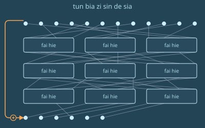

# 第十二章

萨祖都，泽国 · 3724年草期22日

火车开始减速，泽向车窗外望去。

起初，他看到的是树。接着，建筑开始出现，越来越密。最后，几分钟后，他看到了车站。

一块招牌缓缓从车窗外掠过。

sa dzu du

“主城”——泽国这座名字起得十分贴心的首都。

火车停了下来，泽听见车门打开。其他乘客纷纷起身，开始收拾自己的东西。

泽决定不急着抢先下车，不如把这段时间用得值一点。大约两分钟里，他把和 AI 下到一半的那盘民本棋收了尾。

芬一直没腾出手写那套训练框架——用来微调 AI，让它在自定义规则下也下得好——所以泽对上的仍然是原装 AI。

就在这时，其他 AI 认输了。泽一个人赢了3个。为了弥补它们水平不够，他调整过规则：只给自己一个角，另外3个角给3个 AI，还让它们3个组成一队来对付他。即便这样，泽还是赢了。他发现三打一其实也没帮上 AI 多少忙——这种打法不在它们的训练数据里，于是它们犯了低级错误，还互相蚕食对方的负熵。

泽收起手持终端，叹了口气。

到这时，其他乘客几乎都下车了。泽抓起行李，起身，也开始往车外走。

他走出来时，6个人穿着民本棋祭司的袍子，正等着他。

“欢迎来到萨祖都，泽”，领头的祭司——一位资历更深的女性，和穆年纪相仿——对他说。

“能来这里，我很兴奋”，泽很快答道。“这才是我第二次到首都。”

“对了，我叫苏。我是全国赛的组织者之一。”

“幸会，苏。”

“那接下来几天，我都有什么安排？”

“先去酒店办入住，明天早上是开幕式。32位选手，全泽国最聪明的民本棋年轻头脑。你会见到他们所有人的。”

苏把泽带到一间满是门的房间。其中一扇门滑开，门后停着一辆黑色轿车，和几个月前登带他去晶圆厂时坐的那辆一模一样。

“抱歉，泽，我只能送你到这儿了。半个长时后还有一位选手坐火车到这儿。路上顺风，好好休息。”

“太谢谢您了。”

泽上了车，车门合上。车开动了。

泽望着车窗外，惊叹于城里的建筑和树木。有些地方看起来和帕佛盖都差别不大，只是这里的电子产品店更少，取而代之的是种类更杂的场所。还有些药店。

一家店铺的橱窗上，泽看到一块招牌：

ti ka dia shu fe cen su jui hui

“长寿套餐，此处有售”

很快，这些药店换成了卖艺术家具和其他家居用品的店。

再往后，是几家样式仿泽国中古时代的餐馆和茶馆。

有一瞬间，右侧的建筑忽然断了，泽看见一座公园。公园后面立着好几座山体金字塔，每一座大约只有帕佛盖都南边那座的一半高。

一分钟后，公园到了尽头，车驶过一座横跨小河的桥。泽能看见前方的建筑越来越密。

路面缓缓沉入地下，变成一条隧道。

几分钟、几个转弯之后，车停了。车门打开时，正紧紧贴着另一扇门，外面的人——无论从车外还是从那栋楼外——都看不到泽。

泽下了车，人已经在一家酒店里了。

他走到最近的绿色圆圈前，用手表碰了一下。

<table><tbody><tr><td>

sen hen zi li die fe 150 zo lia kin<b style="font-size: 150%; color: #8f8">✓</b>

</td><td>

man dun li jie hu<b style="font-size: 150%; color: #8f8">✓</b>

</td></tr></tbody></table><b>cau tie zen ci fan zi li 304</b>

信誉分高于150，已验证。无需付款。已批准，房间号304。

泽的手表震了一下，确认了房间钥匙。

泽进了房间，冲了个澡。

他随即睡下了。

---

闹铃响了。

泽点了点手表，看现在是什么时间。30,003，手表显示。距离开幕式只剩半个长时。他在客房服务的菜单上按了几个按钮，点了一杯果蔬汁。

他穿好衣服。

3分钟后，果汁送到，泽很快喝完。他立刻觉得精神起来了——至少，精神足够支撑他去场馆跑一趟。

他没再多耽搁，开门下楼。

一辆黑色轿车已经等在那儿。泽穿过大堂，径直从已经敞开、紧紧抵在一起的酒店门和车门之间跨进车里。门合上了。

车一动，泽就掏出那本密码学教材——登在之前一次见面时推荐给他的——从上次停下的地方接着读。

这一节讲的是哈希函数。书页中间有一幅大图。

“哈希算法的构想”。

泽读起旁边的文字。

书上说，哈希算法的作用，是为一大块信息生成一个缩小后的指纹，而这个指纹仍然能唯一标识原来的信息。它的目标是：要想找出两段哈希相同、内容不同的数据，在计算上难到不可行。

哈希天然会销毁信息——用一个更小的东西表示一个更大的东西，本来就是它的全部目的。但这里有个悖论：在我们造出的所有最好的哈希函数内部，最大的一块部件却是一个**保熵**变换：一个置换。

这个核心部件把输入一一映射到输出。不仅如此，正着跑、倒着跑，它都能高效执行。收缩和不可逆，则来自顶层薄薄的一层：一次删除，再把被删掉的那部分原输入异或之后附在末尾。

为什么要这么做？为什么要把不可逆建在可逆之上？原因很微妙。如果你直接把不可逆做进去，就控制不了熵在什么时候被销毁。一个不可逆的轮函数只要反复应用足够多次，大约一半的熵就会坍缩，协议的安全性也跟着一起垮掉。所以，哪怕销毁信息就是你最终的目的，最好也把负责这件事的那一块干干净净地单独分出来——按照你自己的意愿，在算法里一个精确的位置上销毁信息。

泽收起手持终端，向后靠去。

这一切都是熵，对吧，他暗自想。

一分钟后，车突然减速，向左拐。泽从右侧看到一片被警戒带围起来的区域，里面深处停着各式大型车辆。

“出什么事了？”泽问，声音放得足够大，司机绝不会听不出这是在问他。

“一家尖端生物学研究实验室炸了。多半又是北极人干的。他们得花好几天清理，确保一切安全。”

几分钟后，车减速停下。车门打开，正对一条走廊。

---

泽穿过走廊，走下楼梯。

他看见面前有一扇门。门的样子和帕佛盖都那座山体金字塔里民本棋房间的门很像：一排排石砖，靠近顶部弯成拱形，顶上刻着那个标志——两条横向伸出的手臂，在中间以拳头相撞。

不过这扇门明显更大，维护得更好，装饰也更气派。

泽用手表碰了碰绿色圆圈，门开了。他走了进去。

他走进一间摆了约50把椅子的房间，已经有大约20名选手落座。台上，他认出了苏。她身边还站着另外3位祭司。

泽坐下。接下来15分钟里，其他选手陆续在自己的椅子上落座。

一个年纪偏大的少年在泽旁边坐下。

“你好，我是德鲁因”，他说。

这名字一听就不像泽国名字，泽想。

“我是泽。”

“你从哪儿来？”

“啊，我是红郡人。名字就露馅了吧？”

泽笑了。“大家的反应都这样吗？”

德鲁因也跟着泽笑了。

“在这儿他们叫我 De lu hin。‘一副叉子的模样。’名字挺可爱吧，你不觉得？”

“你在这儿念书吗？你父母移民过来的？”

“啊，我是外籍选手。这次他们请了4位外籍选手进来，让比赛更有意思。”

“你兴奋吗？”

“当然。其实我这还是第一次来泽国，地方太酷了。”

铃声响了，选手们很快安静下来。

“欢迎来到民本棋全国锦标赛”，苏开口道。“很荣幸今年能见到这么多出色的选手。希望每一位抵达的选手，都度过了愉快的夜晚和早晨。”

“我很高兴向大家介绍我们的总负责人——督赛官金。”

另一位祭司走上前，开始讲话。

“对我们在泽国的所有人来说，这都是一个特殊的时刻。这不只是为我们，也不只是为你们，而是为全国千千万万观看比赛的泽国人——他们将看到泽国新一代最聪慧的头脑在这里彼此交锋。”

“我也很荣幸地宣布，今年有4位尊贵的外国来宾与我们同场竞技。”

“今天，我们会在这座山体金字塔里参观民本棋博物馆。明天，我们会带你们游览萨祖都的几个地方，晚上你们可以休息。游览结束再过两天，锦标赛的第一批对局就将开始。”

“资格赛共6轮，每场之间都有8天的长休。”

“你们32个人里，胜场最多的4名选手将进入半决赛。如果找不到一个胜场数刚好只有4个人达到，我们就按两项的几何平均值来排名：一是在败局里撑过的回合数，二是在胜局里所用回合数的倒数（两项都最多计到8,000回合）。这样一来，8,000回合之前认输就没有任何好处。如果还是分不出高下，就再加赛一轮资格赛。”

“我希望你们享受比赛，享受萨祖都的一切，但同样重要的是，也享受彼此的相处。在这里，你们不是敌人，只是暂时的对手。离开棋场，你们应当把彼此当作朋友，记住我们所有人都在做同一件事。Dze go ba fau gie。”

“Dze go ba fau gie”，所有选手齐声回应。

“现在，请大家跟着苏走。她会带大家参观博物馆。”

---

3724年草期25日

<table><thead><tr><th>zan</th><th></th><th>tie</th><th>tei</th></tr></thead><tbody><tr><td style="width: 25%">
白
</td><td style="width: 6%; text-align:center">→</td><td>[dia lau shau]</td><td>23098</td></tr></tbody></table>

泽醒了。白在请求通话。

泽点了点手表。

“你那边的进展怎么样？”白问。

“这个点打电话有点早吧？闹铃还有19分钟才响呢。”

泽顿了顿，决定还是回答白的问题。

“一切顺利。3天前在博物馆看了个特别有意思的展览，第二天又在萨祖都逛了不少地方。还遇见了一个红郡来的人。”

“选手？”

“对，他们今年打算办得国际化一点。”

“帕佛盖那边怎么样？”

“问点我答得上来的。过去这一个长时，我一直在河对岸盯着你即将比赛的那座山体金字塔。”

泽坐了起来。

“你在这儿？”

“登的人找上我，让我过来把选手们的战术都记录下来。”

“你今天第一盘，对吧？”

“确实。”

“要不要我过去帮你一把，或者至少看着？”

“我……觉得不用。而且我怀疑你弄不到现场场馆的票。”

“你放我进去，不就有票了。”

泽无奈地叹了口气。

“那我就远远看着。我们都给你加油！”

“芬怎么样？我已经好几天没他的消息了。”

“大概在忙班孙培的事。他也好几天没跟我说过话。”

“那好吧。我得开始准备了。祝你今天过得开心！”

“也祝你好运，你会需要的！”

“哦，还有，明天我们下一盘练习棋吧。”

泽又叫了一杯果蔬汁，穿好衣服。几分钟后，果汁送到，泽很快喝完。他开门下楼，坐进等在那儿的车里。

20分钟后，车到了金字塔的一个入口。

泽下车，开始沿隧道往前走。

走了几百米，拐了几个弯，他又一次来到那扇巨大的石砖门前。他走进去，这次径直向右，拐进一条3天前第一次来时根本没注意到的走廊。他跟着指示牌走，很快就到了一间等候室。

他看见了苏，还有另一位选手。

“欢迎你，泽！来见见博。”

“幸会，泽。”

“也幸会，博。”

“今天会是一盘有意思的棋，我敢肯定。”

一个机器人过来，给他们3人各送了一杯茶。3人各自喝完了。

“那现在呢？我们就在这儿断网坐一个长时，看着别人先下，就为了不让我们提前知道新规则？”

“正是。而且手持终端和手表都不许带。机器人马上会来收。你们可以用那边那块屏幕看去年的对局。”

---

一个长时后，电梯门开了，泽和博各自走进自己要坐的那部电梯。苏朝他们挥手道别。门合上了。

又过了四分之一分钟，泽的电梯门再次打开，露出一间比帕佛盖都那间大得多的巨型房间。大约5,000到1万人在观看。一条小路亮了起来，指向一张巨大的控制台和一把椅子。

泽往前走。远处，他隐约辨出博的轮廓也在往前走。他走到椅子前，坐下。

无人机嗡嗡作响，围着泽飞，机身约莫手持终端那么大，检查有没有任何作弊设备。这一次，无人机的数量大约是帕佛盖都那场的3倍，形状和大小也更加五花八门。它们嗡嗡地飞了大约20嘀嗒，然后退回了各自的停靠位置。

一个响亮的自动语音播报——这次听着更偏女声：“MU GU GEI FA”。50嘀嗒后开始。

泽闭上眼睛，吸气、呼气，尽力让自己平静下来。他知道，这一盘并非决定性的一局：就算输了，他还能在后面的比赛里补回来。可换个角度想，这反而让他更怕：既然有了“输了也没关系”这个借口，他还能不能提起那股劲，把全部注意力和心力都压在棋盘上，去赢下这一局？

“LE MU GEI FA”

泽又睁开了眼睛。

“PA GU GEI FA”

泽耐心等着。

“欢迎来到今天北场馆的第四场资格赛。各位，来认识本轮的两位选手：来自帕佛盖都的泽雷民，以及就来自萨祖都的博祖梅。”

“我也很高兴宣布今天的规则变动——这种话，观众们或许已经听过太多遍，但对我们的选手还是头一回。今天，民本棋将在六边形网格上进行。”

泽惊讶地张大了嘴。

“你们有20分钟时间，尽可能把自己要用的结构——滑翔机、飞船、墙——都设计出来。然后，一场在雪花之野上展开的静谧之战就要开始。”

泽的显示屏亮了，他看见面前那张六边形网格。

“LE FI SHI GEI TAU FA”，响亮的自动语音喊道。战斗将在2,000嘀嗒后开始。

泽先在沙盒里随手乱涂些乱七八糟的东西，看哪些能保持稳定、哪些会变成滑翔机。一分钟内，他就找出了几种滑翔机和几种可以用作墙的静态结构。让他意外的是，跑得最快的滑翔机是朝……正东方向移动的。

接下来，他刻意画出各种形状的墙，再把滑翔机朝它们放过去，看哪种能奏效。

他仔细盯着那些滑翔机，想尽快凭直觉弄明白：什么样的形状能在移动时保持自身形状不变。他反复定义了好几轮滑翔机和墙。

“PA MU GU GU GEI TAU FA.”战斗将在1,500嘀嗒后开始。

泽开始拿形状和他那枚符记类似的图样做实验，看有没有哪个能当滑翔机用。他必须想出点名堂——否则他只能推进得极慢：每到干预回合，就在已有的符记旁边再造一枚新符记。

他意识到，要真正取得突破，就得学会跟石阵打交道。他猜了几种民本棋六边形版本里石阵可能的形状，再一次次观察滑翔机撞上去时的表现。

“FI SHI GEI TAU FA.”战斗将在1,000嘀嗒后开始。

泽开始冒汗。到现在为止，一无所获。他试过的每一种滑翔机、每一种可能的石阵形状和每一种偏移量，都没能让他复制出自己的符记。

他更仔细地回想自己那枚符记的确切形状。

又白试了两分钟后，泽忽然想起不到两个长时前读过的那本教材。

<blockquote>核心部件把输入一一映射到输出。不仅如此，它无论正着跑还是倒着跑，都能高效执行。</blockquote>

但和哈希函数不同，这里末尾没有那层先截断再异或的包装。所以，只要他知道自己想要的终态是什么，把那个终态丢进沙盒、倒着放就行了。

可是……怎么倒着放？

在哈希函数的内部置换里，你要从最后一层往回走到第一层，每走一步就把那一步取反。

可这里……泽这辈子第一次接触的这套六边形规则，它的逆是什么？

泽拿他看到的那些滑翔机，试了最基础的几种变换：翻转、旋转60度、晚一个时间步发射。全都不奏效。

“MU FI LE GEI TAU FA.”战斗将在500嘀嗒后开始。

泽把每一步都放得更慢，一步步看过去。然后他看破了。每个步骤里，棋盘都会划分成三角形，六边形在各自所在的三角形内部旋转——三角形里填了一个六边形，就顺时针转；填了两个，就逆时针转。

所以要倒放时间，他只需要……让每一个时间步发生两次。毕竟，120度旋转的反向就是两次120度旋转。可还有个问题：每走一个时间步，三角形的划分方式就会错开。所以要把一个时间步倒放，他得……先前进一步，再把时间往回拨一步，好让下一步能在同一套划分下继续往前走；然后再往前走一步，把这套划分下每个三角形里的累计旋转凑到240度；接着把时间往回拨两步，让棋盘切回上一套划分。把每一步都取反，再按相反的顺序播放——就跟在哈希里求一个置换的逆一样。

他确认了一下：界面上有一个按钮可以让时间前进一步，还有两个按钮可以把时间往前或往后拨。那就只能这么办了。A、B、A、B、B。像是某种电子游戏的作弊码。而从某种意义上说，它在这里真的就是作弊码。

行吧，他想。

他把一架滑翔机放进沙盒，试了一下。过程很折腾，手指很快就酸了。但成了。滑翔机倒着动了。

基础测试通过。

泽试了真正的检验：用同样的手法，从一块石阵旁边正在成形的符记、以及一架飞出去的滑翔机开始，倒着放。

第一次失败了：时间倒退时，滑翔机和那枚符记撞在一起，可随后同一枚符记在几步之外重新成形，滑翔机也飞走了。也就是说，在他刚刚抽到的这一段历史里，碰撞之前，那枚符记一直都在。

他换了一架滑翔机再试。这一次成了。时间倒退着越过碰撞的那一刻，石阵加符记变成了一块光秃秃的石阵，两架滑翔机倒着飞了出来。

“FI LE GEI TAU FA.”战斗将在100嘀嗒后开始。

泽迅速用其他几种可能的石阵形状重复同样的实验。他完全没理会那个播报倒计时的声音，一直试到为另外两种最自然的候选形状也各找到了一个方案。

“MU GU GEI TAU FA.”

泽飞快地布下符记、墙和滑翔机——它们撞上合适的石阵时就能生成符记。

他自己都惊讶于这一步有多快，毕竟前面别的事花了那么久。但他几乎立刻就在心底明白，这很合理：想清楚要部署什么才是难的部分，部署只是复制粘贴。

把棋盘上的基本布局做好之后，他呼出一口气。就在他重新吸气、开始最后一遍打磨结构时，最后的倒计时开始了。

“PA GU …… SO …… BI …… ZE …… HA …… MU …… FO …… SHI …… LE …… PA ……”

“TAU FA.”

滑翔机开始飞出。起初，什么也没发生。

500回合后，棋盘的一角露了出来。他的一架滑翔机成功造出了一枚符记，也探开了一片棋盘，让人看清了石阵的样子。

泽立刻转向下一个任务：弄清怎么造滑翔机工厂。

第一次干预回合到来时，泽还没想明白这件事。不过，他确实又送出好几架滑翔机，从自己的主基地飞出，只等撞上位置合适的石阵，就能再造出几枚符记。他还从新符记附近放出滑翔机，一路快速向东。

观众专注地看着。河对岸，白也专注地看着。远处，芬、穆和登同样在看着。

观众很意外。他们发现，两位选手都没能弄出任何纵向移动的滑翔机。

第二次干预回合，泽从棋盘两侧放出滑翔机，直指博的主基地。

就在第三次干预回合之前，泽的一架滑翔机撞上了博的主基地旁边的一块石阵，让泽看清了博的全部符记。

泽利用那次干预回合，直接把滑翔机送往他能看见的3枚博的符记，又朝附近几处地点多送了几架，以防万一。

300回合之内，博的符记全部被毁，泽被宣布为胜者。
