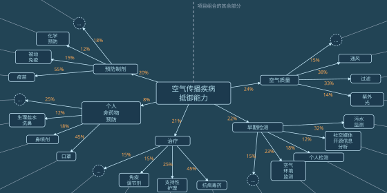
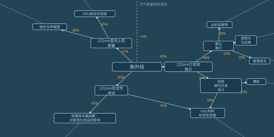

# 第十七章

梅尔丹，维里迪亚 · 3724年果月11日

格拉迪亚斯沿着一条两侧树荫覆盖的小路往前走，前方是那座巨大的圆形议会大厦。

走到大厦的一扇侧门，他把手表往那个绿色圆圈上一贴。

圆圈嗡地响了一声。

<table><thead><tr><th>维里迪亚议会</th></tr></thead><tbody><tr><td>邀请凭证已验证</td></tr></tbody></table>

门开了。格拉迪亚斯走进去，跟着手表转达的指示往前走：向前，右转，再向前，左边第三扇门。

格拉迪亚斯走到那扇门前，又贴了一下手表。

门开了。

屋里有个穿维里迪亚议员长袍的男人。

“格拉迪亚斯，谢谢你跑这一趟！”参议员高声说。

“也谢谢您肯见我，韦尔多参议员！”

“请坐。”

一台机器人滑进房间。

“jie mo kai tu jie hei ja ma？”机器人问。

格拉迪亚斯愣了一下，有些吃惊。

韦尔多笑了。

“几个月前我调了设置，让它这么做。算是个小提醒：这世上还有别的国家，而且它们也很重要。”

韦尔多在机器人的屏幕上点了几下，把屏幕转向格拉迪亚斯。

屏幕上全是泽国语。格拉迪亚斯一脸茫然，目光四处游移。

“哦，想要水就说 ja，想要茶就说 kai ja，字面意思就是‘植物水’。”

格拉迪亚斯点了 kai ja。要是真在泽国待上几个月，不如早点适应，先从喝茶开始——顺便记住本地话怎么说。机器人嘀了一声，表示收到订单，然后悄无声息地滑开。房门短暂地开了一下，机器人出去了。

“所以您觉得我该去泽国？”

“你显然很聪明。你们的秘密会议说了什么，我当然不知道，但从听证会上你说的那些话，还有你几年前最初递交给掌舵会的申请来看，我觉得你是个善良又聪明的人。我们国家需要像你这样的人多出来做事。当掌则人是不错，可话又说回来，你也就是一千多人里的一个。我觉得去泽国亲身经历一番，再带点东西回来，可能更有意义。”

“您觉得是好主意，我就乐意去。可到了那边该找谁聊？这才是我今天想听您意见的地方。”

格拉迪亚斯故意没提泽——不是想隐瞒这层间接关系，而是想先听听韦尔多完全独立的判断。

“我关系最硬的是他们那边一些作家和音乐人。”他说着，轻轻笑了。“不过我也认识几个他们政府里的人，尤其是安全和卫生部门。我把联系方式发给你，再跟他们打个招呼。别只停在这些人身上，但我想他们能帮你开个头。”

“多谢，那太有帮助了！”

“那边的人我只间接认识两个；我妻子在自由城经济研究所偶遇过他们。泽和白，两人都下民本棋。”

韦尔多睁大了眼睛。“说实话，你手上的门路可能比我还硬。你看泽国的民本棋比赛就知道，那些棋手，还有训练他们的人，明显都是顶尖的。要是让我找人护着我对付北极人，比起泽国正规军，我几乎更信他们。”

“泽和白水平有多高？打进过什么锦标赛吗？”

“塞拉上次跟我说，泽赢了半决赛，然后红郡被入侵，决赛就取消了。”

“半决赛？是市级那种吗？”

“是全国赛。”

韦尔多盯着他，又惊又喜。

“那你的关系肯定比我强。等你回来，可得跟我多讲讲泽国！”

“总之，我把刚才提到的那几位介绍给你，等你过去就能见着他们。多听几种说法总没坏处。”

格拉迪亚斯感激地点点头。

“哦，对了，说到多听几种说法，图谱资助的一位理事马上就要来见我。你也想跟他聊聊吗？”

“聊什么？”

“哦，聊他的工作，聊他对图谱资助的看法，当然还有泽国。”

“行，那就聊聊。”

---

几分钟后，门开了，另一个男人走进来。他穿着维里迪亚的隐私袍，但没戴面罩和兜帽。

“贝尔戈尔，又见面了，真好！”

“我也很高兴见到你，韦尔多！”

“来认识一下格拉迪亚斯，他是掌则人。”

“幸会，贝尔戈尔。”

“幸会，格拉迪亚斯！”

“格拉迪亚斯在考虑近期去泽国。我们想，也许你可以多给他讲讲图谱资助，再就他在泽国该做什么、该学什么给他些建议。”

“行，乐意之至。你对图谱资助怎么运作，了解多少？”

“老实说，不太了解。”

“那太好了。”

他掏出手持终端，按了几个键。屏幕上展开一张图，他拿给格拉迪亚斯看。

“这是空气传播疾病防治的子图。图上每一个节点，密码学网络都会随机抽一个委员会，由它决定这个节点正下方那些边的权重。”

“所以它的安全性和合议庭、掌舵会是一个路子。现在给资助配上这么一套东西尤其重要——北极人刚刚对二次方资助发动了和蓝鲸一样的那套攻击，规模却是十倍；至于更传统的那种分配方式，他们当然也会照样去插手。”

“你说得一点没错。最近连掌则人都在挨打，不过靠着各种保密措施和内部通讯壁垒，至少眼下这套体系还撑得住。”

“哦，是这样吗？那还好。不过我挺遗憾的，我们还没什么好办法让这两套东西更民主。听取公民大会的意见是好事，宣谕使也是好事，可它们都替代不了真正的公众问责。”

“总之，图谱资助的设计跟合议庭、掌舵会的运作有一个不同：它能容下更细的专业分工。毕竟分配资金是件相当技术性的事。”

“目标是尽量把每一次资金分配的决定拆成更好处理的小块。别问‘维里迪亚全部公共资金里，该有多大比例给这项紫外线灯研究’，而要问：多大比例给卫生，然后在卫生里，多大比例给空气传播疾病，这样一层层往下分。”

“要是一个项目同时有利于两个领域——比如某种灯，不知怎么的对紫外线灯和防务都有用——那这张图就不再是树，而成了正经的有向无环图。一个节点可以有多个父节点，沿各条路径拿到的资金会累加。”

“所以，每个节点分到的资金，由委员会负责在它的直接子节点之间分配？”

“对。”

“他们能删掉子节点，或者新建子节点吗？”

“当然能。这图本来就是这么做出来的。”

“这太有意思了。”

“我是说，这一切完全取决于这些委员会管不管用，对吧？专业化程度越高，越可能被特殊利益集团把持；随机化程度越高，就越容易让一群对自己要决定的事一无所知的人来做决定？”

“当然，权衡永远都在。”

“还有另一个权衡。事实证明，让委员会达到能分辨项目好坏的水平相当容易，但要它们分辨好项目和极好的项目就非常难。所以近来，针对图里较低的层级，出现了一种主张：干脆在排名顶端直接随机化。如果委员会说你进了前10%，那不管你排91还是99，入选的机会都一样。”

“所以一个人越是排在90以上，基本上就越不用操心去迎合委员会，只管做自己觉得对的事就行。”

“正是。有时候你其实并不想要问责，而是想给人的内在动机留出空间。站在最顶端的人，可能比委员会还聪明。‘截线以上随机化’做的就是这件事：没有问责就成不了事的人，给他问责；最优秀的人，则让他不必受激励驱使——他们几乎不用费什么力气，就能让委员会相信自己的工作足够好。”

“总之，放大到单个项目的层级，就是这样。”

“让这些随机抽出的图谱资助委员会在这么细的层级上做决定，明智吗？”

“我自己也不确定。这个设计的好处是，它总能自己演化，而不用改结构。委员会大可以决定把整个类别‘交给’维里迪亚国立大学材料科学实验室，让实验室内部自行分配。其实开源社交媒体分析那一项，我们差不多就是这么干的，80%直接给了银聊。”

“蓝鲸不太高兴，不过，嘿，谁让他们什么都非得封闭、专有呢。”

“那这一切跟泽国有什么关系？”

“啊，其实这些技术有很多都传到了泽国，他们开始更认真地对待空气过滤器和紫外线灯——有少数人已经在疑神疑鬼，怕北极人哪天故意放出一场瘟疫来打他们。”

“北极人有没有可能对他们发动一场瘟疫，而这场瘟疫最终不会反弹到北极人自己身上？”

“嗯，如果北极的抗疫技术远远领先于世界其他地方，那他们就能放出一场瘟疫，而只有他们能有效保护自己的人不受其害。这也是为什么把这一切开源——至少是防御性的那些东西——如此有价值：让整个世界站在同一条水平线上，谁也甭想一边放火，一边当唯一有防火服的人。”

“总之，你要是真去了泽国，回来一定得跟我讲讲你了解到的公共卫生情况——我很好奇！”

---

格拉迪亚斯推开家门，走了进去。

塞拉和孩子们已经在吃晚饭了。

“今天是你第一次投票，对吧？”塞拉问。

“是啊，难得你还记得！”

“那你今晚又要出去吗？”兹文问。

“哦，不用。要本人到场的是几个月前的讨论，还有密钥登记——那是我在议会开完会之后马上就办了。”

“后来我们掌则人的线上讨论组也聊过几次，不过那个群在投票前七天就自动关闭了——理由是要留一段静默期，给独立思考多腾点空间。”

“唉，那静默期开始时，红郡已经被吞并了。当时大家是什么反应？”

“那些说该把军用硬件从评则最优的几档里剔除的人，我看全都沉默了。后来十八提了一条新修正案，要提高税率档，把开放的激励再往上推。这条我大概会投赞成。”

“那就好。”

“你在议会的会开得怎么样？”

“很顺利。参议员和图谱资助那边的一位都挺支持我去。不过他们说，要论帮我在那边跑这一趟，泽可能比他们认识的任何人都更合适！”

“这倒说得通。谁都知道，有意思的事从来不在泽国官方政府那儿发生。”

“那我回头跟泽说说，让你们俩联系上！”

格拉迪亚斯、塞拉和孩子们各自吃了几口。很快，餐桌上的话头又接了起来。

“费布里克、赫雷达，你们的消息要不要说说？”

“冬季学期我们要去北林交换！”赫雷达骄傲地喊道。

“哇，那地方偏东北挺远的，几乎贴着北极边界了。”格拉迪亚斯答道。

“可好玩了，我们能穿着小型飞行器从山上滑雪冲下去，再一路滑翔下来！”赫雷达兴奋地说。“而且那儿也不真的贴着边界，北林离边界有200多公里。我还是第一次去呢！”

“那你们去那儿干什么？”格拉迪亚斯问。

“维里迪亚最好的数学大学就在那儿，”赫雷达答道。“我在班里数学排前5%，所以被选去那边上专门的课程。”

“我也一样，”费布里克接话。“不过我是计算机方向。”

“莉莉不是也想去北林吗？”

莉莉在洗手间，没法回答。

“维尔说，只要她考试考到75%，夏天就带她去。”

“她更喜欢夏天，没那么喜欢冷。”

格拉迪亚斯的手持终端震了一下。

“嗯，硬件开放度评则的表决开始了。”

<b style="font-size:150%">评则：硬件开放度</b>
<table><thead><tr><th>动议</th><th>表决</th></tr></thead><tbody><tr><td style="width: 75%">在第1档第3行、第2档第3行之后增加：  “军事、监视及反监视用途的产品不适用本档”</td><td style="text-align:center"><button>赞成</button>  <button>反对</button></td></tr><tr><td style="width: 75%">税率档从  0 / 6 / 12 / 18 / 24  提高到  0 / 10 / 20 / 26 / 32</td><td style="text-align:center"><button>赞成</button>  <button>反对</button></td></tr><tr><td style="width: 75%">将第4档第4行、第5档第4行的  “以硬件手段阻止第三方维修”  改为  “以硬件或软件手段阻止第三方维修”</td><td style="text-align:center"><button>赞成</button>  <button>反对</button></td></tr></tbody></table>

有点虎头蛇尾，格拉迪亚斯想。投票前的几个月里，那么多仪式、当面会议、辩论和工作。结果投票本身不过是在屏幕上……点几个按钮。

这倒也合理，格拉迪亚斯想。按密码学的运作方式，只要密钥登记是安全的，这一步完全可以在自己家里、自己的设备上完成。就算德尔瓦特真来敲门，非要在他背后盯着他，从头到尾看完那15个长时的投票窗口，他也没法证明自己设备上的密钥就是登记过的那把——说不定那只是个幌子，真正投票的是莫夫、塞拉，甚至兹文。

格拉迪亚斯最后看了一眼屏幕，若无其事地按下：`反对`、`赞成`、`赞成`。
