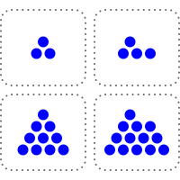
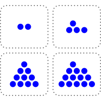
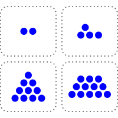
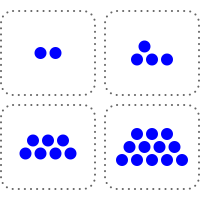
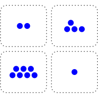
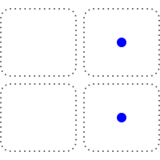

# 第二十五章

帕佛盖都，泽国 · 3724年霜期1日

格拉迪亚斯和泽坐在一间密闭屋子的桌旁，桌面本身就是一块屏幕。屏幕上分作四格，各堆着一些圆圈。

“好，那我该怎么做？”

“你先走，所以挑一格，从那一格里至少拿走一个圆圈。可以多拿，但至少要拿一个，而且一次只能从一格拿。”

“谁拿走最后一个圆圈，谁就赢。”

格拉迪亚斯觉得自己对这游戏谈不上什么战略眼光，于是决定边下边学。

他用手指点了左上格里的一个圆圈。

泽立刻应了一手，点了右下格最上面的那个圆圈。

格拉迪亚斯决定换个路数。他点了左下格里的三个圆圈。

泽应了一手，把右下格里的圆圈全点走，只留下一个。

格拉迪亚斯把左下格剩下的圆圈全点了。泽只是点了右上格里的一个圆圈，作为回应。

格拉迪亚斯把左上格剩下的圆圈全点了。泽则点了右上格剩下三个圆圈中的两个。

“好吧，我输了。”格拉迪亚斯承认。

他唯一能走的下一步，就是从两个格子里的一格拿走最后一个圆圈。这样棋盘上就只剩一个圆圈，泽拿走就赢了。

“你下得真厉害。”

“这是我们小时候常玩的游戏，尤其是在民本棋这类更现代的东西出现之前。”

“那接下来是不是该传授你的独门秘诀了？”

“你倒是懂我。秘诀确实有，而且是个很简单的算法。它需要心算，可你一旦学会，并且算得不出错，那么只要先手后手由你挑，你就永远能赢。”

“那就说吧。”

“把每个格子的圆圈数拿来异或。做法是：把每个数写成二进制。对每一位，数一数这一位上有几个1。如果1的个数是奇数，新数的这一位就写1；否则写0。我们把这个数叫作棋盘的异或和。”

“等等，慢点，举个例子。”

“就拿我们开局那个棋盘。四个格子的圆圈数是3、4、10、13。”

“好。”

“换成二进制是多少？”

“11、100、1010，还有……等等，1101？”

“对！不过我们补几个0，把它们凑成一样长，再写下来。”

他打开手持终端，把这四个数写成网格的样子。

0011 0100 1010 1101

“现在竖着一列一列地数。”

“每一位都有两个1，是偶数。那异或和就是……每一位都是0，所以是0？”

“正是。还记得你第一步走了什么吗？”

“我把第一个数从3减到了2。”

“没错。”

0010 0100 1010 1101

“现在异或和是多少？”

“最低位上现在只有一个1，变成奇数了，所以是1？”

“正是。还记得我做了什么？”

“抱歉，我忘了。”

“我从最后一个数里拿走一个，把它从13减到12。”

0010 0100 1010 1100

“哦，我明白了！异或和又回到0了！”

“正是。所以每次轮到你走，异或和原本是0，而你无论怎么走，都只能让它不再是0。但只要它不是0，我就总能找到某一步，把它调回0。”

“等等，真的吗？”

“取异或和里最高的那个1所在的位。在这一位上为1的圆圈数，个数必然是奇数，也就是说至少有一个。挑出这样一个格子，把它的圆圈数和异或和再做一次异或，用得出的结果替换原来的数。改完之后一定比原来小，因为有一位从1翻成了0，而其余变化的位都比它低。”

“我……大概懂了一点？”

“所以每次**你**走，只能让异或和不再是0；轮到**我**走，我就把它调回0。而最后一步——清空棋盘的那一步——也会把异或和变成0。也就是说，最后取胜的那一步，永远轮得到我来走。”

“如果开局时棋盘的异或和**不**是0，那我执先手就能赢。但如果开局异或和是0，那我执后手就稳赢。”

“有意思！”

格拉迪亚斯往后一靠，想了一会儿。

“我以前从没见过后手占优的游戏。”

“也未必！只有开局异或和是0时，它才偏向后手。而后手占优的游戏，比你想的要常见。”

“通常局面里总有一处位置、一块地盘是有价值的，先手因为能先到，就占了便宜。”

“你能想到，是什么底层原因让一个游戏偏向后手吗？”

“什么意思？”

“后手有什么根本性的优势？”

格拉迪亚斯又停下来想了想。

“轮到他走的时候，他知道得更多。”

“没错。”

“在这里，我先走一步，你就有机会根据我这一步作出应对，于是你永远知道该走哪一步，能把局面重新拉回平衡。”

“正是。”

这次，泽停了一下。过了一会儿，格拉迪亚斯又开口了。

“说起来，如果你执先手，大概也一样能赢。”

“为什么？”

“因为我不知道诀窍。在你眼里，这里有个数学结构，它有一个理想状态——每当我走完，异或和都是0的那个状态。一旦进入这个状态，胜局就永远锁定了。可在我眼里，那只是一团乱。”

“确实。熵这东西，永远只存在于观察它的人眼中。”

“这个游戏是一座由不同层次的规则搭起来的塔。”泽接着说道。“最底下那一层，游戏是不可逆的：每一步你都必须至少拿走一个圆圈。比它高一层，是异或和，那一层是可逆的。无论你怎么改，我总能调回来。但在比那更高的一层上，当异或和处于平衡时轮到你走，这件事本身才是不可逆的。一旦你让局面滑进那个状态，而对手又懂这个诀窍，你就再也出不来了。”

泽又沉默了。过了一会儿，他换了个坐姿，示意热身到此为止，真正的提问要开始了。

“好，下一个问题，格拉迪亚斯。争夺维里迪亚的这场斗争，是先手占优，还是后手占优？”

格拉迪亚斯眼睛睁大了，显然没想到话题会拐到这边。

“什么意思？”

“北极人先动手。他们布设或接管了间谍基础设施；对维里迪亚官员施压、行贿、威胁；还发动了一场高度协同的行动，甚至想拿下掌舵会，让它听命于自己，还让维里迪亚社会觉得抵抗也没什么意思。最后，他们先打了红郡，又打了北林。那么，是他们因为已经占住了关键位置而获胜，还是我们因为握有反制策略而获胜？”

“我明白了……”

“在战场上，眼下他们占优，而且根本不是什么先手的缘故——就是技术更好。但在机构之争里，我们有反制策略。他们玩的这套，我们也能玩，而且我们占优，因为我们要达成的目标，恰恰是我们要去影响的大多数人本来就想要的。”

“只是让他们看清自己的利益所在，从而影响他们去做真正对他们有利的事——这种事的说法叫什么？”

“听起来答案特别简单。”

“说服。”

“那我们去说服谁，让他们做什么？”

“你说呢。”

格拉迪亚斯又顿住了。终于，他开口了。

“合议庭怎么样？”

“继续说。”

“我们对合议庭搞一场同样的影响行动，就像德尔瓦特他们那伙人对掌舵会做的那样。然后说服他们去做……某件能收拾整个局面的事。”

“你学得很快，格拉迪亚斯。”

“那么，我们在这件事上为什么占优？”

“因为我们做的事对维里迪亚真的有利。德尔瓦特要让掌舵会成员做出违背维里迪亚利益的事，就得给每个人准备一套不同的说辞，量身定制，顺着他们的价值观，也戳着他们的软肋，除此之外还要或明或暗地威胁。我们不用这样。我们只要有一个明确的诉求，然后照实把这个故事讲出来就行。说谎很容易栽跟头：一个谎言本质上就是一个虚拟世界，而要让它自洽，你就得把整个世界真的模拟一遍，这几乎做不到。但真相天然自洽，这是白送的。所以我们讲真话。”

“那么，下一个问题。我们对合议庭的诉求是什么？”

“去找韦尔多谈谈。”

“那通电话你来安排。我这就去问一下登，看看我们在维里迪亚的谍报进展。”

---

格拉迪亚斯点了点手表。

<table><thead><tr><th>消息</th><th>收件人</th><th>时间</th></tr></thead><tbody><tr><td>\[正在呼叫\]</td><td style="width: 6%; text-align:center">→</td><td style="width: 25%">
韦尔多参议员
</td><td>78145</td></tr></tbody></table>

过了一会儿，韦尔多接了。

“格拉迪亚斯！近来可好啊？”

“参议员，我们有个新想法。”

“什么想法？”

“北极人当初对掌舵会试过的那一套，我们也想对合议庭来一遍。找出足够多的法官，说服他们去做一件事，让我们能真正反击北极人。”

泽看准机会插了进来。

“管这些摄像头的管理员，大多刚刚装上了我们的更新。这个更新还会回传每台摄像头的现状——结果发现，有一批早就被北极人接管了。所以现在我们手里有很多后门，也已经锁定了十几名法官，顺带还掐掉了他们的一些后门。不过这也意味着，我们接下来得更小心，不能再进一步暴露自己了。他们能玩的那套，我们一样能玩——大概还能玩得更好，因为我们的目标，本来就该是维里迪亚的法官们真心想要的。”

“所以，我们得想清楚，到底要说服他们去做什么。”

韦尔多似乎笑了，那笑更多是出于赞赏。

“我就知道你们能想出点办法来。”

“让我想想……”

沉默了片刻。然后，韦尔多缓缓开口。

“好，我有个疯狂的想法。”

“在维里迪亚，最基本的法律之一，就是军方必须保卫国家。这是第十四条根本法，白纸黑字写在文件里。在北林，他们彻底没能守住国家，而且事后几乎连认真改革的尝试都没有。”

“所以，维里迪亚军方是违法者。所以，合议庭可以撤他们的职。如果议会想拦，那也好办——法律上，议会是军方的集体首脑，于是合议庭连议会一起撤了也行。”

“合议庭……有这么大的权力？”

“原则上，合议庭能做的事很多。”

韦尔多顿了顿，然后决定岔开去谈点哲理。

“你看，格拉迪亚斯，法律不像一段跑在密码学网络里的计算机程序。法律的目的，不是要消灭判断世上是非对错时的那种主观性。恰恰相反，法律要做的是给这种主观判断搭出结构——为它划出一些渠道，使它更可预测、更聚焦，好让每桩案子不必重新审一遍‘什么对人类有益、什么有害’这类根本问题。”

“在普通案件里，它确实常常很接近程序化，而这也正是关键所在。法庭上的一桩商业纠纷，争的不是谁人品好，而是其中一方有没有做出法律定义上的欺诈行为。但在任何例外案件里，都还留着很大的弹性——事实上，今天已成判例法的任何情形，在过去的某个时刻都还是未知的、有弹性的。”

“而这份潜在的弹性，正是给合议庭留出空间、做出好判决的关键。人不是为分类而生的，是分类为人而设的。宣布整个军方违背了它神圣的职责，这很疯狂。疯狂到在我看来，维里迪亚历史上从未有人尝试过任何类似的事。但维里迪亚也正处在一个疯狂的时代。所以此刻，正需要这样一份疯狂的判决。”

“要赢这一局，光把我刚才那套论证扔到公众面前，指望法官一看就知道当然正确、立刻照办，是不够的。你得去说服他们。你得跟他们坐下来，把话说透：这不只是一个站得住脚的法律论证，而且对维里迪亚有好处；还要向他们说明，为什么把整个军方领导层换掉——必要时连议会一起换掉——是能够拯救维里迪亚、而不是把局面推得更乱的事。还要让他们相信，会有足够多的其他法官一起走这条路，而且等他们作出裁决时，公众也会跟上。而所有这些，都得先悄悄做，再一下子亮出来，让北极人来不及反应。”

“我喜欢这一点：连‘这计划值得一试’都不用说服你。”

“我在议会会议上听到的别的方案，只有两个：一是继续照旧，只是‘再努力一点’；二是干脆投降。我判断这两个的成功概率比这个还低。”
