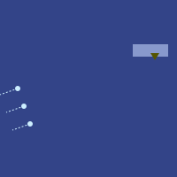
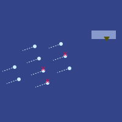
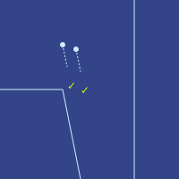

# 第二十六章

维里迪亚 · 3724年霜期5日

泽、白、格拉迪亚斯和登坐在飞机上一间封闭的小舱里，泽和白面朝前，格拉迪亚斯和登面朝后。4人都默默望着窗外，欣赏着这片一望无际、大体平坦的绿色原野。视野里最显眼的是一排小山，再往远处就是梅尔丹城。

广播提示音嗡嗡响起。4人一下从出神的状态里惊醒，准备聆听。

<blockquote>
jo hen jei fe fei go de di mei dan du
</blockquote>

“该你翻译了，格拉迪亚斯！”泽催道。

格拉迪亚斯脑子里拼命地转，想赶在下一句开始前听明白、答得上来。过了片刻，他脱口而出：

“各位，欢迎来到维里迪亚的梅尔丹。”

<blockquote>
ti zun no tei li ze fo fi shi ci cin ho li ze ci bia tei gei ka fiu den min ba fia zui
</blockquote>

“当地时间是74,000，气温7度。再过一小会儿，飞行器就会降落地面。”

<blockquote>
ti tei li dzai hen fe lo kin fe hai bun
</blockquote>

“现在正是欣赏外面美景的大好时机。”

<blockquote>
hai ka sho kin ce fe fei go de bun ji dze kai zui liu
</blockquote>

“此刻窗外，你可以看到维里迪亚那片美丽的、绿色植物铺成的大地。”

“绿色植物构成的风景。”泽温和地纠正。

<blockquote>
biu ka di ge le bo gai dei li lia
</blockquote>

“右边是格勒博尔山脉。”

<blockquote>
cen hai ka ge le bo gai dei de dziu hai ka ce kin fe di mei dan du ci ti li sa dzu du fe fei go
</blockquote>

“更远处，越过格勒博尔山脉继续往前，你能看到梅尔丹城。它是维里迪亚的首都。”

<blockquote>
di mei dan du li bai

ci di mei dan du de jan zi li pa pi pa fi ha

ci dzen fe gi hie pen
</blockquote>

“梅尔丹是座大城，人口110万，下辖许多不同的城区。”

<blockquote>
dzu ka kin ce fe bia gai dei

ci fia sai pen ka dan fe gi jan

ci sei sai pen ka jen bin pei de pen li pai

ci mui dau fe ti li cin pin cu bun
</blockquote>

“城区正中有一座小山。山的下半截住着许多人家，上半截有一部分政府机构在办公。爬上山去，心情愉快，风景也美。”

<blockquote>
gai dei de zei biu ka pai hui pen li bia

ci pai hui pen fei ka fei go de gi bai pai hui li lia

ci sa dzu pai hui li dzen fe ten min de bin dai cu man jei cu su kun gau
</blockquote>

“山的东边是商务区。商务区里有许多大公司，主要产业包括计算机软件、金融和健康防护。”

<blockquote>
gai dei de zei gei ka di ka lia mai pen li lia

ci ti pen li lu fe bai kai zun

ko ti dzen fe gi pui gau ji dan
</blockquote>

“山的南边是卡利马尔城区。这一片看着像森林，里面却藏着许多住宅。”

<blockquote>
gai dei de zei dzun ka gi dan pen li lia

co ti ka gi jan li san cu sun cu mo

ci ti ju fe gi kai de sai hui cu gi dau kin zun
</blockquote>

“山的西边是一片大型居住区。许多人在那里睡觉、学习、吃饭。那里食物种类繁多，还有很多值得一看的地方。”

“也就是旅游景点。”

<blockquote>
ti li tin bia pen fe di mei dan du de ce kin ji gi mui sun jui

ci di mei dan du fei ka ji gi shan jin tei ka jan ki su

te zen hu ka ki kia sin fe ti du
</blockquote>

“这只是梅尔丹众多有趣之处的一小部分。哪怕一个人在梅尔丹住上许多年，也了解不透这座城。”

<blockquote>
jie fe lo cin pin fe lo di mei dan du cu fei go li bun
</blockquote>

“希望你们喜欢梅尔丹，喜欢维里迪亚的美景。”

“说得好。才两个月，你都快成本地人了。”

泽顿了顿，又开口，慢慢地说。

"ci jie fe lo cin pin fe di pa fo gai du"

“我很喜欢帕佛盖都。”

“希望你再来。”

“当然会来！”

“等等，我刚反应过来……帕佛盖的意思就是‘14块石头’？这名字是怎么来的？”

“想想元素周期表。”

---

飞机停了下来。透过窗户，他们看见十几辆大型巴士和轿车正朝这边驶来。

“大一点的那辆黑色轿车是我们的。为了不引人注意，我们最后下车。”登说。

泽、格拉迪亚斯和白点了点头。4人靠在椅背上等着。

大约10分钟后，舱门自动打开。4人立刻起身，从座位下取出随身行李，朝飞机前部走去。穿过机舱时，他们看见其他舱门全都敞开、空无一人，用过的毯子和空瓶空杯丢得到处都是，散落在许多小桌和座椅上。

他们从一扇门走出飞机，门直接连着一道楼梯，通往一个狭长的房间——显然也是某辆巴士的内部。房间一头是入口，他们刚从那进来；另一头是出口；中间有两道闸机挡着路。

泽和格拉迪亚斯先上前。两人各自把手表贴到所过闸机侧面的绿色圆圈上，又看向前方的摄像头。过了几个嘀嗒，两道闸机几乎同时开口：“欢迎来到维里迪亚。”

闸机打开，泽和格拉迪亚斯走了过去。房间另一头的出口径直通向一辆黑色轿车的内部——正是他们先前从飞机窗口望见的那几辆之一。两人走进去，发现里面已经坐着一个男人。

“韦尔多议员！”

“欢迎回家，格拉迪亚斯！”韦尔多答道，脸上的表情和语气比他记忆中的任何时候都更暖。他立刻看向格拉迪亚斯身旁。“那你一定就是泽了。”

“幸会，议员。”

泽和格拉迪亚斯正要坐下，泽已经听见白和登走近的脚步声。两人也穿过舱口，进了车里。

“那你们一定就是白和登了！”

“正是”，白答道。

“好，都坐下吧。我们有很多事要做。”

四人在各自的座位上坐下。连接车厢与入口房间的舱门关上了。几乎立刻，他们就感觉车开始加速。

“那么首先，格拉迪亚斯，我有个非常好的消息要告诉你。”

“哦？什么消息？”

“我们好像知道莉莉在哪儿了。”

格拉迪亚斯睁大了眼睛。

“塞拉费了很大劲才联系上我，把事情的前前后后都跟我说了。兹文一直和莉莉有联络，她自己跟兹文说了在哪儿：她已经越过边界，进了北极占领区，人在北林。”

“接着我们把所有监控画面都筛了一遍——当初你出了个绝妙的主意，让泽国人黑进了那些摄像头。找了几天，我们找到了她。她待在北极人办的一所寄宿学校里，离大梅港大约1公里。”

格拉迪亚斯叹了口气。“至少我们知道她在哪儿了。要把她从北林弄出来会很难，但至少费布里克和赫雷达也在那儿，可以一趟把他们都带出来。”

“确实。你要是真想，现在就可以去北林——不过大梅港的门还关着。”

“北极人最近开始允许北岸与维里迪亚其他地区之间双向通信和往来了。他们在北林开了诊所，提供他们最先进的一些疗法，既能延寿，也能增强体能。看来他们决定试着让维里迪亚人自愿加入北极帝国，办法就是把他们的亮眼技术摆到我们眼前。”

“这招很好。”

“你那句话怎么说的来着，泽？靠让人看清一件事符合自己的利益来驱使人去做，这到底算操纵，还是只能算说服？”

“埃菲里昂肯定会这么看。当然，西尔卡会不高兴，说他们在隐瞒隐性代价——你能活得更久，靠的却是持续注射北极的专有药物，那你的命就捏在他们手里，你就成了他们的奴隶。可埃菲里昂会说，死了——躺在棺材里，连动一块肌肉、想一个念头都不自由——那才是最彻底的奴役。而且这不只是对一个人如此，对一个文明也是一样。”

“想让维里迪亚成功、兴旺，我们就得找到那条融合之路。我们可以承认北极人有些事做得非常好，承认他们追求一个彻底更好的未来这件事本身可以是健康的。维里迪亚的北极星不能只是‘保持现在这样，但少一点贪婪、社会结构好一点’。我们得有真正的进步，并且取其精华、去其糟粕。我们要认可成就，并给予回报。”

“但首先，我们得给自己挣出喘息的空间。这意味着要在北岸打败北极人。”

“正是。要做到这一点，我们就得愿意向外面学——向北极帝国里的敌人学，也向自由城和泽国的朋友学。”

车缓缓停下。片刻之后，车门打开，外面径直通向一家看起来像政府经营的酒店内部。

“好好睡一觉，朋友们。泽、登，你们俩明天一早有件大事。等那件事办完，我们再碰头谈我们的大计划。Veridia ba fau gie。”

格拉迪亚斯和泽先下了车。几乎立刻，格拉迪亚斯就看见房间远角有个女人在等。她转过身，张开双臂朝他跑来。

是塞拉。

---

梅尔丹，维里迪亚 · 3724年霜期6日

泽在一把椅子上坐下，面前是一台控制台，跟他历次参加民本棋锦标赛时用的那些控制台惊人地相似。他能看出的最大不同是：这一次，没有防作弊侦测无人机在周围嗡嗡打转。

他戴上耳机和眼镜，对着麦克风说话。

“登，能听见我吗？”

“嗯，又清楚又响。我想我就在你正下方那间屋里。”

泽玩心一起，跺了跺脚。

“听见了吗？”

“我只能从耳机里听到你说话。”

“看来你这儿的隔音做得真好！”

“好，泽，我们把整个行动再从头过一遍。”

“地点：红郡，总统官邸。目标：救出目标人物——总统之子塔芬德尔。方案：我们安插在里面的人让目标走到阳台上。我们飞进去，放下绳索，让他系在腰间、抓紧，然后在北极人反应过来之前飞走。”

“没错，这是主线方案。备用方案呢？”

“如果北极人出现——士兵或无人机——就开火。如果他不走到阳台上，没有备用方案，那就完了——我们的无人机要是不得不直接落在楼顶上，根本撑不住。如果带绳索的无人机被击落，我们还有第二架，甚至其他战斗无人机也可能把目标再接回来，虽然它们不是为这个设计的。唯一危险的窗口，是无人机接住他之后没过几个嘀嗒就被击落——这个空当太短，备用无人机来不及扑过去抓住他，人就摔到地上了。”

“我负责什么？”

“监督主线方案。”

“你呢？”

“监督战斗和备用方案。”

“穆，你在吗？”

“在。我负责监督侦察，保证任何意外一出现，我们第一时间就知道。”

“穆，你怎么会在这儿！？”

“我昨天跟你坐同一架飞机，泽。只是不同舱，进城也是不同的车。隐私上的防范措施。”

“能见到你我很高兴！或者说，至少能听见你。”

眼镜把显示画面直接投进他眼里，泽逐一核对上面的各项数字。

"Fi le gei tau fa"，他模仿着每场民本棋开赛前倒计时播报员的声音，喊了一句。

随后，他刻意收拢心神，让自己完全专注于那场即将开始的战斗。

无人机渐渐逼近议会大楼，屏幕上出现的无人机也越来越多，泽紧紧盯着屏幕。

二十个嘀嗒后，屏幕上那个暗黄色的三角形变成了一个更亮的黄色对勾。塔芬德尔按原定时间走上了阳台。

又过了30个嘀嗒。

"mu gu gei tau fa"，他轻声说。50嘀嗒后开战。某种意义上，战斗早就开始了，但他等的那个时刻，是塔芬德尔抓住绳索的时刻。他想，那才是真正考验开始的时候。

又过了20个嘀嗒。

突然，那个对勾又变回了暗黄色的三角形。

泽把视频画面放大。有人抓住了塔芬德尔，把他拽回了室内。

几乎就在同一刻，北极无人机开火了。

泽立刻听见登的声音在耳机里炸响。

“我来查清目标出了什么事。泽，你来指挥战斗。”

泽下意识地点了点头。头戴设备自动把这个动作转成一个对勾图标，闪现在登和穆的显示画面上。

泽闷哼一声。他的无人机已经有3架被击中。

“规避机动，向敌机还击。所有受损无人机，只要还能动，就降落到地面装死。”

他意识到，北极人的侦察能力比他原先预想的要强。

就在那时，他的第四架无人机上方出现了一个叉号——那架本该去接目标的无人机。一个嘀嗒后，那架无人机从显示地图上彻底消失了。泽查看原始视觉画面：它被直接命中，在半空中炸开。

泽绝望地尖叫起来。他们此前几次任务里学来的规避技巧都不管用。看来这次任务要失败了——也许昆高培的信誉也会跟着一起完。

下一刻，耳机里传来穆急促的声音。

“换方案。所有人低飞，贴着楼房和树底下飞。穿过街道飞。那里是它们火力最弱的地方。然后我还有一招。”

泽点头，把指令转发给所有无人机。10个嘀嗒之内，4架完好可用的无人机全都降到接近地面的高度。另有一架受损的无人机——泽早已下令让它装死——本来就贴着地面，已经待了半分多钟。

突然，泽在视觉画面里看到，路灯和楼内的灯光全都开始混乱地闪烁。北极无人机搞不清对手在哪，开始朝四面八方开火。

他的无人机继续向前飞。第一架刚进入距总统官邸100米以内，登就开口了。

“让一架无人机撞在这个坐标上。”

楼的一侧出现了一个新的黄色三角形。泽立刻指挥无人机全速撞向那里。4个嘀嗒后，它撞了上去，激起一大团爆炸和烟雾。

又过了10个嘀嗒，黄色三角形变成了两个亮黄色的对勾。

泽有些困惑，但还是立刻做了唯一说得通的事。无人机飞得太低，绳索用不上。于是他把3架剩余无人机中的两架调到总统官邸正前方，减速停住。

两个对勾都变绿了。无人机重新加速，向前飞驰。泽指挥第三架无人机留在后面，向它能侦测到的一切北极无人机开火。

他查看画面。两架飞离的无人机背上，各有一人紧紧抓着。一个是塔芬德尔，另一个是他们的内线——他的助理。两人都披着隔热斗篷。干得好，登，泽心想。

泽继续紧盯着屏幕。不知怎的，明明希望渺茫，他们似乎真的做成了？

登清了清嗓子，开口说话。

“这样不行”，他低声说。“我看到更多北极无人机在过来。它们更快，会追上来的。”

穆立刻回应。

“已经在办了。目标很快就会跳下无人机，无人机继续往前飞。会通知目标跑200米到一条路上——不是离他们最近的那条路。我有辆车去接他们。运气好的话，等北极人搞清楚怎么回事，他们已经在几十公里外了。他们一到海边，就会有一架海上无人机过来，把他们带出红郡。”

泽叹了口气。“我信你，穆。”

泽重新坐回椅子上，叹了口气，对自己深感失望。他闭上眼。

一分钟后，第一条好消息：

“接人成功。”

又过了10分钟：

“我们的无人机在多利纳尔一处大型商业综合体降落。北极人正在合围。但愿这场搜捕能拖久一点。”

又过了30分钟：

“我们的车平安到了海边。目标正在登上海上无人机。”

再过10分钟：

“北极人发觉上当了。他们正在扩大搜索范围。”

泽看着屏幕，此时画面上是那架海上无人机一路向西、缓慢艰难地驶离红郡海岸。

五十分钟后：

“目标已顺利抵达阿图里亚海岸。”

---

“实在抱歉，各位”，泽低声说。“我彻底搞砸了。要不是穆不知怎么用一个全新的方案救了我们，这次就失败了，我们计划的其他事多半也都会跟着失败。”

“欢迎见识真实的战场，泽”，登答道。“这跟民本棋不一样。有时候想赢，唯一的办法就是让思路整个跳出框框。不是把一整台计算机编码进滑翔机骨架里那种跳出框框，而是从控制台椅子上蹿起来、冲过去照对手脸上来一拳那种跳出框框。”

“那么……穆，你刚才到底做了什么？”

“这里不是北极帝国，这里是红郡。那里有很多人暗暗支持我们，很多技术基础设施也还没完全转到北极控制之下。所以眼下，还能黑进一些东西。我从红郡的人手里拿到了一批管理员密码。用这些密码，我先控制了路灯，接着又征用了几十辆自动驾驶汽车。其实还布置了好几路诱饵，飞行器在好几个地方停了又起飞。这方案我们一开始就该用，只是——我和你一样，低估了北极侦察的力度。”

“穆，这活儿干得真漂亮。”

“但重要的是我们赢了。塔芬德尔安全到了阿图里亚。北极人丢了脸。现在全世界都知道，他们是可以被打败的。”

登顿了顿，又开口。

“眼下，他们以为这不过是自由城的防务公司干的。但现在该轮到昆高培站出来，分走属于自己的那份功劳了。然后就看维里迪亚人愿不愿意让维里迪亚得到它应得的防务了。”

---

格拉迪亚斯拉开隔间的门，走了进去。5名法官已经坐在里面——能把这5个人找出来，莫夫和塞拉出了力，泽国黑进的那些监控摄像头更是帮了大忙。

“那么，你想谈什么？”第一位法官问。

格拉迪亚斯坐下，随手拉上身后的隔间门。

“我打算对维里迪亚军方领导层提起诉讼。按照第十四条根本法，维里迪亚军方有义务保卫维里迪亚。从北林发生的事可以看出，他们完全没有做到。所以我的主张是：他们违法了，应该被免职。”

“这太荒唐了。没错，我们在北岸被打了个措手不及，输得很难看。但维里迪亚军方在艰难时局里已经尽了最大努力。我们不能就这么从外面进来，说我们不喜欢他们的干法，就把他们换掉，而我们连拿什么标准来衡量他们都说不清——”

“凯隆”，格拉迪亚斯打断他。“今天的新闻你看了吗？”

“没看。得了吧，格拉迪亚斯，你知道法官不该读每日新闻，这是规矩。我们依据的是恒久的原则，不是被一群正在气头上的人推得东倒西歪。”

“一个泽国人的小组飞进红郡，成功救出了总统的儿子。”

几乎立刻，另一位法官开口了。

“所以你是想让我们用某个泽国人去换掉维里迪亚军方的领导层？”

“对，正是。”

“抱歉，这太离谱了。这不是合议庭该干的事。维里迪亚是民主国家。掌管军队、有权改变军队构成的是议会。所以你要搞你那个疯狂的计划，就该去找他们谈。”

“得了吧，塞尔沃特，你跟我一样清楚，议会已经烂了。他们要么已经待在北极人精心炮制的宣传气泡里，要么收了贿赂，要么因为北极人黑进了我们的监控系统，自己和家人正被威胁。”

“我们是合议庭。我们没有权力径直去判定整个议会都腐败了。”

“其实你有。第二十一条根本法：维里迪亚政府官员必须以诚实、善意、不受不当影响的方式履行职责；一旦受到任何不当影响，必须上报并辞职。”

“所以你还想把议会也一起免职？”

“如果有必要，对。”

格拉迪亚斯看得出自己说不进去。于是他决定换一条路试。

“你们有谁的家人住在北岸吗？”

第三位法官开口了。

“我有，一个儿子。他在大梅港——那是唯一一个他们还在封锁、不许人离开的地方。”

凯隆愤怒地转向他。

“你提这个干什么？格拉迪亚斯自己说了，我们履行职责不能受不当影响。”

“维里迪亚有6%的人口住在北岸。每个人大约有10位近亲——父母、兄弟姐妹、子女、配偶、其他近亲、共同家长。那么你们5个人加起来就是50位，所以按统计，你们当中总共该有3名亲属在北岸。如果你们一个都没有，那你们就没有感受到许多其他维里迪亚人正在感受的东西。也就是说，你们的利益是错位的。你们错位到了麻木自满那一边——可这难道不也是一种不当影响吗？”

“那些法律不是这么运作的，这方面有先例。”

“那**你**在北岸有家人吗？如果有，那**你**才是受不当影响的那一个。”

“这回是你不懂法了。原告本来就允许与案件结果有利害关系——事实上，是必须有利害关系。这个法律术语叫**诉讼资格**。”

“而且没错，我有3个孩子在那里。”

“听着，格拉迪亚斯。再说一遍，维里迪亚是民主国家。我们不会因为一帮泽国小天才救了个王子、你又觉得自己比整个议会更聪明、道德更纯洁，就对着我们的民主跺脚撒泼。”

“就算我们真这么干，你也想想程序。一个案子从立案到结案最少要30天，前提是法官不要求延期。然后他们还能上诉，可以上诉多次。上诉可以更快，但只有从第三轮起才行。所以这一整套要走完得花好几个月。而在这期间，维里迪亚会陷入混乱，北极人只要扑进来接管就行了。”

“所以我们不干。”

格拉迪亚斯环顾四周。另外4名法官里有3人正跟着塞尔沃特的话点头。剩下那位法官泽温，看起来对格拉迪亚斯同情得多——无疑很大程度上是因为他也有个儿子困在北林——但他似乎不太愿意把话说出口。

“明白了”，格拉迪亚斯轻声说。如果这一批法官对他的方案如此敌视，那他真立案后随机抽到的那批法官，几乎肯定也会相当敌视。他得换个策略。

他拉开隔间的门，慢慢走了出去。
