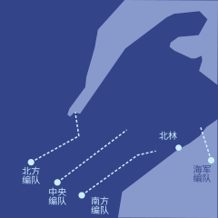
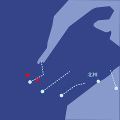
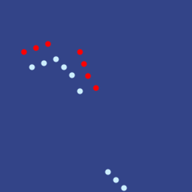
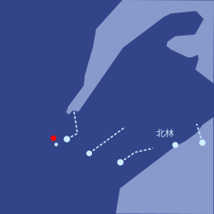
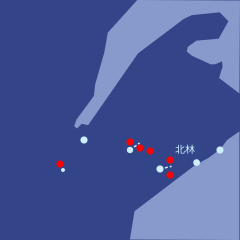

# 第二十九章

埃莱纳森林，维里迪亚 · 3725年雪月29日

泽和穆站在一座积雪的山丘顶上。四周是覆着厚厚白雪的翠绿松林，一直铺到目力所及之处。一股强劲的冷风迎面扑来。身上其余部位裹在白灰相间的外套里，那厚度足以让他们从容欣赏这片景色，却又刻意留了一线，不至于觉得暖和。远处树梢正上方，是一轮刚从东方升起的太阳。

“这里就是决定我们未来的地方了。”穆平静地说。

“你觉得我们准备好了吗？”泽问。

“没有。”穆答。“可有意义的事，从来不在人准备好的时候发生。”

“我们指望的是，北极人比我们更没准备好。”

身后传来缓缓上坡的脚步声，每一步都比前一步大约晚一个嘀嗒，艰难地踏过深雪。过了片刻，泽感觉有人从背后抱住了他。

“不管今天发生什么，泽，我很高兴认识了你。”

是白。泽转过身，抓住她的手，把她拉上最后一步，让她站到和自己、穆一样高的地方。

“我也很高兴认识了你。”

三个人沉默地等了一会儿，望着雪从东边的林间吹过、越过树梢。

“那计划是什么？”

“开往埃尔迪尔的末班列车今天到站。事到如今，北极人不可能不知道我们在这里集结了一支规模不小的部队。所以他们肯定已经在集结军队来迎我们了。这片森林难走，但不是走不通。所以我们最好的机会就是今晚动手，从西面插进北岸北部，完全绕过北林，然后把它切断、包围。”

“你对这个计划有信心吗？”

“我上一次和北极人交手，彻底搞砸了，是穆救的场。所以，没有，我没信心。但这是我们最好的机会。”

白又从侧面抱了抱泽。

“我相信你。”

穆打破了沉默。“我也相信你，泽。”

他们沉默地望着那片积雪厚厚的松林，又看了5分钟，然后开始慢慢往山下走，回他们临时搭建的掩体。

---

登、穆、泽和另外几十名维里迪亚将领与昆高培领导人坐在一间逼仄的屋子里，莱克托站在最前面做汇报。

“好，每个人都知道自己的任务吗？”莱克托大声问。“加洛瓦？”

“我带北集群，任务是穿过森林，一路向东北，直到海岸，然后拉出防线，把北极人和整个半岛隔绝开。这要求我在南翼与北岸的北极部队交战并将其包围，同时在北翼挡下来援。”

“好！你呢，特尔波？”

“我带中集群，任务是直接向东穿过森林。预计会撞上北极的主力无人机群。没有进攻性的位置目标，我们的任务是拖住他们，确保他们突不破。”

“那你呢，登？”

“我带南集群，任务是穿过森林，向东南推进，然后在北林外围拉起防线。”

“瓦卡里亚？”

“我带海上集群，主要任务是用海上无人机从南面攻击北林以东的北岸。尽我所能地牵制、包围。更远的目标是继续向东，攻击塔尔杜尔岛上的北极核心领土。”

瓦卡里亚答完，沉默了片刻。最后，莱克托又开口了。

“泽？”

“监督各条战线，找出无人机作战中必要的战略与战术调整。”

莱克托转回去，又看了一眼屏幕。

各位集群指挥说的，似乎和地图上的计划都对得上。

“好，很好。看来大家都知道自己该做什么了。解散。你们有3个长时做最后的准备。日落时出发。”

---

泽、白和穆又一次站在山丘顶上。太阳此刻在他们身后，只比地平线高出一点，再过几分钟就要落下。松林和先前一样覆着雪。但景色已经彻底变了。林子边缘停着成千上万台像雪地摩托一样的装置，许多明显装上了武器。泽能辨认出大量细细的银线在阳光下反光，从许多最大的雪地无人机尾部牵出，一直延伸到目力尽头。是光纤电缆，他明白了。今晚它们会铺开数百公里——也正是它们，能让泽在战线推进时始终可靠地跟无人机保持联络。

“等等，那架无人机顶上是不是一箱*打印机*？”白突然问。

“对。还有些无人机运的是贴纸和衬衫。一大堆教室设备。以防我们需要快速对北极无人机的算法发起视觉攻击。”

“原来如此……”

泽的手表震了一下。他转过身，看见太阳的底部已经沉到地平线以下。他心想，“Fi le gei fa”——距开始还有100个嘀嗒。他回想起过去十年下过的所有民本棋对局，从练习到锦标赛。他这才意识到，那些时间全都是在为唯一一场真正重要的对局做准备：今晚。

“该回指挥所了。”穆轻声说。

泽转过身。太阳已经有一半沉到地平线以下了。

“是啊，该走了。”

三个人慢慢走回山下那座掩体。他们推开门，走进去，脱下雪鞋，关上门。

他们刚一进屋，一台机器人就滑到他们面前，端来了茶。

“谢谢。”穆轻声说，拍了拍机器人的头，接过自己的茶。机器人轻轻滴了一声。

泽和白也各自端起了茶。

泽的手表震了一下。

他听到外面雪地无人机加速的声响。

行动开始了。

---

3725年雪月30日

泽和穆坐在相邻却彼此隔开的房间里，各自坐在椅子上。两人能看见同一块指挥屏幕。左上角，时钟显示着时间。刚过午夜。

三支陆军集群都在快速推进。海上集群推迟了出动，好让它的突袭紧随主战事开始之后。到目前为止，三个主力集群轻松击溃了几支北极警戒小队，正继续全速前进。

警报响起。

泽立刻在地图上看到了原因。

泽能听到加洛瓦和特尔波在频道里协调。

“转入防御阵位，散开，防止被包围。”加洛瓦喊道。

“派中集群一部分北上，从背后攻击。”特尔波答。

泽放大地图。维里迪亚与北极的无人机集群正迅速逼近。双方都开了几发远程武器，北集群已有10架无人机失能——这还不算先前在森林各处被北极固定陷阱干掉的那几十架——但到目前为止，主力交锋还没有开始。

过去一个半月里，他演练过数百次森林雪地无人机作战的模拟，知道在侦测、隐蔽、攻击和找掩护上什么策略最好。这些策略已经载入无人机的 AI 模型。

屏幕上出现了一幅图像。正是北极雪地无人机的设计图。它和他以前看过的图略有不同——更快、更灵活，对固定陷阱的防护更好，侧面和背面的防御也更强。北极人一直在等着打又一场快速进攻战，他明白了。这些改进牺牲的是传统固定正面交战的效能。维里迪亚雪地无人机机队也做过一些类似的改动，但幅度小得多。因此，对他们最有利的作战方式似乎是……固定战线的正面交锋。

不妙，泽想——北极的无人机机队规模更大。他们只能靠更好的微观战术来弥补。

几分钟后，双方的无人机机队靠近到可以交火的距离。维里迪亚机队抢先砍倒了大量树木，以防被包围，尤其是在北翼。加洛瓦的策略很简单：北边拖，东边打。大约20分钟后，特尔波的机队将从南面攻击东侧的北极集群，希望能将其包围并歼灭。

泽仔细看着。双方的无人机伤亡数开始迅速攀升。很快，维里迪亚和北极的损失都突破了100。

泽继续翻看所有画面。他看到加洛瓦最大的几架雪地无人机顶上有些大箱子打开了。一大群翔球小型飞行器和送货小型飞行器飞了出来，似乎改装过，挂载着更危险的载荷。对了——北极的雪地无人机顶部同样是弱点。民用设施改造得不错，泽想。

每支集群里都编入了一批泽国最优秀的民本棋棋手和一些维里迪亚最出色的翔球选手，他们都由昆高培悄悄空运而来，坐在远离前线、安全无虞的指挥中心里。这两拨人最懂空中对决的实战门道。

泽继续看着。眼下加洛瓦的策略似乎进展顺利。他这路集群在北翼一边砍树、一边留下陷阱，成功缓慢后撤；东翼的战斗也推进得很顺。确切的伤亡比不好判断，但从屏幕上跳出的数字看，明显对维里迪亚人有利。

40分钟后，他看到了真正重要的好消息：加洛瓦的部队已经从北极的北翼与东翼之间突了进去，特尔波的机队也开始从南面攻击北极东翼。

很快，东面的北极雪地无人机接连失能，而加洛瓦的西翼继续缓慢后撤，拖住北极的北翼。北极无人机试图照搬这种缓退战术，却没有成功：此时特尔波几乎已经把它们完全包围，它们无处可去。

几分钟后，加洛瓦宣布北极无人机机队已被基本击溃。他命令东翼绕开残骸，以免半残的残余单位或陷阱造成损失，随后全速向东北继续推进。

泽缩小地图，又看了一遍全局。

又过了一个半长时，维里迪亚的四支无人机机队继续推进——只有加洛瓦留下拖延其北面那支北极无人机部队的小股分队例外。

警报再次响起。这一次，中集群和南集群同时受到威胁。

“好了，各位。”莱克托喊道。“这才是真正的硬仗。”

“中路转入防御，缓慢后撤；两翼尝试包抄。小心，把我们的损失压到最低，把他们的损失抬到最高。别让他们突破我们的阵地。”

片刻之后，他又补了一句：

“为了维里迪亚！”

“Dze go ba fau gie”登紧跟着喊了出来。

泽指挥无人机开始动用全部战术，包括几个月前他在红郡那些秘密战斗里学到的。他知道，这些战术在北极人适应之前只能管一小段时间，但此时不用，就再没机会了。

双方的无人机机队铺开，拉出防线。在完全缩小的地图上，泽能看见两条线缓缓靠近。几分钟后，交锋开始。双方的损失迅速攀升到数百。

加洛瓦的北面集群突然由退转进，开始使用同样的战术。

泽屏住呼吸，仔细看着。他翻过一张张小尺度战术地图和实时画面。

有些不妙，他意识到。

“翡翠，分析所有微观战术和画面，判断哪些战术有效。”

“分析中……”

大约20个嘀嗒后，翡翠回应了。

“战术一和战术五效果中等。战术二、三、四、六效果为零或略为负面，北极方似乎已完全适应。”

泽呻吟了一声。他知道，尽管自己已经尽力，北极人一定还是从红郡那些无人机上成功取回了一部分画面——当初他正是拿这些画面训练自由城的防务公司的。

“各单位停止使用战术二、三、四、六。使用战术一和五。ID 末尾是0或5的单位，随机尝试改良。”

接下来几分钟，伤亡比又朝维里迪亚一方倾斜。随后，北极人再次缓慢而稳定地占了上风。

“翡翠，哪些改良成功了？”他问。

“共尝试了8项。只有第7项成功，已作为战术五的主线版本投入使用。建议淘汰战术一。”

“照办。”

泽又惊又急，开始冒汗。他没料到北极人能如此有效地抵挡他们的战术。

快想啊，泽心想。想个办法。

海上无人机似乎得手了，至少在突袭初期是这样。它们在北林以东和往东数百公里外特尔滕的北极核心领土上都投下了地面载具。海上无人机已经开始返回基地，去装第二轮载荷。

泽有一瞬间感到欣慰。但这还远远不够。

一台机器人进了房间，悄悄滑到泽身边，送来一罐能量饮料。泽拿起来，灌了大约一半，把剩下的放在桌上。片刻之内，它就起了作用——可唯一的功效，似乎是让泽更加绝望。

又过了一会儿，屏幕上跳出一条消息，把泽眼里最后一点光也吸干了。

后方基地3号似乎已被北极导弹的高精度打击彻底摧毁。

最可能的原因：内部叛徒泄露了基地位置。

目前的估计是，基地内几乎所有人员都没能生还。南集群指挥登生还的概率估计不足10%。

泽哭了出来。

接下来的几分钟里，他有气无力地对着话筒低声说话，提出一些无人机战术上的小调整，试图优化位置优势和伤亡比。穆已经立刻接任南集群指挥。但他心里清楚，这场仗已经输了。

就在那一刻，泽的手表震了一下。

这不是标准的军事通信频道。而且，这是翡翠认为足够重要、可以越过他严格的“勿扰”指令的事。

泽对着颈带低声说话，把手表接到眼镜的显示上。一条消息出现在屏幕上。

我是德鲁因。

这几个月，我一直在执行我的计划。我赢得了北极人的信任；凭我成功的民本棋履历，再加上我父母的地位，这件事证明并不难。如今，我是北极一方的指挥官之一。

我们被严密监控，在不暴露我的前提下，我能对北极无人机机队做的事非常有限。不过，我设法为你们留下了一个可利用的弱点。

这个文件里写的是专门针对南翼有效的战术，南翼由我指挥。如果你用上它们，应该能在海岸以北约20公里处突破，然后向北、向南扩大缺口，把南线打成一场彻底的胜利。

接下来，就要靠你们从南面包围残余部队，夺回北林。

几乎立刻，一股劲头重新回到了泽身上。为登哀悼的事，只能留到改天了。

“翡翠，确认这条消息的真实性。”

“消息用的密钥，与你在葡期15日收到的那条德鲁因原始消息中嵌入的密钥相同。”

“分析这些战术，看起来可信吗？”

“战术极具攻击性。看起来不合常规，但可信。若对手正好有相应弱点，它们会非常有效；若对手没有，则会加速失败。正在跑模拟。”

大约20个嘀嗒后，翡翠又开口了。

“若用于对付维里迪亚、昆高培或自由城的 AI，这些战术会加速失败。它们的有效性完全取决于德鲁因所说的那个前提是否成立——北极 AI 是否真有他所指的那个特定弱点；而那个弱点既可能是被发现的，也可能是被人为植入的。”

泽想了一会儿，决定向人求助。

“白，我把德鲁因的一条消息转给你。告诉我你怎么看。”

白几乎立刻回了。

“正在看。”

大约30个嘀嗒后，她又回了话。

“我不知道我们能不能信德鲁因。我们唯一的依据就是他自己说的话。连他当初在葡期发给你的那条消息，都可能是别人种下的。北极人完全干得出这种事，德尔瓦特就曾连着几个月给格拉迪亚斯和莫夫栽赃。”

“不过我有个别的想法。”

“你说。”

“我们没有好理由信德鲁因。但德鲁因有充分的理由信我们。所以，我们把这件事反过来，压到他头上。先迈出信任这一步，是他的责任。”

“那你想让他做什么？”

“把北极无人机 AI 模型的原始权重发给我们。”

白停了一下，又说下去。

“AI 模型不像普通软件，你可以把整个东西分析一遍，找出安全属性，再用数学证明它安全。它们是无法预测的野兽——是养出来的，不是锻造出来的。它们没有围墙，只有免疫系统。所以，只要拿到原始权重，我们就能并行跑模拟，优化出能骗过它们的攻击。”

泽的情绪再次明朗起来。

“其实比并行跑模拟简单得多。用梯度下降就行。你可以对模型在模拟器里的输出结果，针对我们在战场上能改的所有变量求导——我们贴在无人机侧面的图案、无人机的动作方式。系统会自动找出那个能把‘它们的模型漏掉我们的无人机’这一概率抬到最高的小改动。哪怕只是一小步，把‘漏掉我们某架无人机’的概率从百万分之一提高到百万分之二，也能立刻被找到。”

“你要不断找出能把成功概率最大化的调整。换不同参数的模拟器去试——记住，最后的攻击会出现在真实世界里，而不是模拟器里，所以我们能做到的，只是筛出在不同模拟器上都稳健的改动。跑个100万轮之后，希望我们能得到一套在现实中相当管用的东西。在我们人类看来，那大概是一堆看不懂、古怪的涂鸦。而对我们要用这套攻击去针对的 AI 来说，它就像一条魔法蛇，带着致命的目光，直直盯在你脸上。”

“我们大概没法让它们的无人机反戈一击或者关机，但我们可以让它们看不见我们的无人机，甚至让它们朝自己脚上开火，过热失能。”

“哇。那好，我们回一条消息问德鲁因。”

“翡翠，起草一条消息给德鲁因，把白刚才说的意思写进去。用他来时用的那条隐写术信道发回去。但愿德鲁因能明白。”
