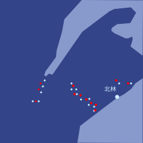
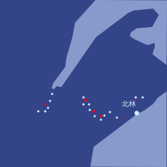

# 第三十章

埃莱纳森林，维里迪亚 · 3725年雪月30日

泽紧盯着屏幕，留意北极无人机机队有没有突破的迹象。40分钟前，他建议4路集群全部缓慢后撤，砍倒树木拖慢雪地无人机，沿途布设陷阱，首要目标就是把战事尽量拖长。莱克托采纳了他的建议，并回话说，他有把握这套策略至少能撑到日出。到目前为止，他都说对了。

泽的手表震了一下。是德鲁因。

我理解你的顾虑，也完全同意：你眼下确实没有好理由信我。

遗憾的是，我没法把无人机上那些语言模型的原始权重交给你们。它们受到严密保护，只有极少数人能接触——正因为担心对手拿到权重去跑梯度下降攻击。

但我能给你们一个次优的选择：北极那套模拟环境的 API 访问权限。里面包括北极无人机的模拟副本，既有完整的世界模型模拟，也有只针对输入模态的部分模拟，会给出分类结果——喂进一段特定的视觉输入，它就能告诉你，它以为自己看到的是什么物体。

以下是网络地址和访问密钥，另有红郡几处北极端点的地址和密钥，可以经由它们中转。记住稳妥行事，尽量降低被侦测的风险。

网络：
13178080a5bf1c815dfb1300c6039af76c7b8f14e47581d3549e8990012e1d5f：35a504923a4d8dde09e0ed814ec05ae81be8e91c2bcb249b22ad13af0bcf7b4de680176e029dcfd96b27e328149f8db4ab368a87762568799bf8a56b95f968c5：519cce3e5e0ee46fbaf2735a53429d6cb1829485e2886962dde9606cab13f0a204569c9a285f10e1a3670985a1fa0696530feae84eae853209d1f0345a214933：8d174efbc3857326999a58e4d4eea9c7fbc61fd56dd233707321d9d5c0bfb9cefed7dd2e3ee0f2c9a1ed4b61dd21ae165780497b39ae4ae5b06b1b8b0b15a034：a9bf7a809e4e998946e59e377e7e96cd9f22dd4db9a87080b669de3e74a03d83  
代理：
4446e4f5350e5d76fe0b5254f50f3923fc2f480d1d9df33da1dc58d532e49e86：9b0dadf8d9418283416f70d60afd909c7346e63cbf7c815b110926eeb943afff27770fdc6c08da318e64f0f16d1d0e300958e4eefe1b55de1a48a9c6a7872ecf：884c9a310b61edf0e73d2d9e9352ac9f21b8c354aa90203468a76f1a2383ff08dfb1c543a259ade8d53344893807d47c0bebd02ed04cde46e31335d2e71f7ac3：b2eb4a17a06c68ab7bf149bb031702ff3514d5571d83c9a2c652dbdaa50768a90ca84c8548d95f6edcd3b6fd1b695d743aff2904cec00fd411bd9d36566e4048：af0dd33ec09e8e8331ff34bf9d15432d8f91ec4870720d8fdc2bdffe29f871d5

泽立刻把这条消息转给白，又给芬发了一份，并吩咐翡翠给芬发一条最高优先级的紧急警报，说明眼下的情况。

芬几乎立刻就回了。

“好，泽，你需要什么？”

“在看……”

“嗯，这看着能成。知道的人不多：要有效地训练出对抗攻击，其实并不需要模型的原始权重。班孙培肯定有人很擅长这一套——‘语言模型’跟语言的关系可大着呢！”

泽又把消息转给穆。翡翠自动建了一个实时聊天群。1分钟后，大约10个人在群里分享对这个问题的看法，开始并行攻关。

“先假定我们的攻击介质是：我们有自己的雪地无人机，还有可以打印图案的贴纸。假定我们在日出之后才部署。做法是这样：先取一个图案，放进模拟器里跑，让我们的无人机慢慢靠近目标，看目标需要多久才能发现它。要把侦测时间量出来，这样衡量我们藏得好不好，得到的就是一个标量信号，而不只是一个二值结果。”

“不断朝各个方向对图案做微小改动。凡是能让目标侦测时间变长的改动，就保留下来。这个过程噪声大也没关系，信号会累积，噪声会随时间被平均掉。它没有梯度下降那么快，但确实管用。最终你会得到一个能稳定骗过对手的图案。”

“我们还能做得更好。我们自己也有模型，训练方式和北极的模型相近，而且我们当然握着它们的原始权重。所以我们可以对自己的模型用梯度下降。比如，按我们模拟器里自家模型的判断，找出10个能把侦测时间拉到最长的最优正交方向，再把这些方向当作试探性的偏移，拿去他们的模拟器里试他们的模型。同时，我们还用每一次查询的结果微调自己的模型，让它越来越能预测北极模型面对这些攻击会怎么反应。”

“这东西多快能跑起来？”泽插话道。

“写代码最多10分钟，翡翠很快就能搞定。完整的训练循环……大概要一个长时？”

“那就是日出前后能做完？”

“正是。然后你们还需要——我不知道要多少分钟——把攻击图案真正打印到无人机各个面上，这条流程你那边先准备好，我们这边一就绪就能立刻上手。”

“好，各位。动起来。”

泽靠回椅背，继续扫视放大的战场地图和一个个视觉画面。维里迪亚无人机机队已经损失了大约三分之一，但伤亡速度明显降了下来。缓慢后撤的策略很管用：它还意味着一件事——凡是因战损失去行动能力、但武器仍完好的维里迪亚无人机，都可以进入低功耗模式，等北极人自己推进到它们所在的位置，再苏醒过来，打出最后一阵火力。

大约15分钟后，泽的手表又震了一下。翡翠让他回群里去。

“我们有了点初步的好消息。”一名班孙培研究员喊道。

“什么消息？”

“我们成功接入了北极的模拟平台，对着模拟器跑了最初几百轮。现在有能把侦测时间拉长约5%的图案了。”

“只有5%？”

“这只是说明流水线开始起效了。”

“哦，刚涨到11%了。”

“确实起效了。”另一名研究员插话。“我们还在并行跑翡翠，优化软件。它在找办法从每次查询里榨出更多信息，也在让查询更好地并行化，好让这一切跑得更快。”

泽的手表震了一下。

我能看到你们开始跑查询了！不过你们得再小心点——如果我看得到，他们的哨兵大概也看得到。这里还有几个代理端点。
c8baa6614d9fba874af5cb90ba7c3d1a53aabaa8facd1e4f5fe46bdeb229a106：3fa5fbd0bc8aa8af8a4842b099dad4e700b5d54edcd4a21c9e272552318d4a558d01f119fbdb499f24a298c59c1b83a7f591df97f3b7a9823e313b1bff3872ca：1a5529862c273fefb898acccdfa0bec29d594904b427eaee88b7b1df393fdb0b44ee73e0355611ad0d975bda2eec43c21e490cb42c61f71bc03b3b4bd7718ad1：bf53236e5d72d2142348d5529275908f995b77791f07a5c818eca0cfc400c1acab7a609ce6f71f55571184cb5d32996a3b5ddd08230ae788f7f65355d5385abe：254804b48ae25417535e6336735d0b66bdd7d20afe77ac687e933d8bd5c24d2495d40f8a44c6c3f4d32d2a4c7c533f9dd71c5d9ac1020361e9e7f4552967a778：12b152f44f00a1f542f4ac6fbb3aced5144c8a98d813a34dce1cb5abc18c3314508a323cda2f87b053986f17d0c073a51c9a001b9b9152a393fe06ff4a30072b：eff66952719415cc534e8f1feb06aa044fa468a81c911a14b95f9be93371e528  
另外，再加一批在做别的事的假查询，甚至可以让每次查询同时尝试好几种不同的攻击，这样别人就更难看清它在做什么。

好建议，泽想。他转了出去。

为了验证模拟器的效果，他们还在一套夜间环境里跑了模拟——那套环境精确复刻了当晚早些时候一场小规模战斗的真实场景。另一个小组由两名研究员和几个翡翠实例组成，他们开始研究如何自动分析夜间环境下模拟与现实的偏差，进而学会怎样构造发给模拟器的查询，让结果更贴近真实战场。

泽看着攻击图案一点点优化成型：一张张纸上满是弯弯曲曲的线条和文字，看上去既异常眼熟，又完全陌生。在模拟器里，北极无人机 AI 发现来机所需的时间翻了一倍还多。

又过了30分钟，侦测时间再次翻倍。

莱克托下令在他们当前位置后方约2公里处搭建印刷设施——那里能让他们在日出前后安全地组织后撤。

维里迪亚的人类士兵还远在机器人前线后方几十公里处，莱克托命令他们开始向前线开进，好让他们能上手把攻击图案贴到雪地无人机上。精细的手部动作仍是 AI 的一大短板。

天色从近乎全黑，缓缓转成一片深蓝，极东方向尤其看得分明。时间一分分过去，那蓝色也一寸寸亮了起来。

“好了，我们有了几个不错的图案。北岸那边快日出了。我建议现在就发出去。”

“同意。”泽答道。

“那就动手吧。”穆补了一句。

---

泽翻看显示器里的一个个视觉画面。他们的大部分无人机机队已经后撤了1公里，大批纸张被打印出来，几乎立刻分发下去，贴到每一台雪地无人机和空中无人机的各个面上。计划已经动起来了。

“北集群报告：除前锋外，所有无人机已贴装完毕。”

“中集群报告：除前锋外，所有无人机已贴装完毕。”

“南集群报告：除前锋外，所有无人机已贴装完毕。”

“海上集群报告：我们在北林外围的村庄征用了设备，当地人好得没话说，很多人半夜起来帮我们。除前锋外，大部分无人机已经贴装完毕。”

“那就这样。”莱克托轻声却坚定地开口。“行动。”

泽调出视觉画面，很想知道最终版的攻击图案究竟长什么样。他看到一长排望不到头的雪地无人机，每一台四面都糊着大张的纸，每张纸上都有许多彩色、弯弯曲曲的图案——还有一个用硕大字体印出的词：**狗**。

几分钟后，他看到了结果。维里迪亚的雪地无人机快速推进，打穿敌军阵线，把前线搅成一团双方无人机混杂的乱局。维里迪亚无人机机队的伤亡比拉开到10比1以上。

泽放任自己高兴了片刻——这是整整一夜里，他头一次感到真正的快乐。

他想起登那天对他说的话。那天，他差点让营救红郡总统之子的任务失败。“跳出框框，是指从控制台椅子上蹿起来、冲过去照对手脸上来一拳。”

黑进对手的模拟环境，跑上百万次查询，只为优化几笔随手就能画在纸上的弯曲线条，再骗得对手的无人机把你的无人机当成狗——这算不算？

大概算吧，泽下了结论。登会为他骄傲的。

觉得自己庆祝得差不多了，泽就调出那个真正要紧的统计数字：伤亡比。它已经降到6比1。到目前为止，北极军队还没能适应，但他们已经转入应急防御：每一小队无人机都绕成环形，好争取时间。而他们很快就会适应，泽心里清楚。

那个由班孙培和昆高培成员组成、负责向北极模拟环境发查询的聊天群，转向优化更简单的攻击手段：能最大限度推迟被发现、并干扰对方瞄准的运动方式，能骗过它们的声响，以及自家火力的准头——全都是不需要重新打印、粘贴纸张的手段。他们还把德鲁因随最初那条消息一起发来的一些进攻性微观战术也加了进去。

伤亡比一度回升，重新向维里迪亚人倾斜，随后又开始缓慢回落。泽继续看着。

15分钟后，模拟环境的所有访问权限突然被切断。几乎同一时间，伤亡比骤然跌落，对维里迪亚人只剩1.5比1。

他们摧毁了北极无人机机队的一大部分，但仍有很大一部分留存下来。如今双方陷入一场复杂的阵地战，两边无人机小队混乱地交错在一起，遍布战场，没有一条清晰的前线。

维里迪亚的人类士兵就在前线后方几百米处，搜寻那些能快速修复的雪地无人机并动手修理。他们穿着隔热斗篷，把被发现的可能压到最低，附近树木燃烧产生的烟又提供了额外的遮蔽。在几个视觉画面里，泽能看到远处北极的人类士兵也在做同样的事，但人数少得多：维里迪亚人整夜后撤时一路布下陷阱，而那些陷阱对付人远比对付无人机管用。

几分钟后，泽的手表又震了一下。

我希望你现在信我了。

我下一条消息会给出我们南翼部分部队的精确坐标，以及几处建议的攻击薄弱点。

jie fe hen dzi.

泽笑了。

我当然信你，德鲁因，他想。

几乎立刻，泽的手表又震了一下。他收到了第二条消息。

他把坐标转给了穆。

“这是你大显身手的机会，穆。”

“别忘了瓦卡里亚。”

几分钟内，南线的伤亡比开始与更北面的各条战线大幅拉开差距，重新向维里迪亚人倾斜。

而仅仅几分钟后，他们似乎就拿到了需要的结果。

穆把自己无人机机队最南端的一部分交给瓦卡里亚指挥，后者的任务是进入北林并重新控制它。

她机队的其余部分向北横扫。接下来一个长时里，她把残余的北极无人机机队彻底围住，并在日出后差不多正好一个长时，与特尔波最北端的侧翼会合。

加洛瓦的北集群歼灭了北面的残余北极无人机，抵达那条标示维里迪亚领土与北极核心领土分界的河流。有几架无人机越过河，朝附近的北极城镇疾飞而去，逼得北极人紧急派出增援。特尔波机队的一部分北上与加洛瓦会合，加强了北线。

与此同时，海上无人机第二趟出动，直奔塔尔杜尔——北岸以东那座属于北极核心领土的岛屿——卸下了一支由空中无人机和雪地无人机组成的机队，在接下来的几个长时里巩固了对该岛的控制。北极人无法有效应对：塔尔杜尔太远，双方都难以迅速抵达，而少数在航程内的无人机又被加洛瓦牵住，脱不了身。

到那天下午晚些时候，战斗渐渐平息下来，北岸和塔尔杜尔残余的最后一批北极士兵与无人机被有条不紊地逐一清剿。

泽靠回椅子，把椅背调到最大仰角。熬过14个多长时之后，他头一次睡着了。
